# 什么是架构

## 定义

架构，又称软件架构

- 是有关于软件整体结构与组件的抽象描述
- 用于指导软件系统各个方面的设计

> Q：定义还是太抽象，能不能通俗一点？

实现一个软件有很多种方法，架构在**方法选择**上起着至关重要的指导作用

> 架构的重要性？

- 地基没打好，大厦容易倒
- 地基坚实了，大厦才能盖得高
- 站在巨人得肩膀上，才能看得远

## 问题

兰师傅蛋糕坊开张了，必须解决如下问题：

- 如何做蛋糕
  - 独家秘方，还是亲自做比较好
- 如何卖蛋糕
  - 刚开始客流量应该不大，边做边卖

看来问题都解决了，可以开张

## 单机

软件系统需要具备对外提供服务，单机，就是把所有功能都实现在一个进程里面，并部署在一台机器上

- 优点
  - 简单
- 问题
  - C10K problem
  - 运维需要停服

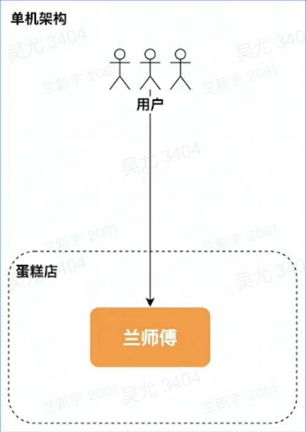

演进：如何卖更多得蛋糕？多雇几个蛋糕师傅

## 单体、垂直应用|垂直切分

单体架构：分布式部署

垂直应用架构：按应用垂直切分的单体

优点：

- 水平扩容
- 运维不需要停服

问题：

- 职责过多，开发效率不高
- 爆炸半径大

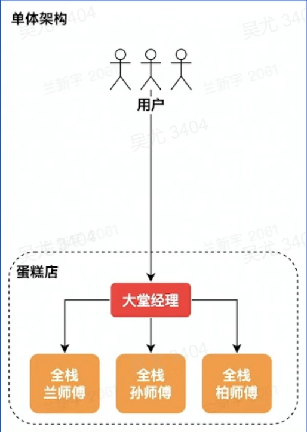

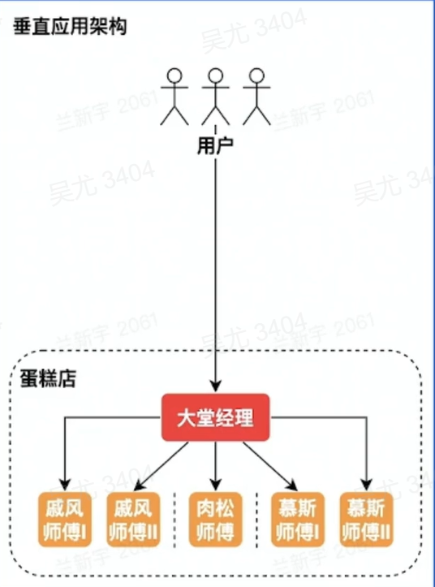

演进 ：如何提高做蛋糕的效率？分工协作

## SOA、微服务|水平切分

> SOA（Service-Oriented Architecture）

- 将应用的不同功能单元抽象为**服务**
- 定义服务之间的**通信标准**

问题：

- 数据一致性
  - 装货台共交付了多少蛋糕？
- 高可用
  - 这么多师傅，如何合作？
- 治理
  - 烤箱坏了，这么容灾？
- 解耦 vs 过微
  - 运维成本高，值当么？

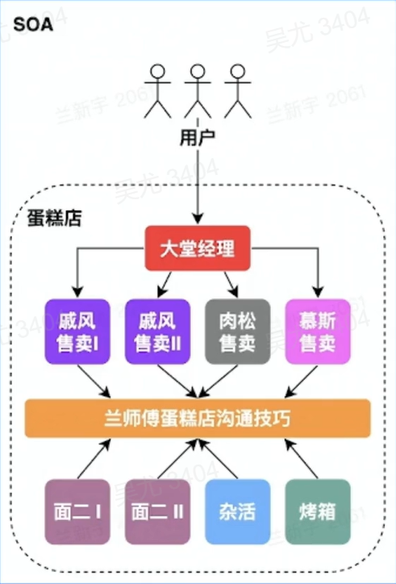

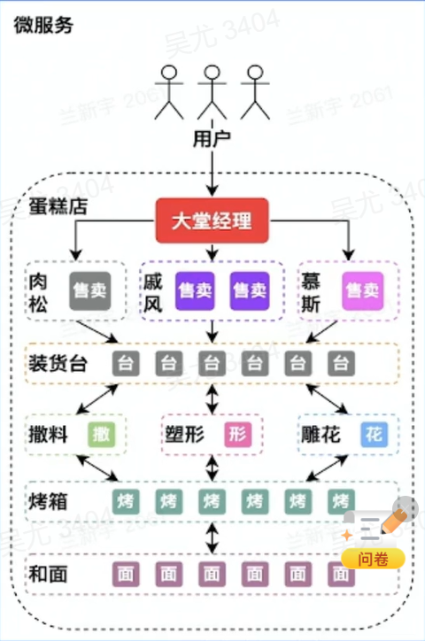

## 小结

架构的演进初衷：好比做蛋糕

- 需求量越来越大，终归要增加人手
- 越做越复杂，终归要分工合作

架构的演进思路：就像切蛋糕，蛋糕越做越大，一口吃不下终归要切分

- 竖着切（垂直切分）
- 横着切（水平切分）

# 企业级后端架构剖析

## 背景

兰师傅蛋糕店经过3年的蓬勃发展，积累了良好的口碑和用户基础，接下来，需要扩大规模：

- 店面怎么盘：
  - 买
  - 租
- 师傅怎么招：
  - 兰师傅全家出马
  - 招培训班出身的
- 是否继续坚持纯手工制作？
- 规模大了之后，工作的重心应该是？
  - 精进蛋糕制作收益
  - 蛋糕店重点方向梳理 & 未来规划

## 云计算

云计算：是指软件自动化管理，提供计算资源的服务网络，是现代互联网大规模熟悉分析和存储的基石。

基础：

- 虚拟化技术——整租 vs 合租
- 编排方案——业主vs租凭平台

架构：

- LaaS（Infrastructure as a Service）
  - 买房子 vs 房屋租凭平台
- PaaS （Platform as a Service）
  - 清包 vs 全包
- SasS （Software as a Service）
  - 从零培训 vs 雇佣培训过的师傅
- FaaS （Function as a Service）
  - 纯手工制作 vs 蛋糕机批量生产

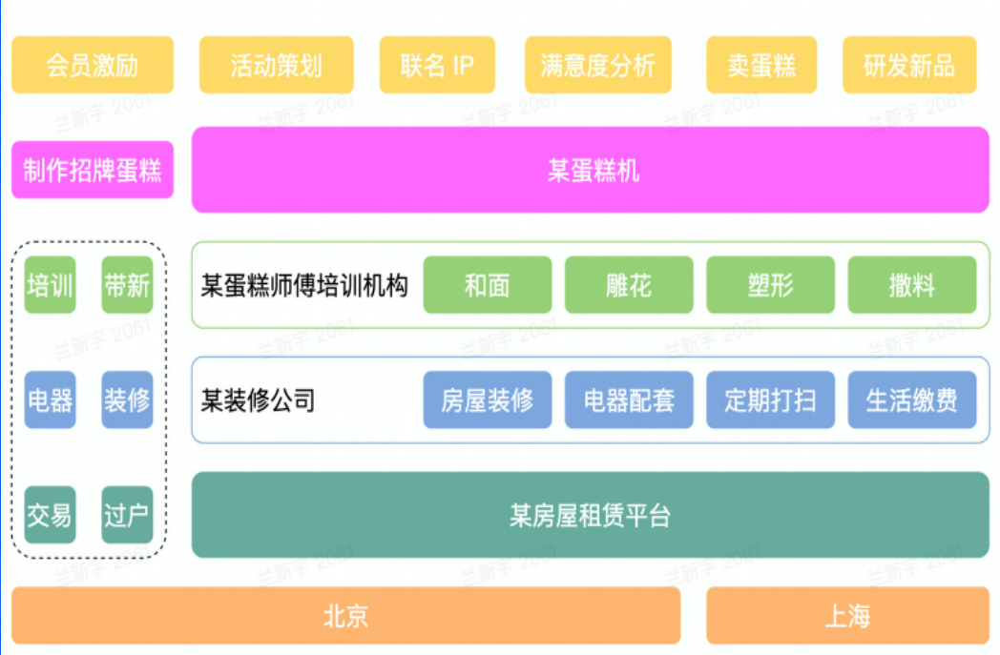

## 云原生

云原生技术为组织（公司）在共有云、自由云、混合云等新型的动态环境中，构建和运行可弹性扩展的应用提供了可能。

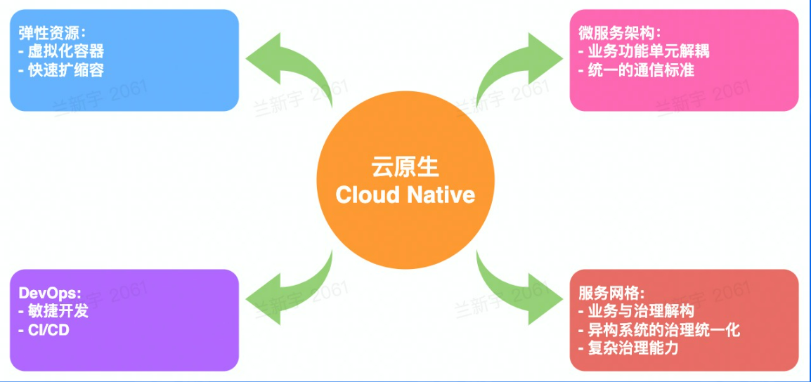

### 弹性计算资源

- 服务资源调度
  - 微服务：和面、雕花
  - 大服务：烤箱
- 计算资源调度
  - 在线：热销榜单
  - 离线：热销榜单更新
- 消息队列
  - 在线：削峰、解耦
  - 离线：大数据分析

### 弹性存储资源

- 经典
  - 对象：宣传视频
  - 大数据：用户消费记录
- 关系型数据库
  - 收银记录
- 元数据
  - 服务发现：蛋糕店通讯录
- NoSQL
  - KV：来个 xx 蛋糕

总结：将存储资源当成服务一样

### DevOps

DevOps 是云原生时代软件交付的利器，贯穿整个软件开发周期。

结合自动化流程，提高软件开发、交付效率

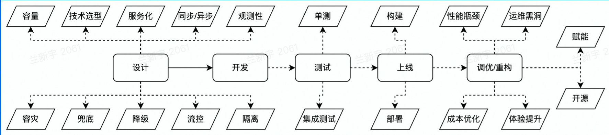

### 微服务架构

通信标准：

- HTTP（RESTful API）
- RPC（Thrift， gRPC）

微服务中间件 RPC vs HTTP：

- 性能
- 服务治理
- 协议可解释性

云原生场景下，微服务大可不必在业务逻辑中实现符合通信标准的交互逻辑，而是交给框架来做

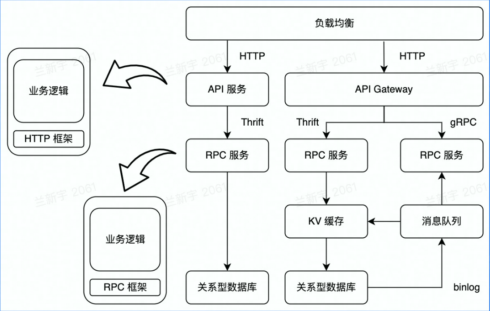

### 服务网格

服务网格（Service Mesh）：

- 微服务之间通讯的中间层
- 高性能网络代理
- 业务代码与治理解耦

相比较 RPC/HTTP框架：

- 异构系统治理统一化
- 与业务进程解耦，生命周期易管理

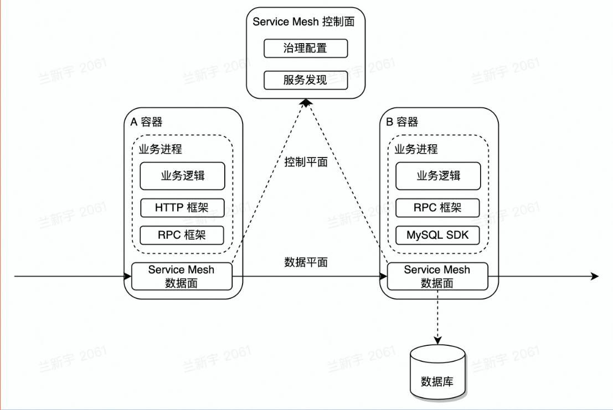

### 云原生蛋糕店

企业级蛋糕店架构：

- 售卖
- 蛋糕制作（肉松、慕斯）
- 会员激励
- 满意度分析
- 研发新品

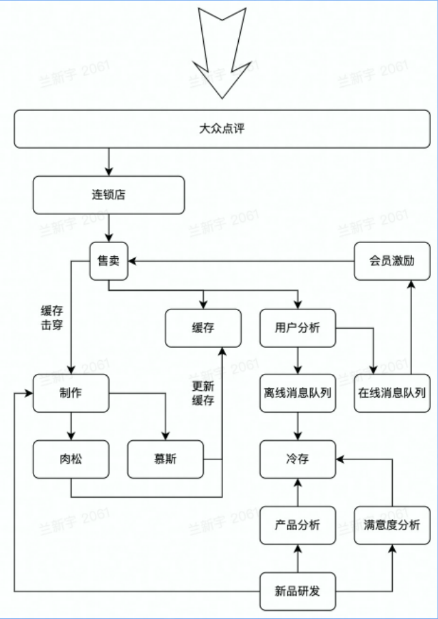

# 企业级后端架构的挑战

## 问题

挑战：

- 基础设施层面
  - 物理资源是有限的
    - 机器
    - 带宽
  - 资源利用率受制于部署服务
- 用户层面
  - 网络通信开销比较大
  - 网络抖动导致运维成本提升
  - 异构环境下，不同实例资源水位不均

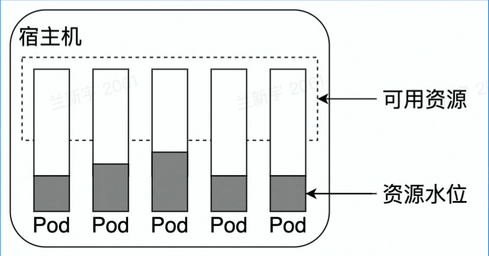

## 离在线资源并池

核心收益：

- 降低物理资源成本
- 提供更多的弹性资源，增加收入

解决思路：**离在线资源并池**

- 在线业务打的特点
  - IO 密集型为主
  - 潮汐性、实时性
- 离线业务的特点
  - 计算密集型占多数
  - 非实时性

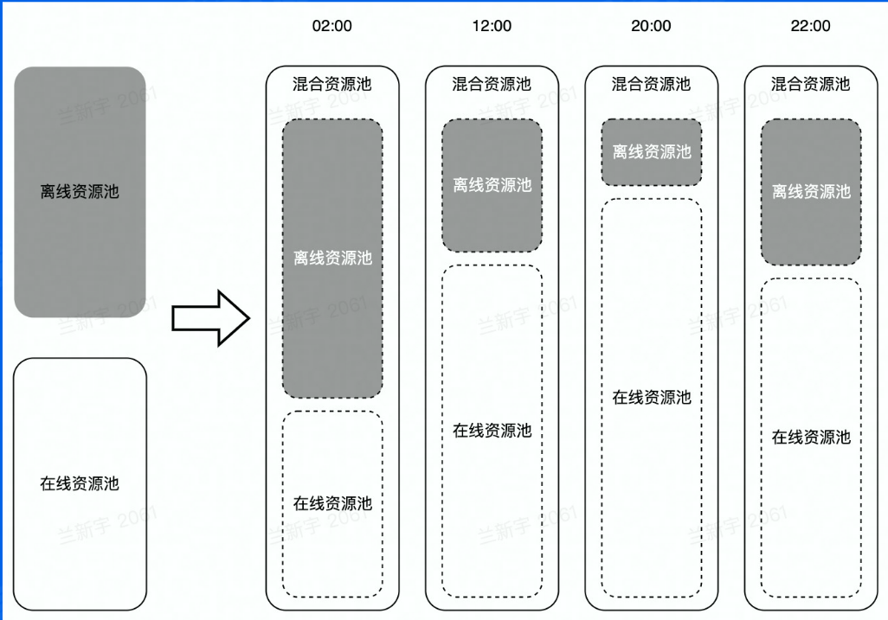

## 自动扩缩容

核心收益：

- 降低业务成本

解决思路：**自动扩缩容**

- 利用在线业务潮汐性自动扩缩容

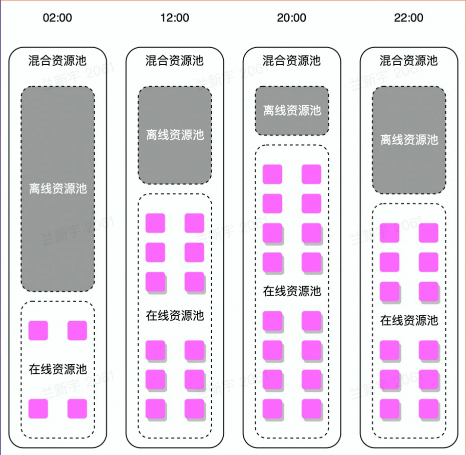

问题：扩缩容依据什么指标？

## 微服务亲和性部署

核心收益：

- 降低业务成本
- 提高服务可用性

解决思路：**微服务亲和性部署**

- 将满足亲和性条件的容器调度到一台宿主机
- 微服务中间件与服务网格通过共享内存通信
- 服务网格控制面实施灵活、动态的流量调度

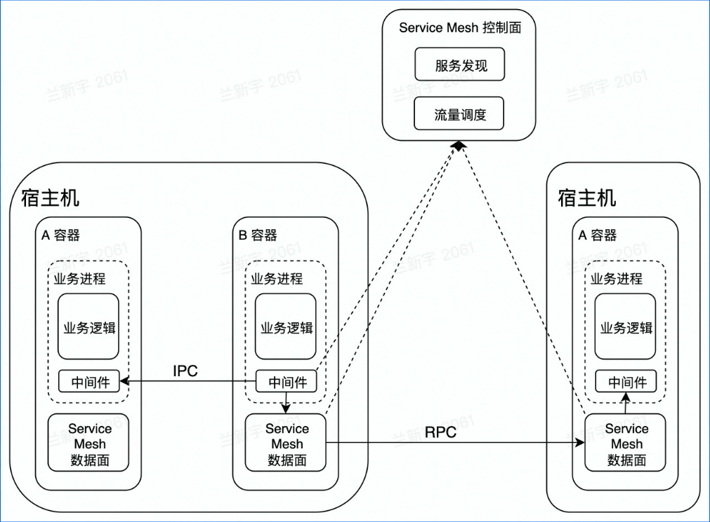

## 流量治理

核心收益：

- 提高微服务调用容错性
- 容灾
- 进一步提高开发效率，DevOps 发挥到极致

解决思路：**基于微服务中间件 & 服务网格的流量治理**

- 熔断、重试
- 单元化
- 复杂环境（功能、预览）的流量调度

# 后端架构实战

## 问题背景

兰师傅蛋糕店也碰到了类似的问题：

- 不同师傅干活的效率差距较大
- 有些师傅希望 “能者多劳多挣”

在这个背景下，继续像之前一样为每个师傅分配完全相同的工作，会引起他们的不满...

回到 03 最后的挑战 —— CPU 水位负载均衡，应该如何设计？

- 需要哪些输入？
- 设计时需要考虑哪些关键点？

## 问题提炼

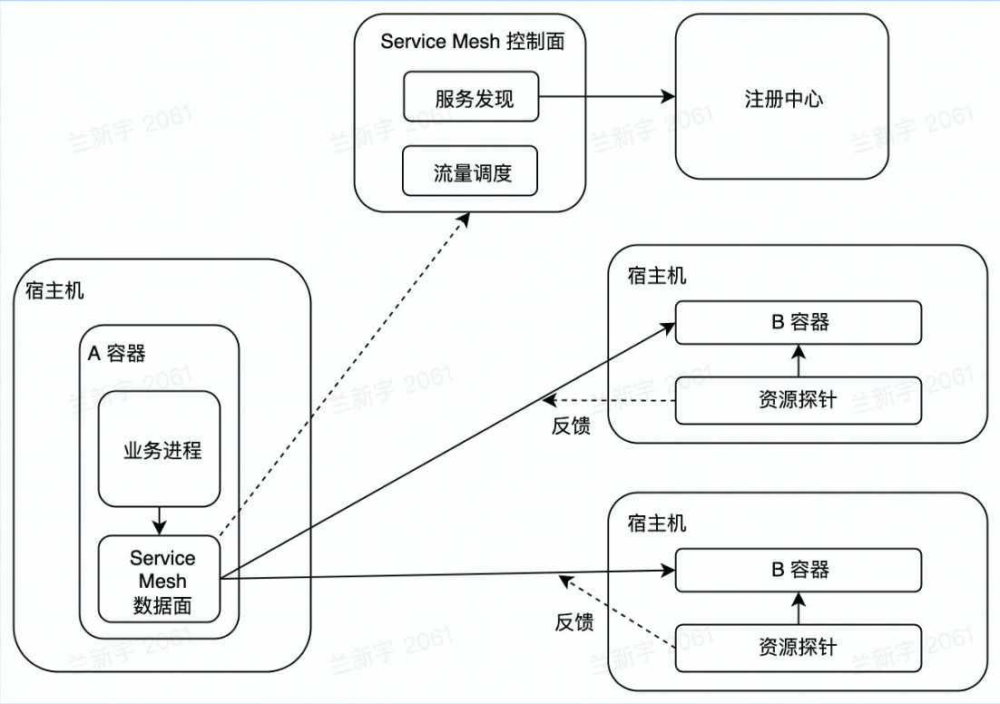

输入：

- 服务网格数据面
  - 支持带权重的负载均衡策略
- 注册中心存储了所有容器的权重信息
- 宿主机能提供
  - 容器的资源使用情况
  - 物理资源信息（如CPU型号）

关键点：

- 紧急回滚能力
- 大规模
- 极端场景

## 自适应静态权重

方案：

- 采集宿主机物理资源信息
- 调整容器注册的权重

优势：

- 复杂度低
- 完全分布式，可用性高
- 微服务中间件无适配成本

缺点：

- 无紧急回滚能力
- 缺乏运行时自适应能力

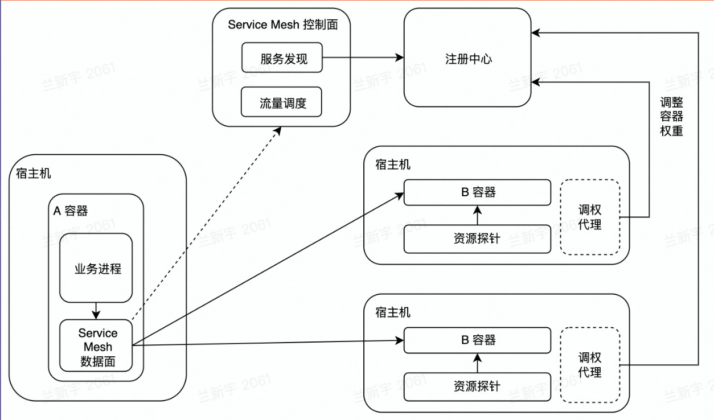

## 自适应动态权重 Alpha

方案：

- 容器动态权重的自适应调整
- 服务网格的服务发现 & 流量调度能力

演进方向：

- 解决无法紧急回滚的问题
- 运行时权重自适应

缺点：

- 过度流量倾斜可能会有异常情况

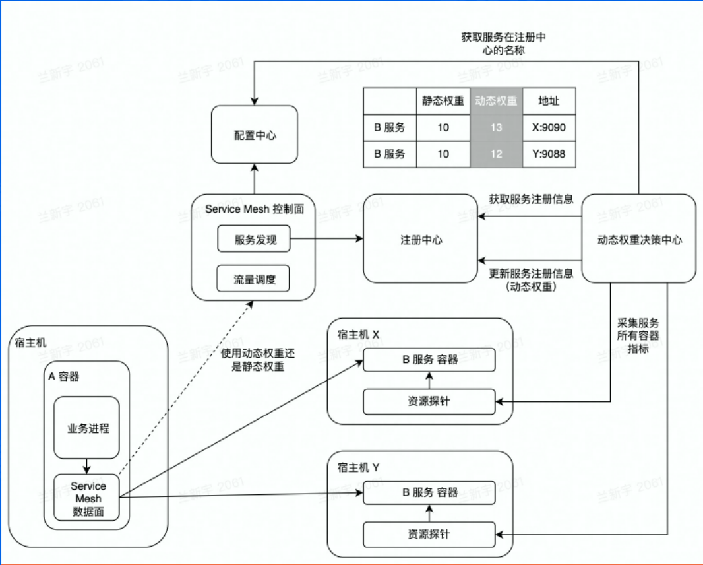

## 自适应动态权重 Beta

方案：

- 服务网格上报 RPC指标

演进方向：

- 极端场景的处理成为可能

缺点：

- 时许数据库压力较大
- 动态决策中心职责越来越多，迭代 —> 变更 —> 风险

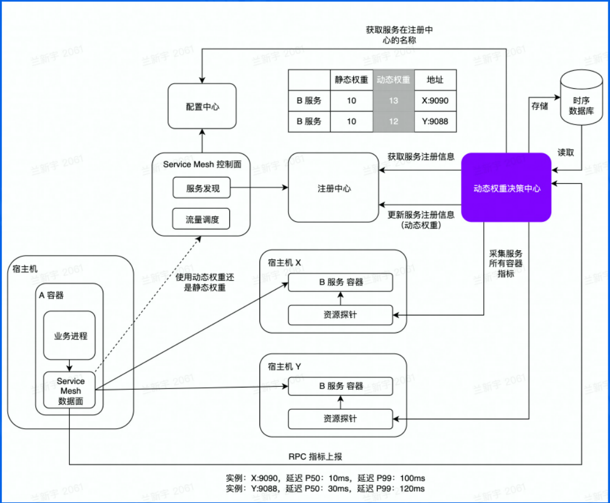

## 自适应动态权重 Release

演进方向：

- 微服务化
- 引入消息队列削峰、解耦
- 离在线链路切分
- 梳理强弱依赖

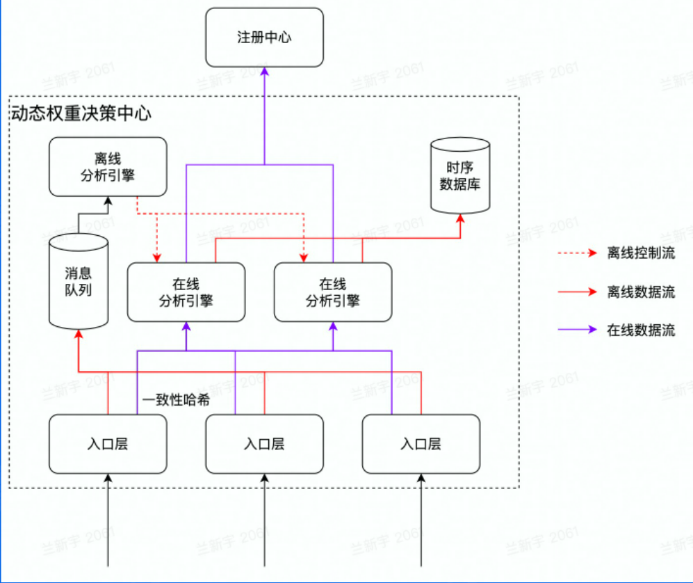

## 尾声

- 没有最好的架构，只有最适合的架构

- 如何做架构设计

  - 需求先行。弄清楚要解决什么问题

  - 业界调研。业界都有哪些解决方案可供参考

  - 技术选型。内部/社区都有哪些基础组件

  - 异常情况。考虑清楚 xxx 不行了怎么办

- 架构师与工程师成长
  - 技术经理
  - 架构师

# 课后作业

兰师傅蛋糕房要支持线上售卖了！请帮忙做整套系统的架构设计，需求：

- 多端支持
  - 微信/支付宝小程序
  - App
  - 网页
- 使用云原生基础设施
- 用户画像很重要
- 积极参加妇女节/光棍节等活动

注：不需要考虑做蛋糕相关服务的交互