# Git是什么

- 介绍版本控制的发展历史，为什么会出现Git
- 介绍Git的发展历史

## 方向介绍

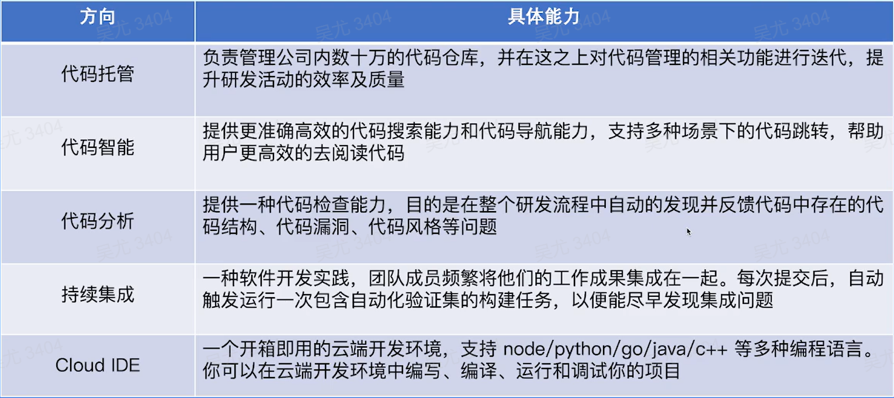

## 为什么要学习Git

> 协同工作

业界绝大多数公司都是基于Git进行代码管理，因此Git是一个程序员的必备技能

> 开源社区

目前绝大多数的开源项目都是基于Git维护的，参与这些项目的开发都需要使用Git。

## 为什么要设计这门课程？

常见问题

- 入职后按照文档进行Git配置，但是配置后依然拉取代码有问题，缺少自己排查问题的能力
- 研发流程中进行一些异常操作，不符合研发规范，不清楚保护分支，MR/PR等概念

课程目标

- 学习基本的Git命令，并了解原理，在遇到Git相关问题时，能自行排查并解决
- 了解研发流程中的基本概念和规范，学会正确的使用Git

## 版本控制

> Git是什么？

开源的分布式版本控制系统

> 版本控制是什么？

一种记录一个或若干文件内容变化，以便将来查阅特定版本修订的情况的系统

> 为什么需要版本控制？

更好的关注变更，了解到每个版本的改动是什么，方便对改动的代码进行检查，预防事故发生；也能够随时切换到不同的版本，回滚误删误改的问题代码；

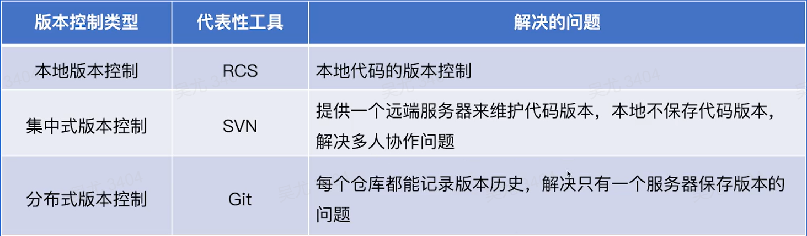

## 本地版本控制

> 最初的方式

通过本地复制文件夹，来完成版本控制，一般可以通过不同的文件名来区分版本

> 解决方案

开发一些本地的版本控制软件，其中最流行的时RCS

> 基本原理

本地保存所有变更的补丁集，可以理解成就是所有的Diff，通过这些补丁，我们可以计算出每个版本的实际文件内容

> 缺点

RCS这种本地版本控制存在最致命的缺陷就是只能在本地使用，无法进行团队协作，因此使用的场景非常有限，因此衍生除了集中式版本控制

## 集中版本控制

代表性工具：SVN

基本原理：

- 提供一个远端服务来保存文件，所有用户的提交都提交到该服务器中
- 增量保存每次提交的Diff，如果提交的增量和远端现存的文件存在冲突，则需要本地提前解决冲突

优点：

- 学习简单，更容易操作
- 支持二进制文件，对大文件支持更友好

缺点：

- 本地不存储版本管理的概念，所有提交都只能联上服务器后才可以提交
- 分支上的支持不够好，对于大型项目团队合作比较困难
- 用户本地不保存所有版本的代码，如果服务端故障容易导致历史版本的丢失

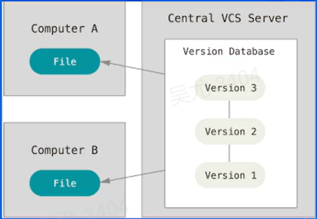

## 分布式版本控制

代表性工具：Git

基本原理：

- 每个库都存有完整的提交历史，可以直接在本地进行代码提交
- 每次提交记录的都是完整的文件快照，而不是记录增量
- 通过Push等操作来完成和远端代码的同步

优点：

- 分布式开发，每个库都是完整的提交历史，支持本地提交，强调个体
- 分支管理功能强大，方便团队合作，多人协同开发
- 校验和机制保证完整性，一般只添加数据，很少执行删除操作，不容易导致代码丢失

缺点：

- 相对SVN更复杂，学习成本更高
- 相对于大文件的支持不是特别好（git-lfs工具可以弥补这个功能）

## Git发展历史

作者：Linus Torvalds（Linux、Git）

开发原因：BitKeeper不允许Linux团队继续无偿使用，因此自己开发了一个分布式版本控制系统。

开发时间：大概花了两周时间，就完成了Git的代码的第一个版本，后续Linux项目就开始使用Git进行维护

Github：全球最大的代码托管平台，大部分的开源项目都放在这个平台上

Gitlab：全球最大的开源代码托管平台，项目的所有代码都是开源的，便于在自己的服务器上完成Gitlab的搭建

Gerrit：由Google开发的一个代码托管平台，Android这个开源项目就托管在这个Gerrit之上

# Git就基本使用方式

- Git的基本命令介绍，如何使用这些命令，以及命令的原理

## Git基本命令

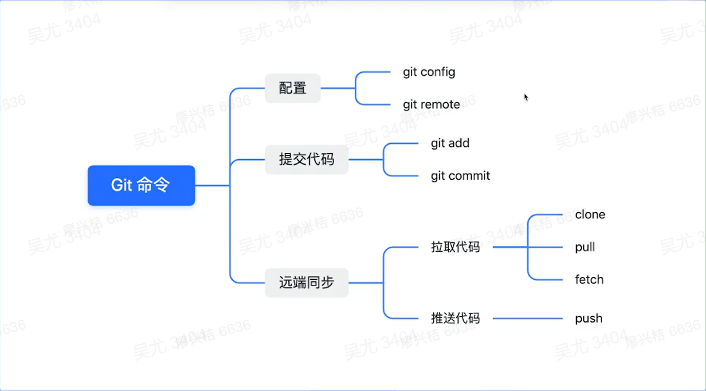

## 常见问题

> 为什么我明明配置了Git配置，但是依然没有办法拉取代码？

- 免密认证没有配置
- Instead Of 配置没有配，配的SSH免密配置，但是使用的还是HTTP访问。

> 为什么我Fetch了远端分支，但是我看本地当前的分支历史还是没有变化？

- Fetch 会把代码拉取到本地的远端分支，但是并不会合并到当前分支，所以当前分支历史没有变化

## Git目录介绍

> 项目初始化

```sh
mkdir demo
cd demo
git init
```

> 其他参数

```sh
--initial-branch 初始化的分支
--bare 创建一个裸仓库（纯Git目录，没有工作目录）
--template 可以通过模板来创建预先构建好的自定义git目录
```

> Git 仓库

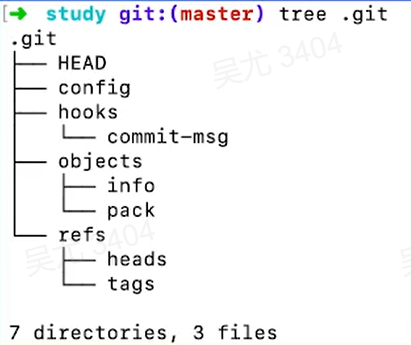

> 工作区&暂存区

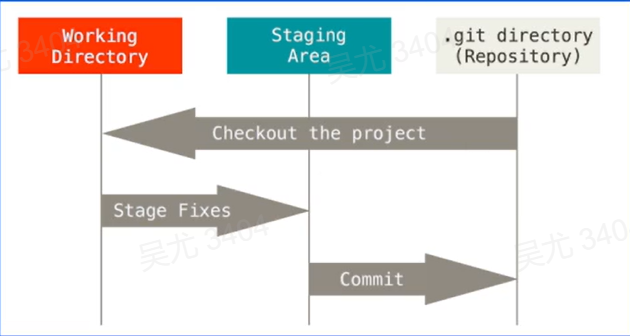

## Git Config

不同级别的Git配置：每个级别的配置可能重复，但是低级别的配置会覆盖高级别的配置

```sh
$ git config
usage: git config [<options>]

Config file location
    --global              use global config file
    --system              use system config file
    --local               use repository config file
    --worktree            use per-worktree config file
    -f, --file <file>     use given config file
    --blob <blob-id>      read config from given blob object

Action
    --get                 get value: name [value-pattern]
    --get-all             get all values: key [value-pattern]
    --get-regexp          get values for regexp: name-regex [value-pattern]
    --get-urlmatch        get value specific for the URL: section[.var] URL
    --replace-all         replace all matching variables: name value [value-pattern]
    --add                 add a new variable: name value
    --unset               remove a variable: name [value-pattern]
    --unset-all           remove all matches: name [value-pattern]
    --rename-section      rename section: old-name new-name
    --remove-section      remove a section: name
    -l, --list            list all
    --fixed-value         use string equality when comparing values to 'value-pattern'
    -e, --edit            open an editor
    --get-color           find the color configured: slot [default]
    --get-colorbool       find the color setting: slot [stdout-is-tty]

Type
    -t, --type <>         value is given this type
    --bool                value is "true" or "false"
    --int                 value is decimal number
    --bool-or-int         value is --bool or --int
    --bool-or-str         value is --bool or string
    --path                value is a path (file or directory name)
    --expiry-date         value is an expiry date

Other
    -z, --null            terminate values with NUL byte
    --name-only           show variable names only
    --includes            respect include directives on lookup
    --show-origin         show origin of config (file, standard input, blob, command line)
    --show-scope          show scope of config (worktree, local, global, system, command)
    --default <value>     with --get, use default value when missing entry
```

## 常见的Git配置

> 用户名配置

```sh
git config --global user.name "wuyou"
git config --global user.email 2213093478@qq.com
```

> Instead of配置

```sh
git config --global url.git@github.com:.intsteadOf https://github.com/
```

> Git命令别名配置

```sh
git config --global alias.cin "commit --amend --no-edit"
```

## Git Remote

> 查看Remote

```sh
git remote -v
```

> 添加Remote

```sh
git remote add origin_ssh git@github.com:git/git.git
git remote add origin_http https://github.com/git/git.git
```

```sh
22130@DESKTOP-NTD187I MINGW64 /d/github/study/demo (master)
$ git remote add origin_ssh git@github.com:git/git.git

22130@DESKTOP-NTD187I MINGW64 /d/github/study/demo (master)
$ git remote add origin_http https://github.com/git/git.git

22130@DESKTOP-NTD187I MINGW64 /d/github/study/demo (master)
$ git remote -v
origin_http     https://github.com/git/git.git (fetch)
origin_http     https://github.com/git/git.git (push)
origin_ssh      git@github.com:git/git.git (fetch)
origin_ssh      git@github.com:git/git.git (push)
```

```sh
22130@DESKTOP-NTD187I MINGW64 /d/github/study/demo (master)
$ cat .git/config
[core]
        repositoryformatversion = 0
        filemode = false
        bare = false
        logallrefupdates = true
        symlinks = false
        ignorecase = true
[gui]
        wmstate = normal
        geometry = 1061x563+32+32 233 255
[remote "origin_ssh"]
        url = git@github.com:git/git.git
        fetch = +refs/heads/*:refs/remotes/origin_ssh/*
[remote "origin_http"]
        url = https://github.com/git/git.git
        fetch = +refs/heads/*:refs/remotes/origin_http/*
```

> 同一个Origin设置不同的Push和Fetch URL

```sh
git remote add origin git@github.com:git/git.git
git remote set-url --add --push origin git@github.com:my_repo/git.git
```

```sh

22130@DESKTOP-NTD187I MINGW64 /d/github/study/demo (master)
$ git remote add origin git@github.com:git/git.git

22130@DESKTOP-NTD187I MINGW64 /d/github/study/demo (master)
$ git remote set-url --add --push origin git@github.com:my_repo/git.git

22130@DESKTOP-NTD187I MINGW64 /d/github/study/demo (master)
$ git remote -v
origin  git@github.com:git/git.git (fetch)
origin  git@github.com:my_repo/git.git (push)
origin_http     https://github.com/git/git.git (fetch)
origin_http     https://github.com/git/git.git (push)
origin_ssh      git@github.com:git/git.git (fetch)
origin_ssh      git@github.com:git/git.git (push)
```

## HTTP Remote

URL：https://github.com

免密配置

内存：`git config --global credential.helper 'cache -- timeout=3600'`

硬盘：`git config --global credential.helper "store --file /path/to/credential-file"`，不指定目录的情况默认是 `~/.git-credentials`


将密匙信息存在指定文件中

具体格式：`${scheme}://${user}:${password}@github.com`

## SSH Remote

URL：git@github.com:git/git.git

免密配置

SSH可以通过公私匙的机制，将生成公匙存放在服务端，从而实现免密访问

目前的Key的类型四种，分别是 dsa、rsa、ecdsa、ed25519

**默认使用的是 rsa**，由于一些安全问题，现在已经不推荐使用dsa和rsa了，优先推荐使用 ed25519

```
ssh-keygen -t ed25519 -C "your_email@example.com" 密匙默认存在 ~/.ssh/id_ed25519.pub
```

```sh
22130@DESKTOP-NTD187I MINGW64 /d/github/study/demo (master)
$ ssh-keygen -t ed25519 -C "2213093478@qq.com"
Generating public/private ed25519 key pair.
Enter file in which to save the key (/c/Users/22130/.ssh/id_ed25519):
Enter passphrase (empty for no passphrase):
Enter same passphrase again:
Your identification has been saved in /c/Users/22130/.ssh/id_ed25519
Your public key has been saved in /c/Users/22130/.ssh/id_ed25519.pub
The key fingerprint is:
SHA256:fbwg1fVhq5uMdiCl4xKh0weVEOQyovYS4XbHirb55qY 2213093478@qq.com
The key's randomart image is:
+--[ED25519 256]--+
|      .+o..   .o |
|      . .. . ...o|
| . . o +  ...  ..|
|. o o = ooo.  .  |
| * . = oS=o.o.   |
|o = o . +.oo+.o  |
| + o   . . o.=   |
|. +o    . . .    |
| E*o             |
+----[SHA256]-----+

22130@DESKTOP-NTD187I MINGW64 /d/github/study/demo (master)
$ cat /c/Users/22130/.ssh/id_ed25519.pub
ssh-ed25519 AAAAC3NzaC1lZDI1NTE5AAAAIKp45aWVO9QwSJUYc2SXdK7fqHlBmH/XQ0MBTlTHm+yR 2213093478@qq.com
```

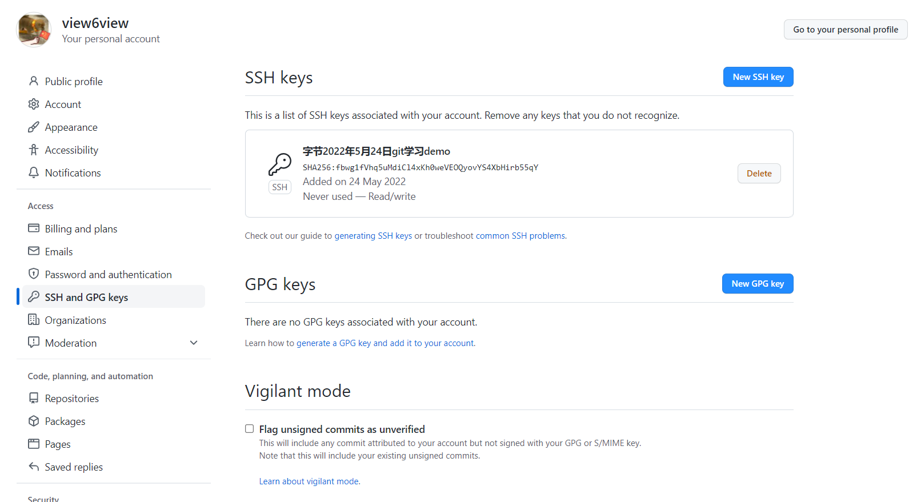

## Git Add

```sh
22130@DESKTOP-NTD187I MINGW64 /d/github/study/demo (master)
$ ls

22130@DESKTOP-NTD187I MINGW64 /d/github/study/demo (master)
$ touch README.md

22130@DESKTOP-NTD187I MINGW64 /d/github/study/demo (master)
$ ls
README.md

22130@DESKTOP-NTD187I MINGW64 /d/github/study/demo (master)
$ vim README.md

22130@DESKTOP-NTD187I MINGW64 /d/github/study/demo (master)
$ git status
On branch master

No commits yet

Untracked files:
  (use "git add <file>..." to include in what will be committed)
        README.md

nothing added to commit but untracked files present (use "git add" to track)

22130@DESKTOP-NTD187I MINGW64 /d/github/study/demo (master)
$ git add .
warning: LF will be replaced by CRLF in README.md.
The file will have its original line endings in your working directory

22130@DESKTOP-NTD187I MINGW64 /d/github/study/demo (master)
$ git status
On branch master

No commits yet

Changes to be committed:
  (use "git rm --cached <file>..." to unstage)
        new file:   README.md
```

## Git Commit

```sh
22130@DESKTOP-NTD187I MINGW64 /d/github/study/demo (master)
$ git commit -m "add readme.md"
[master (root-commit) e81625c] add readme.md
 1 file changed, 1 insertion(+)
 create mode 100644 README.md

22130@DESKTOP-NTD187I MINGW64 /d/github/study/demo (master)
$ tree .git
.git
|-- COMMIT_EDITMSG
|-- HEAD
|-- config
|-- description
|-- hooks
|   |-- applypatch-msg.sample
|   |-- commit-msg.sample
|   |-- fsmonitor-watchman.sample
|   |-- post-update.sample
|   |-- pre-applypatch.sample
|   |-- pre-commit.sample
|   |-- pre-merge-commit.sample
|   |-- pre-push.sample
|   |-- pre-rebase.sample
|   |-- pre-receive.sample
|   |-- prepare-commit-msg.sample
|   |-- push-to-checkout.sample
|   `-- update.sample
|-- index
|-- info
|   `-- exclude
|-- logs
|   |-- HEAD
|   `-- refs
|       `-- heads
|           `-- master
|-- objects
|   |-- 3b
|   |   `-- 18e512dba79e4c8300dd08aeb37f8e728b8dad
|   |-- 43
|   |   `-- b71c903ff52b9885bd36f3866324ef60e27b9b
|   |-- 4b
|   |   `-- 825dc642cb6eb9a060e54bf8d69288fbee4904
|   |-- e8
|   |   `-- 1625cfd4407372b8521afd96edc19bb6932479
|   |-- info
|   `-- pack
`-- refs
    |-- heads
    |   `-- master
    `-- tags

15 directories, 26 files
```

```sh
22130@DESKTOP-NTD187I MINGW64 /d/github/study/demo (master)
$ git log
commit e81625cfd4407372b8521afd96edc19bb6932479 (HEAD -> master)
Author: wuyou <2213093478@qq.com>
Date:   Tue May 24 15:48:58 2022 +0800

    add readme.md
```

## Objects

`commit/tree/blob`在git里面都统一称为Object，除此之外还有个tag的object

Blob：存储文件的内容

Tree：存储文件的目录信息

Commit：存储提交信息，一个Commit可以对应唯一版本的代码

> 如何把这三个信息串联到一起呢？

- 通过Commit寻找到Tree信息，每个Commit都会存储对应的Tree ID

```sh
22130@DESKTOP-NTD187I MINGW64 /d/github/study/demo (master)
$ git cat-file -p e81625cfd4407372b8521afd96edc19bb6932479
tree 43b71c903ff52b9885bd36f3866324ef60e27b9b
author wuyou <2213093478@qq.com> 1653378538 +0800
committer wuyou <2213093478@qq.com> 1653378538 +0800

add readme.md
```

- 通过Tree存储的信息，获取到对应的目录树信息

```sh
22130@DESKTOP-NTD187I MINGW64 /d/github/study/demo (master)
$ git cat-file -p 43b71c903ff52b9885bd36f3866324ef60e27b9b
100644 blob 3b18e512dba79e4c8300dd08aeb37f8e728b8dad    README.md
```

- 从Tree中获得blob的ID，通过Blob ID获取对应的文件内容

```sh
22130@DESKTOP-NTD187I MINGW64 /d/github/study/demo (master)
$ git cat-file -p 3b18e512dba79e4c8300dd08aeb37f8e728b8dad
hello world
```

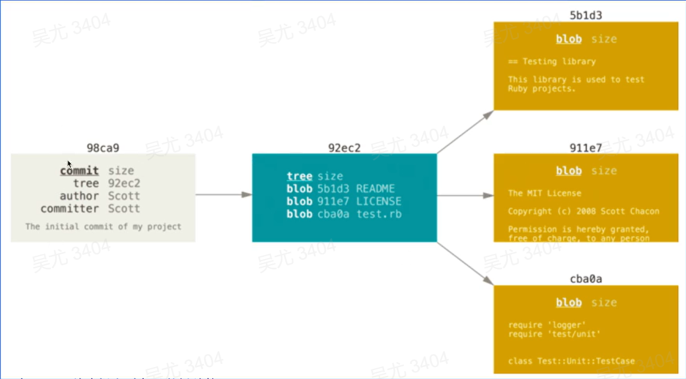

## Refs

```sh
22130@DESKTOP-NTD187I MINGW64 /d/github/study/demo (master)
$ git checkout -b test
Switched to a new branch 'test'

22130@DESKTOP-NTD187I MINGW64 /d/github/study/demo (test)
$ git status
On branch test
nothing to commit, working tree clean

22130@DESKTOP-NTD187I MINGW64 /d/github/study/demo (test)
$ tree .git
.git
|-- COMMIT_EDITMSG
|-- HEAD
|-- config
|-- description
|-- hooks
|   |-- applypatch-msg.sample
|   |-- commit-msg.sample
|   |-- fsmonitor-watchman.sample
|   |-- post-update.sample
|   |-- pre-applypatch.sample
|   |-- pre-commit.sample
|   |-- pre-merge-commit.sample
|   |-- pre-push.sample
|   |-- pre-rebase.sample
|   |-- pre-receive.sample
|   |-- prepare-commit-msg.sample
|   |-- push-to-checkout.sample
|   `-- update.sample
|-- index
|-- info
|   `-- exclude
|-- logs
|   |-- HEAD
|   `-- refs
|       `-- heads
|           |-- master
|           `-- test
|-- objects
|   |-- 3b
|   |   `-- 18e512dba79e4c8300dd08aeb37f8e728b8dad
|   |-- 43
|   |   `-- b71c903ff52b9885bd36f3866324ef60e27b9b
|   |-- 4b
|   |   `-- 825dc642cb6eb9a060e54bf8d69288fbee4904
|   |-- e8
|   |   `-- 1625cfd4407372b8521afd96edc19bb6932479
|   |-- info
|   `-- pack
`-- refs
    |-- heads
    |   |-- master
    |   `-- test
    `-- tags

15 directories, 28 files
```

> Refes文件存储的内容

refes的内容就是对应的Commit ID

```sh
22130@DESKTOP-NTD187I MINGW64 /d/github/study/demo (test)
$ cat .git/refs/heads/master
e81625cfd4407372b8521afd96edc19bb6932479

22130@DESKTOP-NTD187I MINGW64 /d/github/study/demo (test)
$ cat .git/refs/heads/test
e81625cfd4407372b8521afd96edc19bb6932479
```

因此把ref当作指针，指向对应的Commit来表示当前Ref对应的版本

> Branch

`git checkout -b` 可以创建一个新的分支

分支一般用于开发阶段，是可以不断添加Commit进行迭代的

> Tag

标签一般表示的是一个稳定版本，指向的Commit一般

不会变更

`git tag ` 生成Tag

```sh

22130@DESKTOP-NTD187I MINGW64 /d/github/study/demo (test)
$ git tag v0.0.1

22130@DESKTOP-NTD187I MINGW64 /d/github/study/demo (test)
$ tree .git
.git
|-- COMMIT_EDITMSG
|-- HEAD
|-- config
|-- description
|-- hooks
|   |-- applypatch-msg.sample
|   |-- commit-msg.sample
|   |-- fsmonitor-watchman.sample
|   |-- post-update.sample
|   |-- pre-applypatch.sample
|   |-- pre-commit.sample
|   |-- pre-merge-commit.sample
|   |-- pre-push.sample
|   |-- pre-rebase.sample
|   |-- pre-receive.sample
|   |-- prepare-commit-msg.sample
|   |-- push-to-checkout.sample
|   `-- update.sample
|-- index
|-- info
|   `-- exclude
|-- logs
|   |-- HEAD
|   `-- refs
|       `-- heads
|           |-- master
|           `-- test
|-- objects
|   |-- 3b
|   |   `-- 18e512dba79e4c8300dd08aeb37f8e728b8dad
|   |-- 43
|   |   `-- b71c903ff52b9885bd36f3866324ef60e27b9b
|   |-- 4b
|   |   `-- 825dc642cb6eb9a060e54bf8d69288fbee4904
|   |-- e8
|   |   `-- 1625cfd4407372b8521afd96edc19bb6932479
|   |-- info
|   `-- pack
`-- refs
    |-- heads
    |   |-- master
    |   `-- test
    `-- tags
        `-- v0.0.1
```

```sh
22130@DESKTOP-NTD187I MINGW64 /d/github/study/demo (test)
$ git tag -a v0.0.2 -m "add feature 1"

22130@DESKTOP-NTD187I MINGW64 /d/github/study/demo (test)
$ tree .git
.git
|-- COMMIT_EDITMSG
|-- HEAD
|-- config
|-- description
|-- hooks
|   |-- applypatch-msg.sample
|   |-- commit-msg.sample
|   |-- fsmonitor-watchman.sample
|   |-- post-update.sample
|   |-- pre-applypatch.sample
|   |-- pre-commit.sample
|   |-- pre-merge-commit.sample
|   |-- pre-push.sample
|   |-- pre-rebase.sample
|   |-- pre-receive.sample
|   |-- prepare-commit-msg.sample
|   |-- push-to-checkout.sample
|   `-- update.sample
|-- index
|-- info
|   `-- exclude
|-- logs
|   |-- HEAD
|   `-- refs
|       `-- heads
|           |-- master
|           `-- test
|-- objects
|   |-- 3b
|   |   `-- 18e512dba79e4c8300dd08aeb37f8e728b8dad
|   |-- 43
|   |   `-- b71c903ff52b9885bd36f3866324ef60e27b9b
|   |-- 4b
|   |   `-- 825dc642cb6eb9a060e54bf8d69288fbee4904
|   |-- 8b
|   |   `-- e9e7ff9e7b890c3ba1bdcd321a0dc702244ccb
|   |-- e8
|   |   `-- 1625cfd4407372b8521afd96edc19bb6932479
|   |-- info
|   `-- pack
`-- refs
    |-- heads
    |   |-- master
    |   `-- test
    `-- tags
        |-- v0.0.1
        `-- v0.0.2

16 directories, 31 files

22130@DESKTOP-NTD187I MINGW64 /d/github/study/demo (test)
$ git cat-file -p 8be9e7ff9e7b890c3ba1bdcd321a0dc702244ccb
object e81625cfd4407372b8521afd96edc19bb6932479
type commit
tag v0.0.2
tagger wuyou <2213093478@qq.com> 1653380466 +0800

add feature 1
```

## 追溯历史版本

> 获取当前版本代码

通过Ref指向的Commit可以获取唯一的代码版本

> 获取历史版本代码

Commit里面会存在parent commit字段，通过commit的串联获取历史版本代码

- 修改文件，并提交，创建新的commit
- 查看最新的commit，新增了parent信息

```sh
22130@DESKTOP-NTD187I MINGW64 /d/github/study/demo (test)
$ vim README.md

22130@DESKTOP-NTD187I MINGW64 /d/github/study/demo (test)
$ git add .
warning: LF will be replaced by CRLF in README.md.
The file will have its original line endings in your working directory

22130@DESKTOP-NTD187I MINGW64 /d/github/study/demo (test)
$ git commit -m "update README.md"
[test c6abc4f] update README.md
 1 file changed, 1 insertion(+), 1 deletion(-)

22130@DESKTOP-NTD187I MINGW64 /d/github/study/demo (test)
$ tree .git
.git
|-- COMMIT_EDITMSG
|-- HEAD
|-- config
|-- description
|-- hooks
|   |-- applypatch-msg.sample
|   |-- commit-msg.sample
|   |-- fsmonitor-watchman.sample
|   |-- post-update.sample
|   |-- pre-applypatch.sample
|   |-- pre-commit.sample
|   |-- pre-merge-commit.sample
|   |-- pre-push.sample
|   |-- pre-rebase.sample
|   |-- pre-receive.sample
|   |-- prepare-commit-msg.sample
|   |-- push-to-checkout.sample
|   `-- update.sample
|-- index
|-- info
|   `-- exclude
|-- logs
|   |-- HEAD
|   `-- refs
|       `-- heads
|           |-- master
|           `-- test
|-- objects
|   |-- 16
|   |   `-- df2ff1521d676112eeac32748b0c81477a21d2
|   |-- 3b
|   |   `-- 18e512dba79e4c8300dd08aeb37f8e728b8dad
|   |-- 43
|   |   `-- b71c903ff52b9885bd36f3866324ef60e27b9b
|   |-- 4b
|   |   `-- 825dc642cb6eb9a060e54bf8d69288fbee4904
|   |-- 8b
|   |   `-- e9e7ff9e7b890c3ba1bdcd321a0dc702244ccb
|   |-- c6
|   |   `-- abc4f085adcb1b950fd3647ebd836dd75c66ca
|   |-- cf
|   |   `-- dc3e277402cff686775c72faa8d7e828b602e9
|   |-- e8
|   |   `-- 1625cfd4407372b8521afd96edc19bb6932479
|   |-- info
|   `-- pack
`-- refs
    |-- heads
    |   |-- master
    |   `-- test
    `-- tags
        |-- v0.0.1
        `-- v0.0.2

19 directories, 34 files
```

```sh
22130@DESKTOP-NTD187I MINGW64 /d/github/study/demo (test)
$ git log
commit c6abc4f085adcb1b950fd3647ebd836dd75c66ca (HEAD -> test)
Author: wuyou <2213093478@qq.com>
Date:   Tue May 24 16:26:20 2022 +0800

    update README.md

commit e81625cfd4407372b8521afd96edc19bb6932479 (tag: v0.0.2, tag: v0.0.1, master)
Author: wuyou <2213093478@qq.com>
Date:   Tue May 24 15:48:58 2022 +0800

    add readme.md

22130@DESKTOP-NTD187I MINGW64 /d/github/study/demo (test)
$ git cat-file -p c6abc4f085adcb1b950fd3647ebd836dd75c66ca
tree cfdc3e277402cff686775c72faa8d7e828b602e9
parent e81625cfd4407372b8521afd96edc19bb6932479
author wuyou <2213093478@qq.com> 1653380780 +0800
committer wuyou <2213093478@qq.com> 1653380780 +0800

update README.md

22130@DESKTOP-NTD187I MINGW64 /d/github/study/demo (test)
$ git cat-file -p cfdc3e277402cff686775c72faa8d7e828b602e9
100644 blob 16df2ff1521d676112eeac32748b0c81477a21d2    README.md

22130@DESKTOP-NTD187I MINGW64 /d/github/study/demo (test)
$ git cat-file -p 16df2ff1521d676112eeac32748b0c81477a21d2
hello world1111

```

## 修改历史版本

> commit --amend

通过这个命令可以修改最近的一次commit信息，修改之后commit id 会变

```sh
22130@DESKTOP-NTD187I MINGW64 /d/github/study/demo (test)
$ git commit --amend
[test 4051566] update README.md!!
 Date: Tue May 24 16:26:20 2022 +0800
 1 file changed, 1 insertion(+), 1 deletion(-)
```

```sh
22130@DESKTOP-NTD187I MINGW64 /d/github/study/demo (test)
$ git commit --amend
[test 4051566] update README.md!!
 Date: Tue May 24 16:26:20 2022 +0800
 1 file changed, 1 insertion(+), 1 deletion(-)

22130@DESKTOP-NTD187I MINGW64 /d/github/study/demo (test)
$ tree .git
.git
|-- COMMIT_EDITMSG
|-- HEAD
|-- config
|-- description
|-- hooks
|   |-- applypatch-msg.sample
|   |-- commit-msg.sample
|   |-- fsmonitor-watchman.sample
|   |-- post-update.sample
|   |-- pre-applypatch.sample
|   |-- pre-commit.sample
|   |-- pre-merge-commit.sample
|   |-- pre-push.sample
|   |-- pre-rebase.sample
|   |-- pre-receive.sample
|   |-- prepare-commit-msg.sample
|   |-- push-to-checkout.sample
|   `-- update.sample
|-- index
|-- info
|   `-- exclude
|-- logs
|   |-- HEAD
|   `-- refs
|       `-- heads
|           |-- master
|           `-- test
|-- objects
|   |-- 16
|   |   `-- df2ff1521d676112eeac32748b0c81477a21d2
|   |-- 3b
|   |   `-- 18e512dba79e4c8300dd08aeb37f8e728b8dad
|   |-- 40
|   |   `-- 51566ebf800c6a1ed7f895821dbc625de5737b
|   |-- 43
|   |   `-- b71c903ff52b9885bd36f3866324ef60e27b9b
|   |-- 4b
|   |   `-- 825dc642cb6eb9a060e54bf8d69288fbee4904
|   |-- 8b
|   |   `-- e9e7ff9e7b890c3ba1bdcd321a0dc702244ccb
|   |-- c6
|   |   `-- abc4f085adcb1b950fd3647ebd836dd75c66ca
|   |-- cf
|   |   `-- dc3e277402cff686775c72faa8d7e828b602e9
|   |-- e8
|   |   `-- 1625cfd4407372b8521afd96edc19bb6932479
|   |-- info
|   `-- pack
`-- refs
    |-- heads
    |   |-- master
    |   `-- test
    `-- tags
        |-- v0.0.1
        `-- v0.0.2

20 directories, 35 files

```

会发现commit会变更，之前的commit并没有被删除，“悬空的Obeject”，指向这个命令进行清理

```sh
22130@DESKTOP-NTD187I MINGW64 /d/github/study/demo (test)
$ git fsck --lost-found
Checking object directories: 100% (256/256), done.
dangling commit c6abc4f085adcb1b950fd3647ebd836dd75c66ca
dangling tree 4b825dc642cb6eb9a060e54bf8d69288fbee4904
```

> rebase

通过`git rebase -i HEAD~3`可以实现对最近三个commit的修改：

- 合并 commit
- 修改具体的 commit message
- 删除某个 commit

> filter --branch

- 该命令可以指定删除所有提交中的某个文件或者全局修改邮箱地址等操作

## Git GC

> GC

通过git gc 命令，可以删除一些不需要的object，以及会对object进行一些打包压缩来减少仓库体积

> Reflog

reflog是用于，防止误操作后数据丢失，通过reflog来找到丢失的数据，手动将日志设置为过期

> 指定时间

git gc prune=now 指定的是修剪多久之前的对象，默认是两周前

```sh
22130@DESKTOP-NTD187I MINGW64 /d/github/study/demo (test)
$ git reflog expire --expire=now --all

22130@DESKTOP-NTD187I MINGW64 /d/github/study/demo (test)
$ git gc --prune=now
Enumerating objects: 7, done.
Counting objects: 100% (7/7), done.
Delta compression using up to 8 threads
Compressing objects: 100% (3/3), done.
Writing objects: 100% (7/7), done.
Total 7 (delta 0), reused 0 (delta 0), pack-reused 0

22130@DESKTOP-NTD187I MINGW64 /d/github/study/demo (test)
$ tree .git
.git
|-- COMMIT_EDITMSG
|-- HEAD
|-- config
|-- description
|-- hooks
|   |-- applypatch-msg.sample
|   |-- commit-msg.sample
|   |-- fsmonitor-watchman.sample
|   |-- post-update.sample
|   |-- pre-applypatch.sample
|   |-- pre-commit.sample
|   |-- pre-merge-commit.sample
|   |-- pre-push.sample
|   |-- pre-rebase.sample
|   |-- pre-receive.sample
|   |-- prepare-commit-msg.sample
|   |-- push-to-checkout.sample
|   `-- update.sample
|-- index
|-- info
|   |-- exclude
|   `-- refs
|-- logs
|   |-- HEAD
|   `-- refs
|       `-- heads
|           |-- master
|           `-- test
|-- lost-found
|   |-- commit
|   |   `-- c6abc4f085adcb1b950fd3647ebd836dd75c66ca
|   `-- other
|       `-- 4b825dc642cb6eb9a060e54bf8d69288fbee4904
|-- objects
|   |-- info
|   |   |-- commit-graph
|   |   `-- packs
|   `-- pack
|       |-- pack-9d7b617f575b1f80bd271d8fe0e59db7b1cc6bc0.idx
|       `-- pack-9d7b617f575b1f80bd271d8fe0e59db7b1cc6bc0.pack
|-- packed-refs
`-- refs
    |-- heads
    `-- tags

14 directories, 30 files
```

## 完整的Git视图

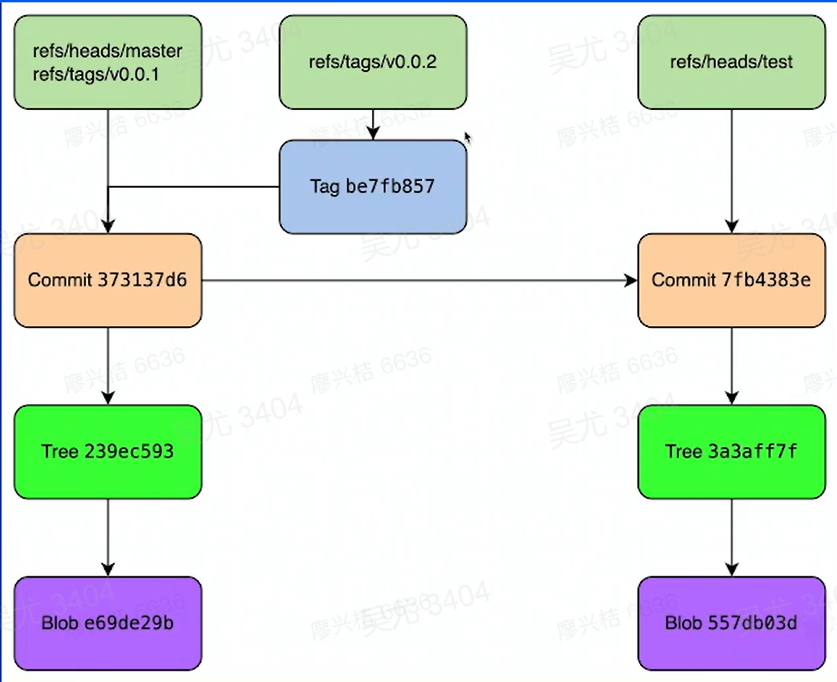

## Git Clone & Pull & Fetch

> Clone

拉取完整的仓库到本地目录，可以指定分支，深度

> Fetch

将远端某些分支最新代码拉取到本地，不会执行merge操作。

去修改 refs/remote 内的的分支信息，如果需要地代码合并需要手动操作。

> Pull

拉取远端某分支，并和本地代码进行合并，操作等同于 git fetch + git merge，也可以通过 git pull --rebase 完成git fetch + git rebase操作。

可能存在冲突，需要解决冲突。

## Git Push

常用命令：一般使用git push origin master 命令即可完成

冲突问题：

- 如果本地 commit 记录和远端 commit 历史不一致，则会产生冲突，比如 git commit --amend or git rebase 都有可能导致这个问题
- 如果该分支就自己一个人使用，或者团队确认可以修改历史则可以通过 git push origin master -f来完成强制推送，一般不推荐主干分支进行该操作，正常都应该解决冲突后再进行推送

推送规则限制：可以通过保护分支，来配置一些保护规则，防止误操作，或者一些不合规的操作出现，导致代码丢失

# Git研发流程

- 依托代码管理平台Gitlab/Github/Gerrit介绍我们如何进行代码的开发及团队合作

## 常见问题

> 在 Gerrit 平台上使用 Merge 的方式合入代码

Gerrit 是集中式工作流，不推荐使用 Merge 方式合入代码，应该在主干分支开发后，直接Push。

> 不了解保护分支，Code Review ，CI 等概念，研发流程不规范

保护分支：防止用户直接向主干分支提交代码，必须通过 PR来进行合入。

Code Review， CI：都是合入前的检查策略，Code Review 是人工进行检查，CI则是通过一些定制化的脚本来进行一些校验

> 代码历史混乱，代码合并方式不清晰

不理解 Fast Forward 和 Three Way Merge 的区别，本地代码更新频繁的使用 Three Way 的方式，导致生成过多的 Merge 节点，使提交历史变得复杂不清晰

## 不同的工作流

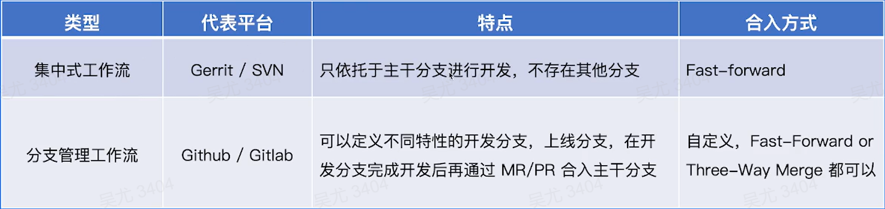

## 集中式工作流

> 什么是集中式工作流？

只依托于master分支进行研发活动

> 工作方式

- 获取远端 master 代码
- 直接再master 分支完成修改
- 提交拉取最新的 master 代码和本地代码进行合并（使用 rebase），如果有冲突需要解决冲突
- 提交本地代码到 master

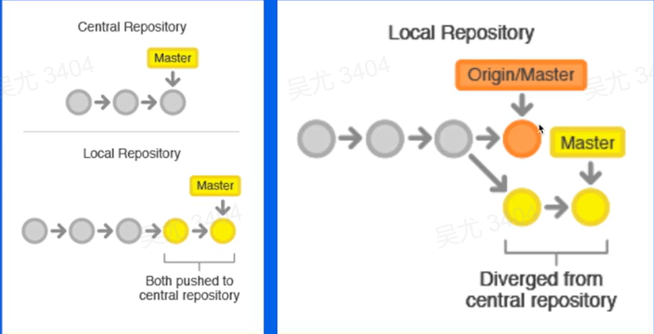

### Gerrit

Gerrit 的由 Google 开发的一款代码托管平台，主要的特点就是能够很好的进行代码评审。在 aosp（android open source project）中使用的很广，Gerrit 的开发流程就是一种集中式工作流。

> 基本原理

- 依托于 Change ID 概念，每个提交生成一个单独的代码评审
- 提交上去的代码不会存储在真正的 refs/heads/ 下的分支中，而是存在一个 refs/for/ 的引用下
- 通过 refs/meta/config 下的文件存储代码的配置，包括权限，评审等配置，每个 Change 却必须要完成 Review 后才能合入。

> 优点

- 提供强制的代码评审机制，保证代码的质量
- 提供更丰富的权限功能，可以针对分支做细粒度的权限管控
- 保证 master 的历史整洁性
- Aosp多仓的场景支持更好

> 缺点

- 开发人员较多的情况下，更容易出现冲突
- 对于多分支的支持较差，想要区分多个版本的线上代码时，更容易出现问题
- 一般只有管理员才能创建仓库，比较难以在项目之间形成代码复用，比如类似的fork操作就不支持

## 分支管理工作流

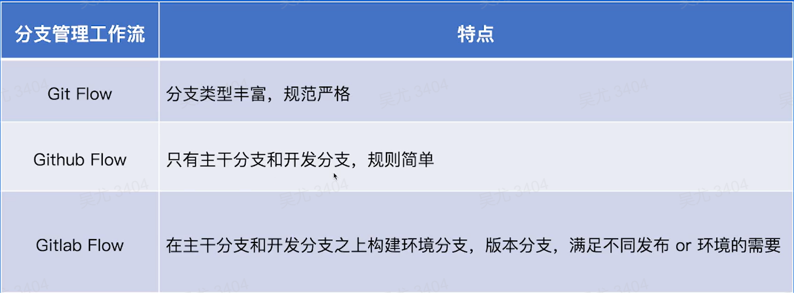

### GitFlow

Git Flow时比较早期出现的分支管理策略。

- 包含五种类型的分支
  - Master：主干类型
  - Develop：开发分支
  - Feature：特性分支
  - Release：发布分支
  - Hotfix：热修复分支

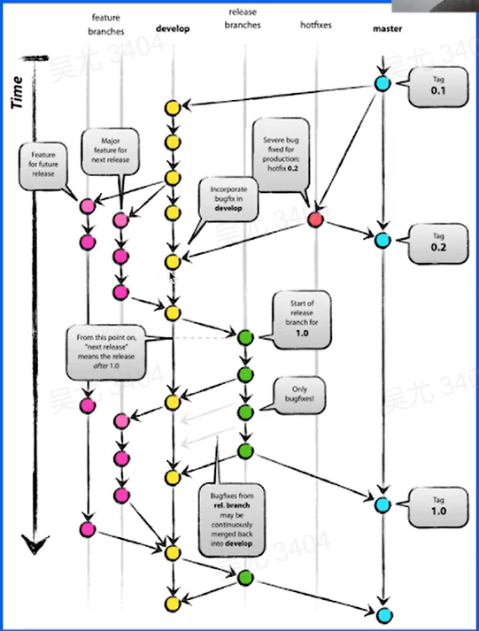

- 优点：如果能按照定义的标准严格执行，代码会很清晰，并且很难出现混乱
- 缺点：流程过于复杂，上线的节奏比较慢，由于太复杂，研发容易不按照标准执行，从而导致代码出现混乱。

### Github Flow

Github的工作流，只有一个主干分支，基于Pull Request 往主干分支中提交代码

选择团队合作的方式

- owner 创建好仓库后，其它用户通过Fork的方式来创建自己的仓库，并在fork的仓库上进行开发
- owner 创建好仓库后，统一给团队成员分配权限，直接在同一个仓库内进行开发

### Gitlab Flow

Gitlab 推荐的工作流是在 GitFlow 和 Github Flow 上做出优化，既保持了单一主分支的简便，又可以适应不同的开发环境

> 原则：upstream first 上游优先

只有在上游分支采纳的代码才可以进入到下游分支，一般上游分支就是 master

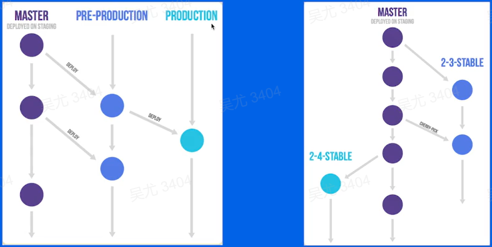

## 代码合并

> Fast-Forward

不会产生一个 merge 节点，合并后保持一个线性历史，如果 target 分支有了更新，则需要 rebase 操作更新，source branch 后才可以合入

`git merge test --ff-only`

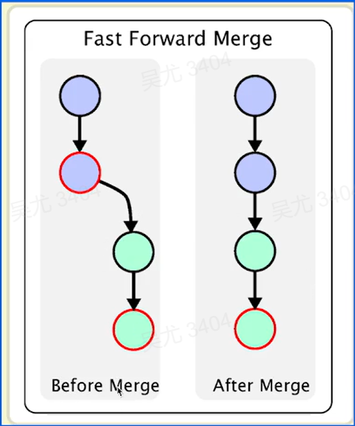

> Three-Way Merge

三方合并，会产生一个新的 merge 节点

`git merge test --no-ff`

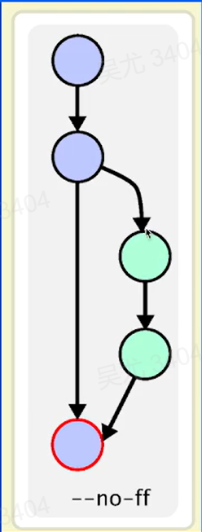

## 如何选择合适的工作流

> 选择原则

没有最好的，只有最合适的

> 针对小型团队合作，推荐使用 Github 工作流即可

- 尽量保证少量多次，最好不要一次性提交上千行代码
- 提交 Pull Request 后最少需要保证有 CR 后再合入
- 主干分支尽量保持整洁，使用 fast -forward 合入方式，合入前进行 rebase

> 大型团队合作

根据自己的需要指定不同的工作流，不需要局限再某种流程中