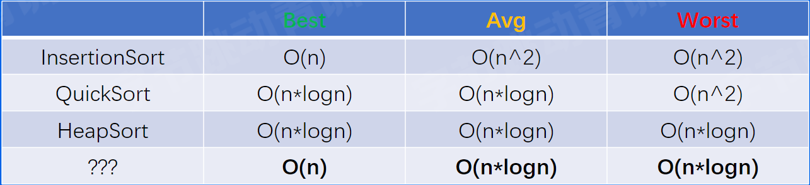

# 为什么要学习数据结构和算法

> 例子—抖音直播排行榜功能

规则：某个时间段中，直播间礼物数TOP10房间获得奖励，需要在每个房间展示排行榜

解决方案：

- 礼物数量存储在 Redis-zset中，使用 skiplist使得元素整体有序
- 使用 Redis 集群，避免单机压力过大，使用主从算法、分片算法
- 保证集群原信息的稳定，使用一致性算法
- 后端使用 缓存算法（LRU）降低Redis压力，展示房间排行榜

数据结构和算法基础存在程序开发中的所有地方

> 什么是最快的排序算法

Python-timesort 

C++-introsort

Rust-pdqsort

> Go 的排序算法有没有提升空间？

Go（<=1.18）-introsort

重新实现了Go的排序算法，在某些场景中比之前算法快 ~10倍，成为Go1.19的默认排序算法

- Go 1.19 的排序算法是如何设计的？
- 生成环境中使用的排序算法和课本上的排序算法有什么区别？
- Go 语言的排序算法是快速排序吗？

# 经典排序算法

## 插入排序

将元素不断插入已经排好序的array中

- 起始只有一个元素5，其本身是一个有序序列
- 后续元素插入有序序列中，即不断交换，直到找到第一个比其小的元素

> 时间复杂度

最好：O(n)

平均：O(n^2)

最坏：O(n^2)

## 快速排序

分治思想，不断分割序列直到序列整体有序

- 选定一个pivot（轴点）
- 使用 pivot分割序列，分成比轴点大和比轴点小两个序列

> 时间复杂度

最好：O(nlogn)

平均：O(nlogn)

最坏：O(n^2)

## 堆排序

利用堆的性质形成的排序算法

- 构造一个大顶堆
- 将根节点（最大元素）交换到最后一个位置，调整整个堆，如此反复

> 时间复杂度

最好：O(nlogn)

平均：O(nlogn)

最坏：O(nlogn)

## 实际场景 benchmark

根据序列元素排列情况划分

- 完全随机的情况（random）
- 有序/逆序的情况（sorted/reverse）
- 元素重复度比较高的情况（mod8）

在此基础上，还需要根据序列长度的划分（16/128/1024）

> 随机

- 插入排序在短序列中速度最快
- 快速排序在其他情况中速度最快
- 堆排序速度于最快算法差距不大

> 有序

- 插入排序在序列已经有序的情况下最快

> 结论

- 所有短序列和元素有序情况下，插入排序性能最好
- 在大部分的情况下，快速排序有较好的综合性能
- 几乎在任何情况下，堆排序的表现比较稳定

> 设计一个更好的算法

我们在市内出行的时候，常常会选择多种工具来到达目的地，排序算法是否也可以如此？

# 从零开始打造 pdqsort

## 简介

pdqsort（pattern-defrating-quicksort）是一种不稳定的**混合**排序算法，它的不同版本被应用在C++ BOOST、Rust 以及 Go1.19中。他对常见的序列类型做了特殊的优化，使得在不同条件下都拥有不错的性能

## v1

结合三种排序方法的优点

- 对于短序列(小于一定长度)我们使用插入排序
- 其他情况，使用快速排序来保证整体性能
- 当快速排序表现不佳时，使用堆排序来保证最坏情况下时间复杂度仍然
  为0(n*logn)

Q&A

> 短序列的具体长度是多少呢?

12 - 32， 在不同语言和场景中会有不同，在泛型版本根据测试选定24

> 如何得知快速排序表现不佳，以及何时切换到堆排序?

当最终pivot的位置离序列两端很接近时(距 离小于length/8)判定其表现
不佳，当这种情况的次数达到limit (即bits.Len(length))时，切换到堆排序

- 对于短序列(<=24) 我们使用插入排序
- 其他情况，使用快速排序(选择首个元素作为pivot)来保证整体性能
- 当快速排序表现不佳时(limit==0) ，使用堆排序来保证最坏情况下时 间复杂度仍然为O(n*logn)

> 如何让 pdqsort速度更快？

- 尽量使得 QuickSort 的 pivot 为序列的中位数 —> 改进 choose pivot
- Partition 速度更快 -> 改进 partition，但是此优化在 Go表现不好，忽略

## v2

> 思考关于pivot的选择

- 使用首个元素作为pivot(最简单的方案)实现简单，但是往往效果不好，例如在sorted情况下性能很差
- 遍历数组，寻找真正的中位数遍历比对代价很高，性能不好

寻找pivot所需要的开销 && pivot带来的性能优化 —> 寻找近似中位数!

> 根据序列长度的不同，来决定选择策略

优化-Pivot的选择

- 短序列(<=8)，选择固定元素
- 中序列(<=50)，采样三个元素，median of three
- 长序列(>50)，采样九个元素，median of media

> Pivot的采样方式使得我们有探知序列当前状态的能力!

- 采样的元素都是逆序排列一>序列可能已经逆序一>翻转整个序列
- 采样的元素都是顺序排列一>序列可能已经有序一>使用插入排序

注：插入排序实际使用partiallnsertionSort,即有限制次数的插入排序

Version1升级到version2优化总结

- 升级pivot 选择策略(近似中 位数)
- 发现序列可能逆序，则翻转序列->应对reverse场景
- 发现序列可能有序，使用有限插入排序->应对sorted场景

> 还有什么场景我们没有优化?

- 短序列情况——使用插入排序(v1)
- 极端情况——使用堆排序保证算法的可行性(v1)
- 完全随机的情况(random)——更好的pivot选择策略(v2)
- 有序/逆序的情况(sorted/reverse)——根据序列状态翻转或者插入排序(v2)
- 元素重复度较高的情况(mod8)——?

### v3

> 如何优化重复元素很多的情况?

- 采样pivot的时候检测重复度?

  不是很好，因为采样数量有限，不一定能采样到相同元素

解决方案:

如果两次partition生成的pivot相同，即partition进行了无效分割，此时认为pivot 的值为重复元素(相比上一种方法有更高的采样率)

> 优化-重复元素较多的情况(partitionEqual)

当检测到此时的pivot和上次相同时(发生在leftSubArray)，使用partitionEqual将重复元素排列在一起，减少重复元素对于pivot选择的干扰

> 优化-当pivot选择策略表现不佳时，随机交换元素

避免一些极端情况使得QuickSort总是表现不佳，以及一些黑客攻击情况

> Go 1.19 default

> 一台云服务器上的测试

- 在有序或者逆序的情况下提升10x
- 其他情况下有 10 ~ 50 % 提升

> 高性能的排序算法是如何设计的?

根据不同情况选择不同策略，取长补短

> 生产环境中使用的的排序算法和课本上的排序算法 有什么区别? 

理论算法注重理论性能，例如时间、空间复杂度等。生产环境中的算法需要面 对不同的实践场景，更加注重实践性能

> Go语言(<=1.18)的排序算法是快速排序么? 

实际一直是混合排序算法，主体是快速排序。Go <= 1.18时的算法也是基于 快速排序，和pdqsort的区别在于fallback时机、pivot 选择策略、是否有针对不同pattern优化等