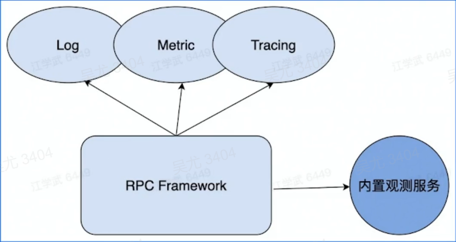
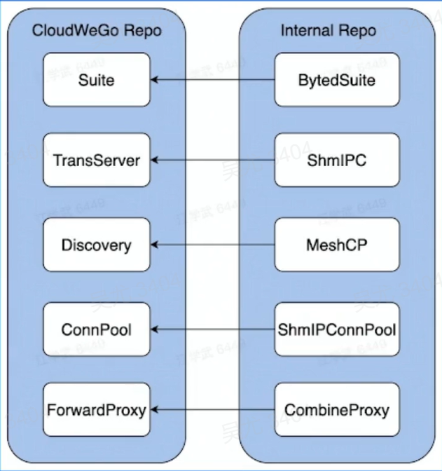

# 基本概念

## 本地函数调用

```go
import "fmt"

func main() {
   var a = 2
   var b = 3
   res := calculate(a, b)
   fmt.Println(res)
   return
}

func calculate(x, y int) int {
   return x*y
}
```

## 远程函数调用

> RPC需要解决的问题

- 函数映射
- 数据转换成字节流
- 网络传输


## RPC概念模型

1984年Nelson发表了论文《Implementing Remote Procedure Calls》，其中提出了RPC的过程由5个模型组成：User、User-Stub、RPC-Runtime、Server-Stub、Server


## 一次RPC的完整过程

- IDL（Interface description language）文件：IDL通过一种中立的方式来描述接口，使得在不同平台上运行的对象和用不同语言编写的程序可以相互通信
- 生成代码：通过编译器工具把IDL文件转化为语言对应的静态库
- 编解码：从内存中表示到字节序列的转化称为编码，反之为解码，也常叫做序列号和反序列化
- 通信协议：规范了数据在网络中的传输内容和格式。除必须的请求/响应数据外，通常还会包含包含额外的元数据
- 网络传输：通常基于成熟的网络库走TCP/UDP传输


## RPC的好处

- 单一职责，有利于分工协作和运维开发
- 可扩展性强，资源使用率更优
- 故障隔离，服务的整体可靠性更高


## RPC带来的问题

- 服务宕机，对方应该如何处理？
- 在调用过程中发生网络异常，如何保证消息的可达性？
- 请求量突增导致服务无法即使处理，有哪些应对措施？


# 分层设计

> 以Apache Thrift为例


## 编解码层


> 生成代码


> 数据格式

- 语言特定的格式：许多编程语言都内建了将内存对象编码为字节序列的支持，例如Java由 `java.io.Serializable`
- 文本格式：JSON、XML、CSV 等文本格式，具有人类可读性
- 二进制编码：具有跨语言和高性能等优点，常见有 Thrift 的BinaryProtocol、Protobuf 等

> 二进制编码

TLV编码：

- Tag：标签，可以理解为类型
- Length：长度
- Value：值，Value 也可以是一个 TLV结构


> 选型

- 兼容性：支持自动增加新的字段，而不影响老的服务，这将提高系统的灵活度
- 通用性：支持跨平台、跨语言
- 性能：从空间和时间两个维度来考虑，也就是编码后数据大小和编码耗费时长

## 协议层


> 概念

- 特殊结束符：一个特殊字符作为每个协议单元结束的标示


- 变长协议：以定长加不定长的部分组成，其中定长的部分需要描述不定长的内容长度


> 协议构造


- LENGHT：数据包大小，不包含自身
- HEADER MAGIC：标识版本信息，协议解析时候快速校验
- SEQUENCE NUMBER：表示数据包的 seqID，可以用于多路复用，单链接内递增
- HEADER SIZE：头部长度，从第14个字节开始计算吗一直到 PAYLOAD 前
- PROTOCOL ID：编解码方式，有别Binary 和 Compact 两种
- TRANSFORM ID：压缩方式，如 zlib 和 snappy
- INFO ID：传递一些定制的 meta 信息
- PAYLOAD：消息体

> 协议解析


## 网络通信层

> Sockets API


> 网络库

- 提供易用 API
  - 封装底层 Socket API
  - 连接管理和事件分发
- 功能
  - 协议支持：tcp、udp和uds等
  - 优雅退出、异常处理等
- 性能
  - 应用层 buufer 减少 copy
  - 高性能定时器、对象池等

# 关键指标

## 稳定性

> 保障策略

- 熔断：保护调用方，防止被调用的服务出现问题而影响到整个链路（A调用B，B调用C，B调用C出现问题，A频繁调用B，请求堆积从而导致服务雪崩的问题）
- 限流：保护被调用方，防止大流量把服务压垮
- 超时控制：避免浪费资源在不可用节点上


> 请求成功率

- 负载均衡
- 重试


> 长尾请求

- Backup Request（备份请求）


> 注册中间件


## 易用性

- 开箱即用：合理的默认参数选项、丰富的文档
- 周边工具：生成代码工具、脚手架工具


## 扩展性

- Middleware
- Option
- 编解码层
- 协议层
- 网络传输层
- 代码生成工具插件扩展


## 观测性

- Log、Metric、Tracing
- 内置观测性服务



## 高性能

> 场景

- 单机多机
- 单连接多连接
- 单/多client 单/多server
- 不同大小的请求包
- 不同请求类型：例如pingpong、streaming等

> 目标

- 高吞吐
- 低延迟

> 手段

- 连接池
- 多路复用
- 高性能编解码协议
- 高性能网络库

# 企业实践

## 整体架构

- Kitex Core：核心组件
- Kitex Byted：与公司内部基础设施集成
- Kitex Tool：代码生成工具


## 自研网络库

> 背景

- 原生库无法感知连接状态：在使用连接池时，池中存在失效连接，影响连接池的复用。
- 原生库存在 goroutine 暴涨的风险，由于连接利用率低下，存在大量 goroutine占用调度开销，影响性能。

> Netpoll

- **解决无法感知连接状态问题**：引入 epoll 主动监听机制，感知连接状态
- **解决 goroutine 暴涨的风险**：建立 goroutine 池，复用 goroutine
- **提升性能**：引入 Nocopy Buffer，向上层提供NoCopy 的调用接口，编解码层面零拷贝

## 扩展性设计

支持多协议，也支持灵活的自定义协议扩展


## 性能优化

> 网络库优化

- 调度优化：
  - epoll_wait 在调度上的控制
  - gopool 重用 goroutine 降低同时运行协程数
- LinkBuffer：
  - 读写并行无锁，支持 nocopy 地流失读写
  - 高效扩缩容
  - Nocopy Buffer 池化，减少 GC
- Pool
  - 引入内存池和对象池，减少 GC 开销

> 编解码优化

- Codegen
  - 预计算并预分配内存，减少内存操作次数，包括内存分配和拷贝
  - Inline 减少函数调用次数和避免不必要的反射操作等
  - 自研了 Go 语言实现的 Thrift IDL 解析和代码生成器，支持完善的 Thrift IDL 语法和语义检查，并支持了插件机制 — Thriftgo
- JIT
  - 使用 JIT 编译技术改善用户体验的同时带来更强的编解码性能，减轻用户维护生成代码的负担
  - 基于 JIT 编译技术的高性能动态 Thrift 编解码器 — Frugal

## 合并部署

微服务过微，传输和序列化开销越来越大

将亲和性强的服务实例尽可能调度到同一个物理机，远程 RPC 调用优化为本地 IPC调用


- 中心化的部署调度和流量控制
- 基于共享内存的通信协议
- 定制化的服务发现和连接池实现
- 定制化的服务启动和监听逻辑

某抖音服务，30%合并流量，服务端 CPU 减少 19%，延迟 TCO 减少 29%

