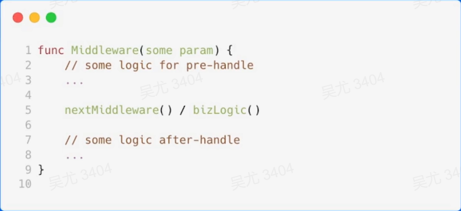

## 课程背景


# 再谈HTTP协议

## HTTP协议是什么

HTTP：超文本传输协议（Hypertext Transfer Protocol）


## 为什么需要协议

****

需要明确的边界

- 开始
- 结束

能够携带信息

- 什么消息
- 消息类型
- ....

> 一个常见的POST请求在协议层究竟做了什么？

## 协议里面有什么


- 请求行
  - 方法名
    - GET
    - HEAD
    - POST
    - PUT
    - DELETE
    - CONNECT
    - OPTIONS
    - TRACE
    - PATCH
  - URL
  - 协议版本

- 状态行
  - 协议版本
  - 状态码
    - 1xx：信息类
    - 2xx：成功
    - 3xx：重定向
    - 4xx：客户端错误
    - 5xx：服务端错误
  - 状态码描述


- 请求头/响应头
- 请求体/响应体

```go
import (
   "github.com/gin-gonic/gin"
   "net/http"
)

func main() {
   router := gin.Default()

   router.POST("/sis", func(ctx *gin.Context) {
      ctx.Data(200, "text/plain; charset=utf-8", []byte("OK"))
   })
   server := &http.Server{
      Handler: router,
   }
   server.ListenAndServe()
}
```

## 请求流程


## 不足和展望


# HTTP框架的设计与实现

## 分层设计

- 专注性
- 扩展性
- 复用性


- 高内聚、低耦合
- 易复用
- 高扩展


一个切实可行的复杂系统势必是从一个切实可行的简单系统发展而来的。从头开始设计的复杂系统根本不切实可行，无法修修补补让它切实可行。你必须由一个切实可行的简单系统重新开始。

## 应用层设计

> 提供合理的API

- 可理解性：如 ctx.Body()
- 冗余性：ctx.Body()，ctx.GetBody()
- 兼容性：不要用ctx.BodyA()
- 简单性：如 ctx.Request.Header.Peeek(key) / ctx.GetHeader(key)
- 可测性
- 可见性

不要试图在文档中说明，很多用户不看文档

## 中间件设计

> 中间件需求

- 配合Handler实现一个完整的请求处理生命周期
- 拥有预处理逻辑与后处理逻辑
- 可以注册多中间件
- 对上层模块用户逻辑模块易用

> 洋葱模型

适用场景：

- 日志记录
- 性能统计
- 安全控制
- 事务处理
- 异常处理


举例：打印每个请求的 request 和 response


既然要实现预处理和后处理，那这个就很像调用了一个函数



路由上可以注册多 Middleware ，同时也可以满足请求级别有效，只需要将 Middleware 设计为和业务 Handler 相同即可。


用户如果不主动调用下一个处理函数怎么办？核心：在任何场景下index保证递增


出现异常想停止怎么办？


调用链


有没有什么坑呢？不在同一个调用栈上

适用场景：

- 不调用 Next：初始化逻辑且不需要在同一调用栈
- 调用 Next：后处理逻辑或需要在同一调用栈上

## 路由设计

框架路由实际上就是为 URL 匹配对应的处理函数（Handlers）

- 静态路由：/a/b/c、/a/b/d
- 参数路由：/a/:id/c（/a/b/c，/a/d/c）、/*all
- 路由修复：/a/b <-> /a/b/
- 冲突路由以及优先级：/a/b、/:id/c
- 匹配 HTTP 方法
- 多处理函数：方便添加中间件


- 青铜：

`map[string]handler`

- 黄金：

前缀匹配树


如何处理带参数的路由注册？

- /a/b/c
- /a/b/d
- /a/:b/d
- /a/:c/f


> 如何匹配 HTTP 方法？

外层 Map：根据 method 进行初步筛选


> 如何实现添加多处理函数？

在每个节点上使用一个 list 存储 handler


## 如何做设计

- 明确需求：考虑清楚要解决什么问题、有哪些需求
- 业界调研：业界都有哪些解决方案可供参考
- 方案权衡：思考不同方案的取舍
- 方案评审：相关同学对不同方案做评审
- 确定开发：确定最合适的方案进行开发

## 协议层设计

抽象出合适的接口：


- 不要将 contexts 放在结构体中，相反，通过 contexts 明确的指出需要的函数，contexts必须为第一个参数
- 需要在连接上数据

## 网络层设计

BIO


NIO


`go net` "BIO" 用户管理buffer


`netpoll` NIO 网络库管理 buffer


# 性能修炼之道

## 针对网络库的优化

go net

- 存下全部 Header
- 减少系统调用次数
- 能够复用内存
- 能够多次读
- "BIO"


go net with bufio 绑定一块缓冲区


netpoll 

- 存下全部的 Header
- 拷贝出完整的 Body


netpoll with nocpoy peek

- 分配足够大的 buffer
- 限制最大 buffer size


> 不同网络库优势

go get

- 流式友好
- 小包性能高

netpoll

- 中大包性能高
- 时延低

## 针对协议的优化

找到 Header Line 边界：\r\n

先找到 \n 再看它前一个是不是 \r


那能不能更快呢？ SIMD

相关代码：https://github.com/golang/go/blob/9a6acc83c853c17700c44e336e2d3e2c0fe9a72b/src/internal/bytealg/indexbyte_amd64.s#L8

Sonic：https://github.com/bytedance/sonic

> Headers 解析


针对协议相关的 Header 快速解析：

- 通过 Header key 首字母快速筛除掉完全不可能的 key
- 解析对应 value 到独立字段
- 使用 byte slice 管理对应 header 存储，方便复用

请求体中同样处理的Key：

User-Agent、Content-Type、Content-Length、Connection、Transfer-Encoding


> Header key 规范化

`aaa-bbb` -> `Aaa-Bbb`：`ToUpperTable[b[i]]`


## 热点资源池化


# 企业实践

- 追求性能
- 追求易用，减少误用
- 打通内部生态
- 文档建设，用户群建设

> 内部 HTTP 框架：Hertz

1万+服务 3千万+QPS
