# 经典案例

## 数据的产生

用户注册

## 数据的流动

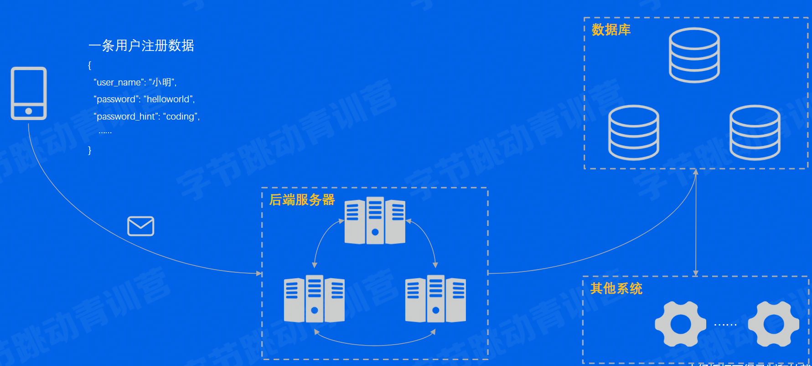

## 数据的持久化

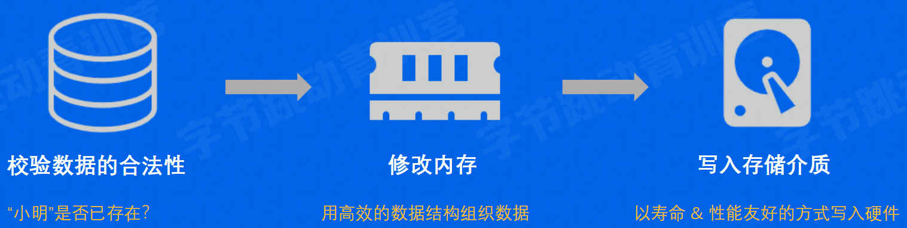

## 潜在的问题

- 数据库怎么保证数据不丢？
- 数据库怎么处理多人同时修改的问题？
- 为什么用数据库，除了数据库还能存到别的存储系统吗？
- 数据库只能处理结构化数据吗？
- 有哪些操作数据库的方式，要用什么编程语言？

# 存储&数据库简介

## 系统概览

> 什么是存储系统？

一个提供了读写、控制类接口，能够安全有效地把数据持久化的软件，就可以称为存储系统

## 系统特点

## 存储器层级结构

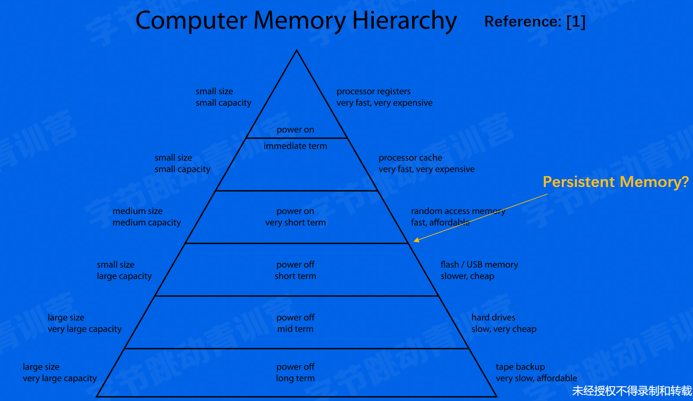

## 数据怎么从应用到存储介质

- 缓存：很重要，贯穿整个存储体系
- 拷贝：很昂贵，应该尽量减少
- 硬件设备五花八门，需要有抽象统一的接入层

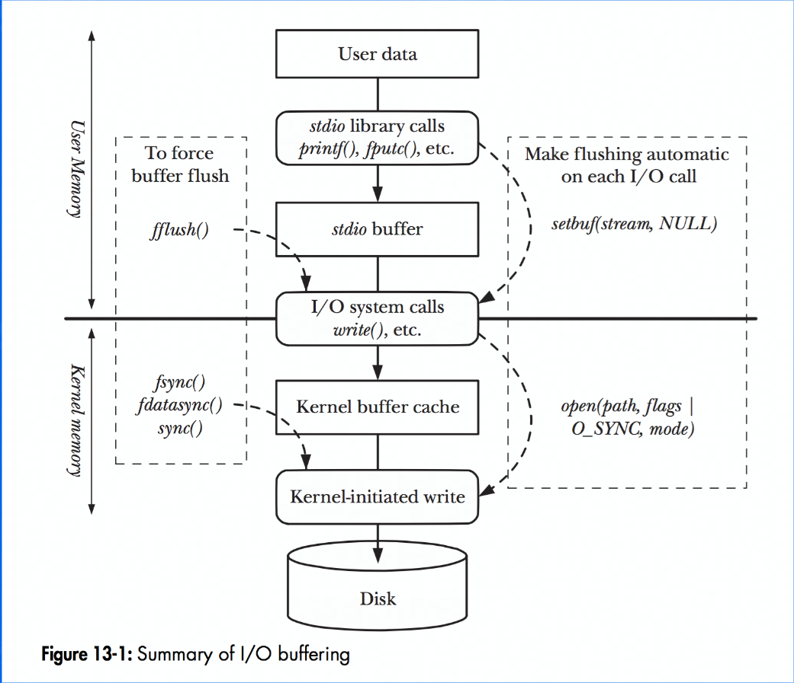

## RAID技术

> 单机存储怎么做到高性能/高性价比/高可靠性？

**R**(edudant)**A**(array)of**I**(nexpensive)**D**(isks)

RAID出现的背景：

- 单块大容量磁盘的价格 > 多块小容量磁盘
- 单块磁盘的写入性能 < 多块磁盘的并发写入性能
- 单块磁盘的容错能力 有限，不够安全

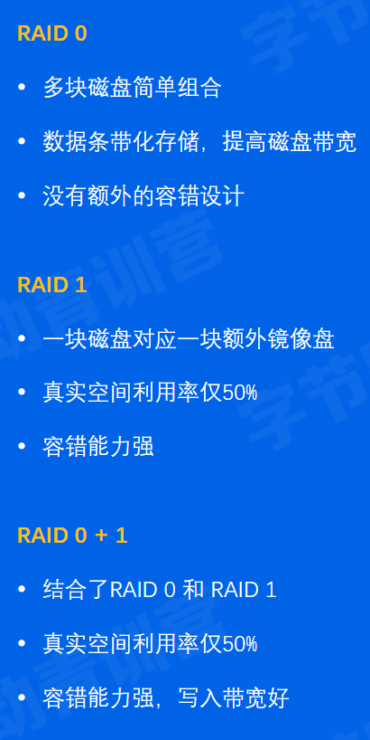

## 数据库

难道数据库和存储系统不一样吗？

- 关系型数据库
- 非关系型数据库

> 概览

关系是什么？

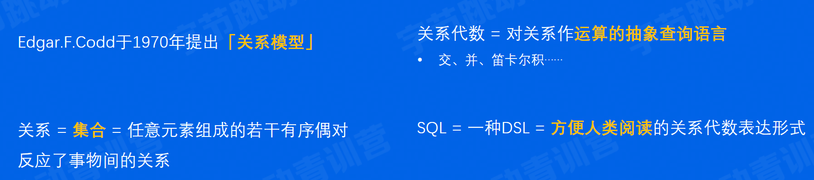

> 关系型数据库是存储系统，但是在存储之外，又发展出其他能力

> 非关系型数据库也是存储系统，但是一般不要求严格的结构化

### 数据库VS经典存储

> 结构化数据管理

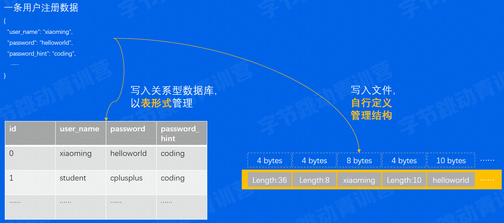

> 事务能力

凸显出数据库支持事务的优越性

事务具有：

- Atomicity，事务内的操作要么全做，要么不做
- Consisitency，事务执行前后，数据状态是一致的
- Isolation，可以隔离多个并发事务，避免影响
- Durability，事务一旦提交成功，数据保持持久性

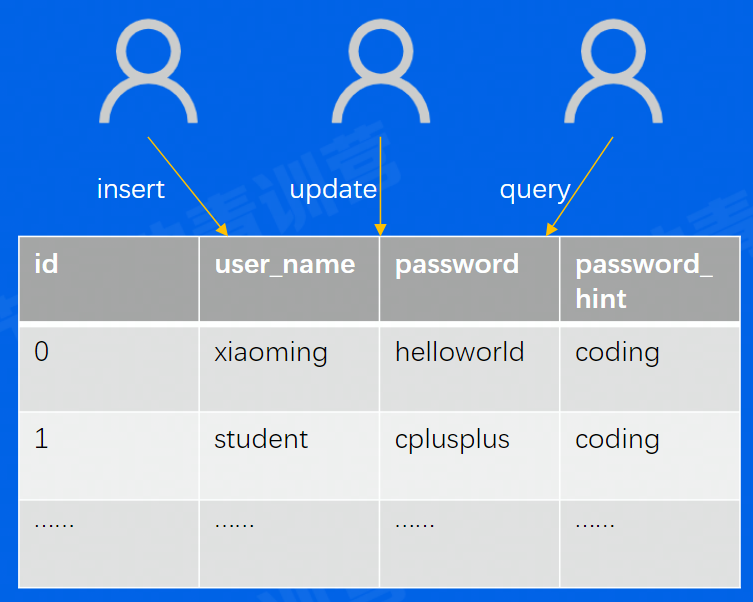

> 复杂查询能力

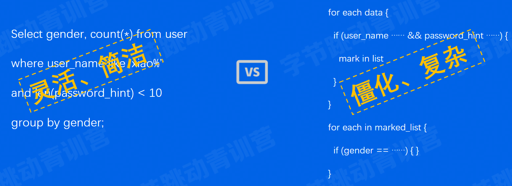

## 数据库使用方式

以SQL为例，要操作数据时，支持以下操作：

- Insert
- Update
- Select
- Delete
- Where子句
- GroupBy
- OrderBy

要对数据定义做修改时，支持以下操作：

- Create user
- Create database
- Create table
- Alter table
- ......

# 主流产品剖析

## 单机存储

> 概览

单机存储=单个计算机节点上的存储软件系统，一般不涉及网络交互

- 本地文件系统
- key-value存储

> 本地文件系统

Linux经典管理单元：文件

文件系统接口：文件系统繁多，如Ext2/3/4，sysfs，rootfs，但都遵循VFS的统一抽象接口

Linux文件系统的两大数据结构：Index Node & Directory Entry

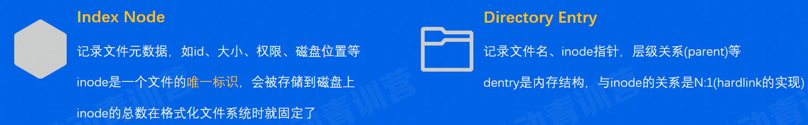

> key-value存储

常见使用方式：put(k, v) & get(k)

常见数据结构：LSM-Tree，某种程度上牺牲读性能，追求写入性能

拳头产品：RocksDB

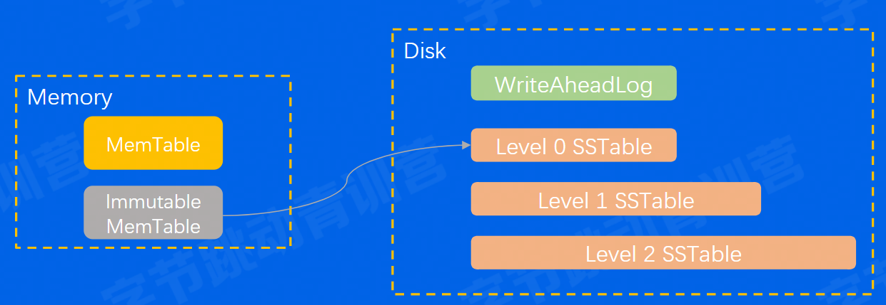

## 分布式存储

分布式存储=在单机存储基础上实现了分布式协议，涉及大量网络交互

- 分布式文件系统
- 分布式对象存储

> HDFS

HDFS：堪称大数据时代的基石

时代背景：专用的高级硬件很贵，同时数据存量很大，要求超高吞吐

HDFS核心：

- 支持海量数据存储
- 高容错性
- 弱POSIX语义
- 使用普通x86服务器，性价比高

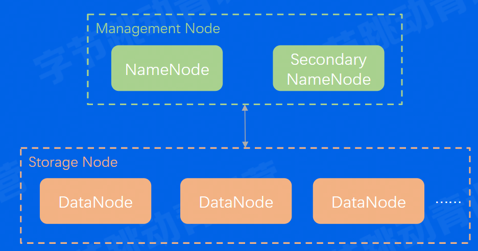

> Ceph

Ceph：开源分布式存储系统里的万金油

Ceph的核心特点：

- 一套系统支持对象接口、块接口、文件接口，但是一切皆对象
- 数据写入采用主备复制模式
- 数据分布模型采用CRUSH算法（HASH+权重+随机抽签）

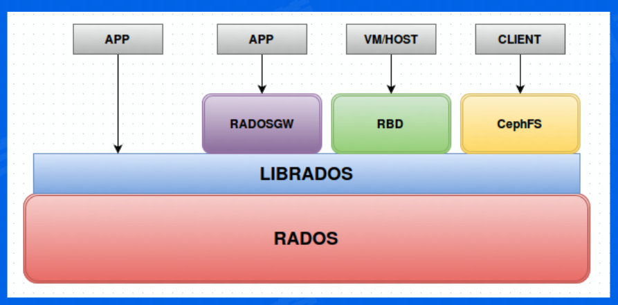

## 单机关系型数据库

商业产品 Oracle 称王，开源产品 MySQL & PostgreSQL 称霸

关系型数据库的通用组件：

- Query Engine：负责解析query，生成查询计划

- Txn Manager：负责事务并发管理

- Lock Manager：负责锁相关的策略

- Storage Engine：负责组织内存/磁盘数据结构

- Replication：负责主备同步

关键内存数据结构：

- B-Tree
- B+Tree
- LRU List等

关键磁盘数据结构：

- WriteAheadLog（RedoLog）
- Page

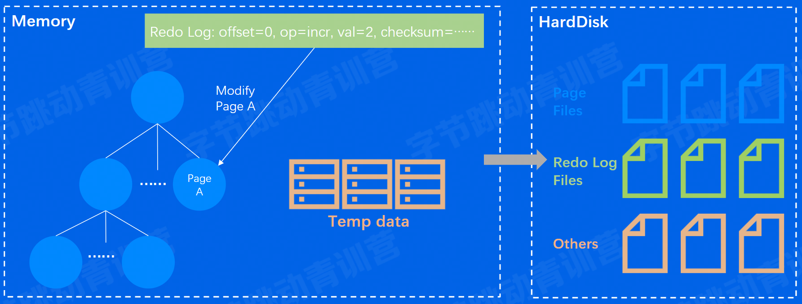

## 单机非关系型数据库

MongoDB、Redis、Elasticsearch三足鼎立

- 关系型数据库一般直接使用SQL交互，而非关系型数据库交互方式各不相同
- 非关系型数据库的数据结构千奇百怪，没有关系约束后，schema相对灵活
- 不管是否关系型数据库，大家都在尝试支持SQL（子集）和”事务“

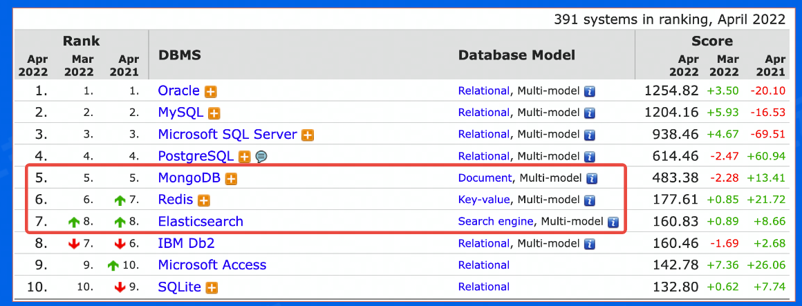

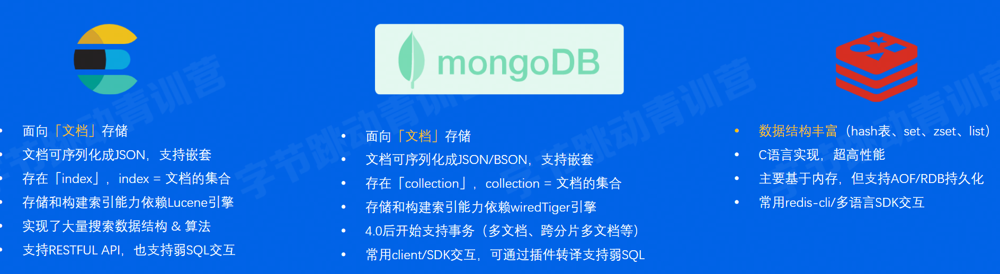

> Elasticsearch使用案例

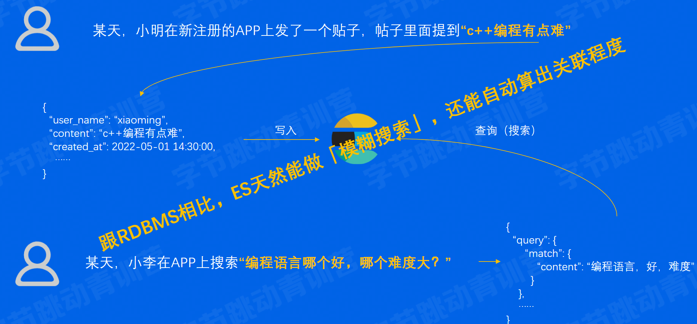

## 分布式数据库

> 解决容量问题

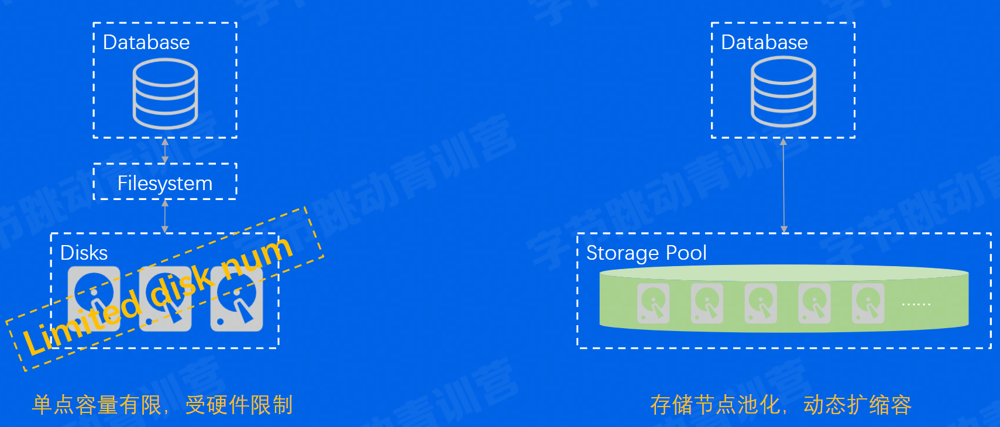

> 解决弹性问题

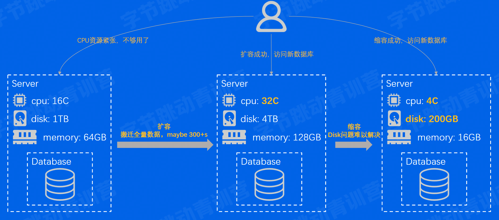

> 解决性价比问题

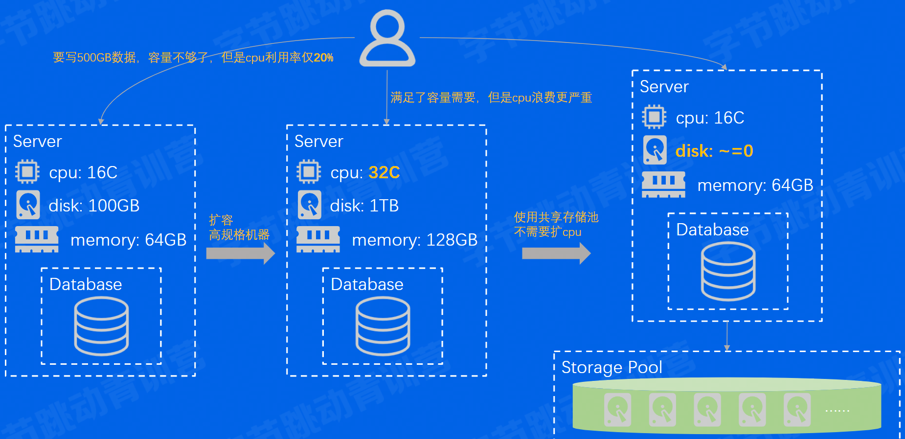

> 更多需要做的

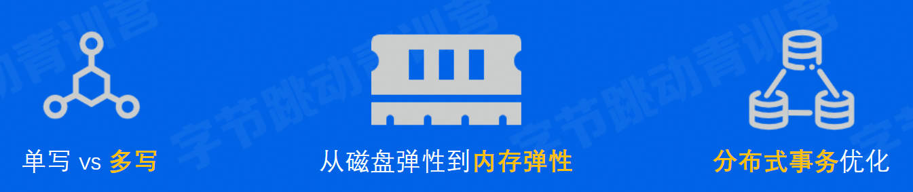

# 新技术演进

> 概览

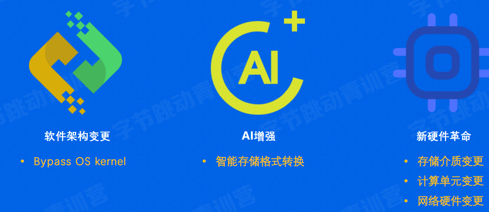

> SPDK

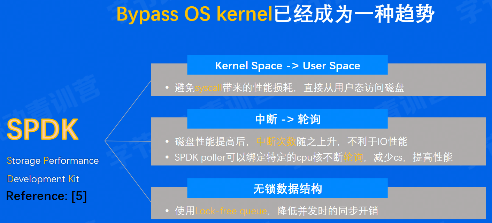

> AI & Storage

AI 领域相关技术，如机器学习在很多领域：如推荐、风控、视觉领域证明了有效性

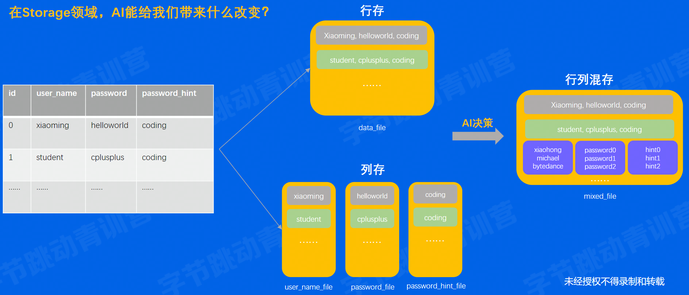

