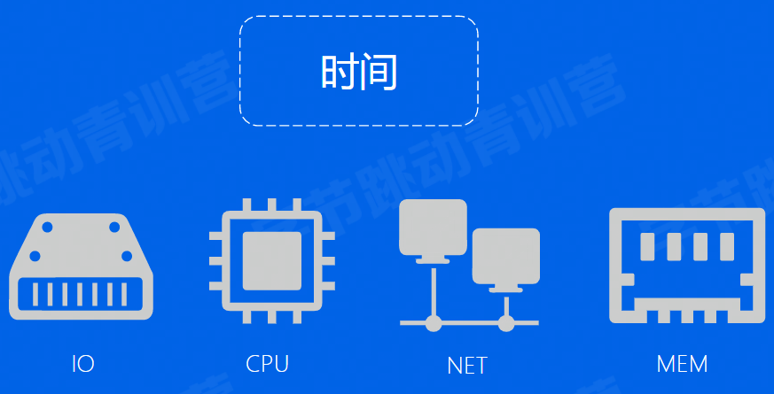

# 经典案例

## 从一场红包雨说起


## RDBMS 事务 ACID

事务（Transaction）：是由一组SQL语句组成的一个程序执行单元（Unit），它需要满足ACID特性。

```sql
B
UPDATE account_table SET balance = balance - '小目标' WHERE name = '抖音';
UPDATE account_table SET balance = balance + '小目标' WHERE name = 'view6view';
COMMIT;
```

- 原子性Atomicity：事务是一个不可再分割的工作单元，事务中的操作要么都发生，要么都不发生
- 一致性Consisitency：数据库事务不能破坏关系数据的完整性以及业务逻辑上的一致性
- 隔离型Isolation：可以隔离多个并发事务，避免影响
- 持久性Durability：事务一旦提交成功，数据保持持久性，不会被混滚

## 红包雨与ACID

> case1：抖音的账户上扣了一个亿之后，假设服务器挂了，还没来得及给用户账户加上一个亿


两个事务要么同时成功。要么同时失败，不存在中间状态

> case2：假设抖音的账户上只有0.5个亿，但是减扣一个亿的操作成功了


每个操作都必须是合法的，账户信息应该从一个有效的状态变成另一个有效的状态

> case3：用户从抖音抢了一个亿红包，又从头条抢了一个亿，两个转账同时进行，假设他们都以为是从零开始更新用户的账户余额，用户最后得到了一个亿


两个操作在对同一个账户并发进行操作时，应该是相互不影响，表现得像是串行操作

> case4：抖音得账户上扣了一个亿，然后用户账户上加了一个亿，但还没有写到磁盘上，这个时候服务器挂了


操作更新成功之后，更新得结果应该永久性的保留下来，不会因为宕机等问题而丢失

## 高并发

全国14亿人，假设有10亿人同时开抢红包，每秒处理一个请求，那需要31年才能完成，春节完了抖音也被大家嫌弃了....


## 高可靠

除夕晚上大家都在抖音上抢红包，这个时候服务挂掉了，程序员花费了一个多小时，终于修好了服务，“抖音宕机”上热搜


# 发展历史

## 前DBMS时代

> 人工管理


> 文件系统


## DBMS时代

1960s，传统的文件系统已经不能满足人们的需求，数据库仓库系统（DBMS）应运而生

DBMS：按照某种数据模型来组织、存储和管理数据的仓库

- 网状数据库
- 层次数据库
- 关系数据库

> 网状模型


> 层次模型


> 关系模型

https://www.seas.upenn.edu/~zives/03f/cis550/codd.pdf


> 对比


## SQL 语言

1974年IBM的Ray Boyce 和 Don Chamberlin将Code关系数据库的12条准则的数学定义以简单的关键字语法表现出来，里程碑式的提出了SQL（Structured Query Language）语言。

- 语法风格接近自然语言
- 高度非过程化
- 面向集合的操作方式
- 语言简洁，易学易用


## 历史发展


# 关键技术

## 一条SQL的一生

- SQL 引擎
- 存储引擎
- 事务引擎


## SQL引擎

### Parser

解析器（Parser）一般分为词法分析（Lexical analysis）、语法分析（Syntax analysis）、语义分析（Semantic analyzer）等步骤。


### Optimizer

为什么需要优化器（Optimizer）？


> 基于规则的优化（RBO Rule Base Optimizer）

- 条件化简


- 表连接优化

```sql
SELECT * FROM A,B,C WHERE A.a1 = B.b1 and A.a1 = C.b1;
```


- Scan优化
  - 唯一索引
  - 普通索引
  - 全表扫描

数据库索引：是数据库管理系统中辅助数据结构，以协助快速查询、更新数据库表中数据。目前数据库中最常用的索引是通过B+树实现的

> 基于代价的优化（CBO Cost Base Optimizer）

一个查询有多种执行方案，CBO会选择其中代价最低的方案去真正的执行

什么是代价？



### Executor

> 火山模型


每个 Operator 操作调用Next访问，访问下层Operator，获得下层Operator返回的一行数据，经过计算之后，将这行数据返回给上层。

优点：每个算独立的抽象实现，相互之间没有耦合，逻辑结构简单

缺点：每计算一条数据有多次函数调用开销，导致CPU效率不高

- 向量化
- 编译执行

> 向量化


每个Operator每次操作计算的 不再是一行数据，而是一批数据（Batch N行数据），计算完成后向上层算子返回一个Batch

优点：

- 函数调用次数降低为1/N
- CPU cache命中率更高
- 可以利用CPU提供的SIMD（Single Instruction Mutil Data）机制

> 编译执行


将所有的操作封装到一个函数里面，函数调用的代价也能大幅度降低

用户SQL千变万化怎么办？难道要穷举用户的所有SQL，给每一个SQL都写好一个执行函数？


## 存储引擎-InnoDB


In-Memory：

- Buffer Pool
- Change Buffer
- Adaptive Hash Index
- Log Buffer

On-Disk：

- System Tablespace（ibdata1）
- General Tablespaces（xxx.ibd）
- Undo Tablespaces（xxx.ibu）
- Temporary Tablespaces（xxx.ibt）
- Redo Log（ib_logfileN）

### Buffer Pool

MySQL中每个chunk的大小一般为128M，一个chunk下面有8192个block，每个block对应一个page（每个page16k），这样可以避免内存碎片化

分成多个instance，可以有效避免并发冲突，Page id % instance num得到它属于哪个instance


当buffer pool里的页面都被使用之后，再需要换存其他页面怎么办？淘汰已有的页面

基于什么规则淘汰：淘汰那个最近一段时间最少被访问过的缓存页了， 这种思想就是典型的LRU算法了

普通的LRU算法存在缺陷，考虑我们需要扫描100GB的表，而我们的buffer pool只有1GB,这样就会因为全表扫描的数据量大，需要淘汰的缓存页多，导致在淘汰的过程中，极有可能将需要频繁使用到的缓存页给淘汰了，而放进来的新数据却是使用频率很低的数据

MySQL确实没有直接使用LRU算法，而是在LRU算法上进行了优化

- MySQL的优化思路就是：对数据进行冷热分离，将LRU链表分成两部分，一部分用来存放冷数据， 也就是刚从磁盘读进来的数据，另一部分用来存放热点数据， 也就是经常被访问到数据

- 当从磁盘读取数据页后，会先将数据页存放到LRU链表冷数据区的头部，如果这些缓存页在1秒之后被访问，那么就将缓存页移动到热数据区的头部：如果是1秒之内被访问，则不会移动，缓存页仍然处于冷数据区中
- 淘汰时，首先淘汰冷数据区


### Page


Header：

- delete_mask：标识此条数据是否被删除
- next_ record：下一条数据的位置
- record_ type: 表示当前记录的类型


### B+ Tree

InnoDB 引擎存储数据的时候，是以页为单位的

页面内（非叶子节点page）：页目录中使用二分法快速定位到对应的槽，然后再遍历该槽对应分组（叶子节点page）中的记录即可快速找到指定的记录。

从根到叶：中间节点存储

点查：

```sql
Select * from table wehre id = 2000;
```

范围查询:

```sql
Select * from table wehre id > 2000;
```

## 事务引擎

### Atomicity 与 Undo Log

```sql
BEGIN;
	UPDATE account table SET balance = balance - '小目标WHERE name =抖音';
	## Server crush
	UPDATE account_ table SET balance = balance +'小目标’WHERE name =‘杨洋';
COMMIT ;
```

> 如何将数据库回退到修改之前的状态？

undolog：Undo Log是逻辑日志，记录的是数据的增量变化。利用Undo Log可以进行事务回滚，从而保证事务的原子性。同时也实现了多版本并发控制(MVCC)解决读写冲突和一致性读的问题。


### Isolation 与 锁

用户从抖音抢了一个亿红包，又从头条抢了一个亿。抖音和头条都要往羊老师的账户转一个亿， 如果两个操作同时进行，发生冲突怎么办?


读写是否冲突？

读写互不阻塞，MVCC机制

### Isolation 与 MVVC

事务还没提交之前，它对数据做的修改，不应该被其他人看到

MVCC的意义:

- 读写互不阻塞
- 降低死锁概率
- 实现一致性读

Undo Log在MVCC的作用：

- 每个事务有一个单增的事务ID
- 数据页的行记录中包含了DB ROW ID，DB TRX_ ID，DB ROLL PTR
- DB_ ROLL PTR将数据行的所有快照记录都通过链表的结构串联了起来


## Durability 与 Redo Log

如何保证事务结束后,对数据的修改永久的保存?

方案一：事务提交前页面写盘


方案二：WAL (Write- ahead logging)

redo log是物理日志，记录的是页面的变化，它的作用是保证事务持久化。如果数据写入磁盘前发生故障,重启MySQL后会根据redo log重做。


# 企业实践

## 红包雨挑战

共计发放红包20亿元——活动钱包: 400w/s

总计发放卡券24亿张——发红包: 300w/s

拜年红包补贴12.9亿——发奖券: 400w/s

- 流量大
- 流量突增
- 稳定性

## 大流量 — Sharding

问题背景

- 单节点写容易成为瓶颈
- 单机数据容量上限

解决方案

- 业务数据进行水平拆分
- 代理层进行分片路由

实施效果

- 数据库写入性能线性扩展
- 数据库容量线性扩展

## 流量突增 — 扩容

问题背景

- 活动流量上涨
- 集群性能不满足要求

解决方案

- 扩容DB物理节点数量
- 利用影子表进行压测

实施效果

- 数据库集群提供更高的吞吐
- 保证集群可以承担预期流量


## 流量突增 — 代理连接池


问题背景

- 突增流量导致大量建联
- 大量建联导致负载变大，延时上升

解决方案

- 业务侧预热连接池
- 代理侧预热连接池
- 代理侧支持连接队列

实施效果

- 避免DB被突增流量打死
- 避免代理和DB被大量建联打死

## 稳定性&可靠性

> 3AZ高可用


> HA管理


