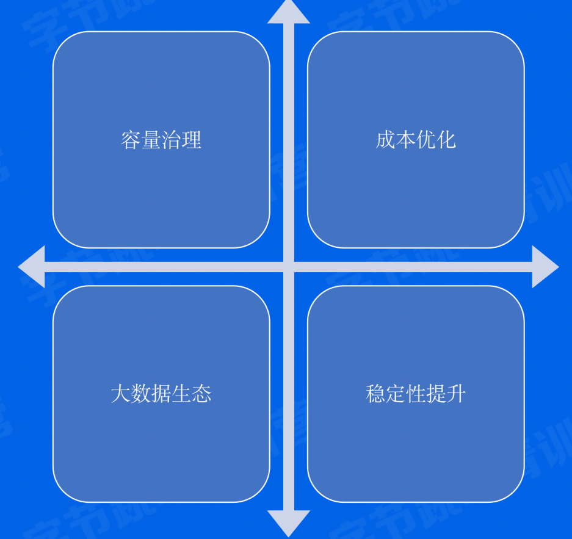

# 介绍

## 抖音背后的存储

> 短视频架构初探

> 存储需求

把短视频生产/消费链路做更细粒度分解，到处都有视频/图片的公共存储需求。

> 存储需求量细化

# 为什么对象存储

## 存储对比

## 分布式存储选型

海量、易用、便宜

> 分布式文件系统HDFS

- 支持PB-> EB海量存储
- 文件数量受Name Node限制
- 伪Posix文件接口，开发略复杂
- 非云原生，搭建维护较麻烦
  低
- 视频/图片相关生态接入略复杂
- 使用普通X86服务器，成本

> 对象存储TOS

- 支持> EB海星存储
- 对象数室无限制

- Restful HTTP接口，开发极简单
- 云原生，按需申请使用
- 视频/图片相关生态丰富

- 使用普通X86服务器
- 具备冷热数据分级存储能力，成本更低

## 易用性：接口对比

弱Posix文件系统语义

- 目录/文件
- Append写
- 无法直接HTTP访问

接口速览

- Mkdirs
- Append
- Create
- CreateSymlink
- Delete
- Open
- Get

Bucket/Object语义

- Bucket:存储对象的桶，可类比一个云上的Map
- Object:对象，包含如下三个部分
  - Key:对象的名字，可类比Map的Key
  - Data:对象的内容，例如视频/图片内容
  - MetaData:对象的一-些元信息，如对象大小，对象Content-Type,也可以存储自定义元信息

HTTP接口

- 任何时间、任何地点、任何互联网设备上传和下载数
  据
- 支持HTTP协议的各种客户端都可访问

接口速览

- GET:下载对象
- HEAD:查看对象元信息
- PUT:上传对象
- DELETE:删除对象

## 适用场景

# 对象存储怎么用

## Restful 接口

## MultiUpload接口

## Listprefix接口

# TOS字节内部实践

## 开发一个对象存储

## 可扩展性解法之Partition

## 持久度解法之Replication

## 成本解法之EC

## 成本解法之温冷转换

## 架构细化

## 高可用解法之拆分降低爆炸半径

## 高可用之粤核酸的启发

## 高可用之镜像灾备

## 未来展望

