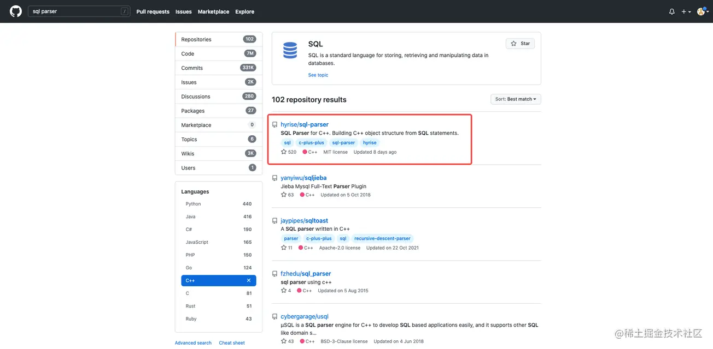
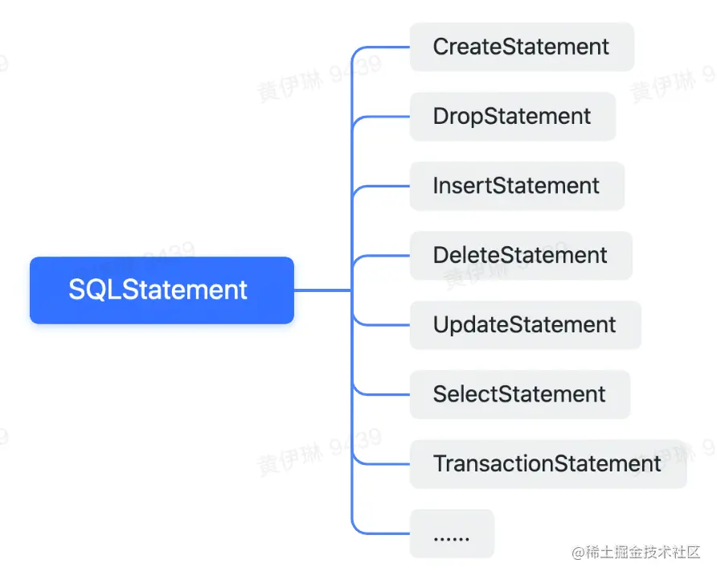
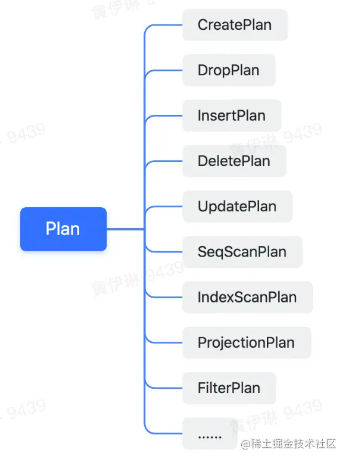
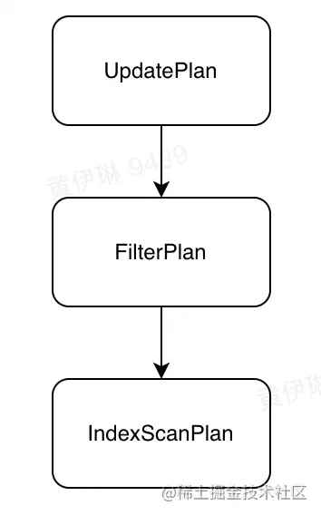
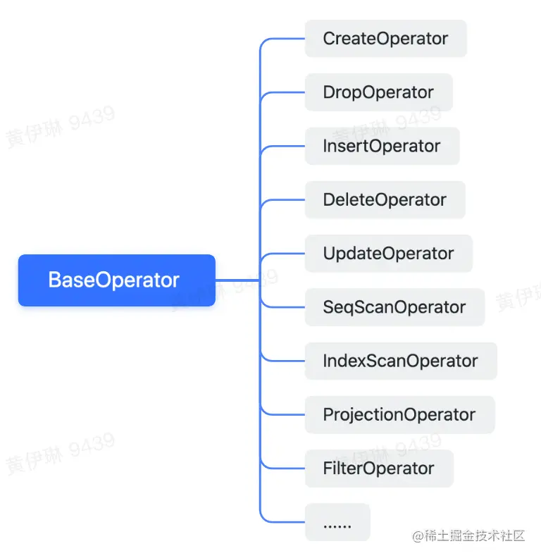
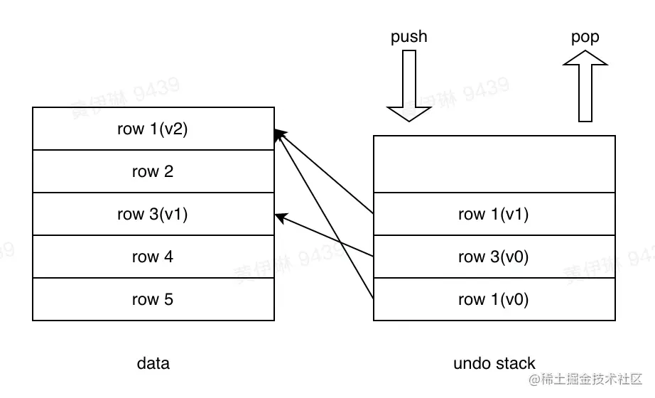
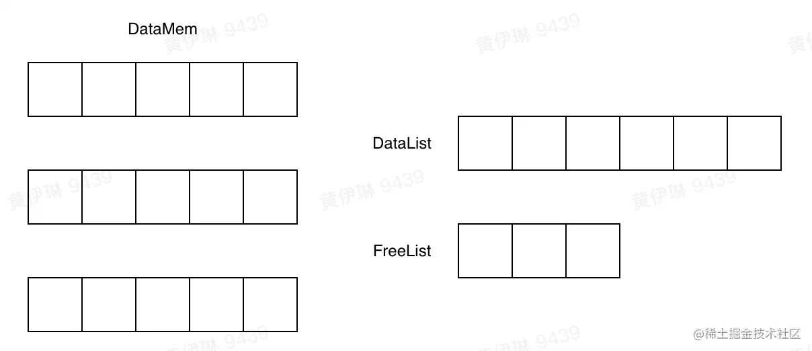
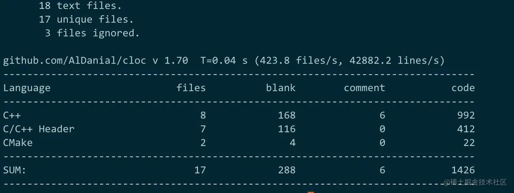
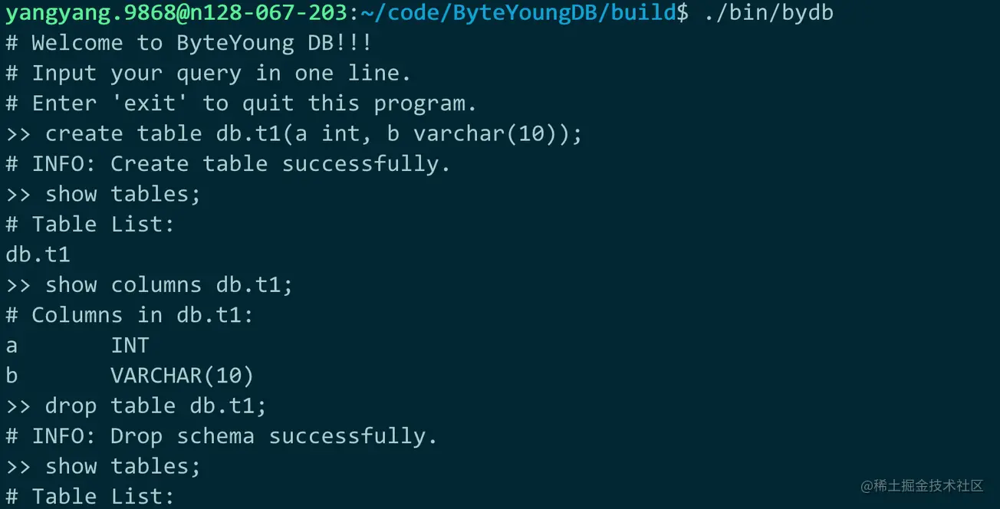

> 前置克隆项目地址：[github.com/thuyy/ByteY…](https://link.juejin.cn?target=https%3A%2F%2Fgithub.com%2Fthuyy%2FByteYoungDB) ，开课前1天完成项目运行，有问题可以记录一下，直播课跟着讲师节奏走，或者积极在弹幕区提问哈。

## 背景知识

### 存储&数据库


存储系统

- 块存储：存储软件栈里的底层系统，接口过于朴素

- 文件存储：日常使用最广泛的存储系统，接口十分友好，实现五花八门

- 对象存储：公有云上的王牌产品，immutable语义加持

- key-value存储：形式最灵活，存在大量的开源/黑盒产品

数据库系统

- 关系型数据库：基于关系和关系代数构建的，一般支持事务和SQL访问，使用体验友好的存储产品

- 非关系型数据库：结构灵活，访问方式灵活，针对不同场景有不同的针对性产品

分布式架构

- 数据分布策略：决定了数据怎么分布到集群里的多个物理节点，是否均匀，是否能做到高性能

- 数据复制协议：影响IO路径的性能、机器故障场景的处理方式

- 分布式事务算法：多个数据库节点协同保障一个事务的ACID特性的算法，通常基于2pc的思想设计

### 数据库结构


- SQL引擎
  - Parser：查询解析，生成语法树，并进行合法性校验。（词法分析、语法分析、语义分析）
  - Optimizer：根据语法树选择最优执行路径。
  - Executor：查询执行流程，真实的对数据进行处理。

- 事务引擎
  - 实现事务的ACID。

- 存储引擎
  - 存储数据、索引、日志。

## 项目要求

实现一个内存态数据库 **ByteYoungDB**，能够支持下面操作：

- Create/Drop Table, Create/Drop Index

- Insert、Delete、Update、Select

- 简单的等值匹配条件 `where col = XXX`

- 支持简单的事务Commit，Rollback

## 项目设计

### 项目分解


- SQL引擎
  - Parser：查询解析，生产语法树，并进行合法性校验。（词法分析、语法分析、语义分析）
  - Optimizer：根据语法树选择最优执行路径。
  - Executor：基于火山模型的查询执行流程。

- 事务引擎
  - 事务提交和回滚机制设计。

- 存储引擎
  - 数据结构设计
  - 索引结构设计

### 项目搭建

使用大型C/C++项目中最常用的CMake工具。CMake是一种跨平台编译工具。CMake主要是编写CMakeLists.txt文件通过cmake命令将CMakeLists.txt文件转化为make所需要的Makefile文件，最后用make命令编译源码生成可执行程序或者库文件。

```
cmake_minimum_required(VERSION 3.8)
project(ByteYoungDB)
set(CMAKE_CXX_STANDARD 11)
set(CMAKE_CXX_COMPILER "g++")
set(CMAKE_CXX_FLAGS "-g -Wall -Werror -std=c++17")
set(CMAKE_CXX_FLAGS_DEBUG "-O0")
set(CMAKE_CXX_FLAGS_RELEASE "-O2 -DNDEBUG ")

set(CMAKE_INSTALL_PREFIX "install")
set(CMAKE_LIBRARY_OUTPUT_DIRECTORY
    ${CMAKE_BINARY_DIR}/lib)
set(CMAKE_RUNTIME_OUTPUT_DIRECTORY
    ${CMAKE_BINARY_DIR}/bin)

include_directories(${CMAKE_SOURCE_DIR}/sql-parser/include)

add_subdirectory(src/main)
add_subdirectory(src/sql-parser-test)
复制代码
```

参考学习资料：

[《CMake Cookbook中文版》 - Bookset](https://link.juejin.cn?target=https%3A%2F%2Fwww.bookset.io%2Fbook%2FCMake-Cookbook)

### SQL引擎设计

#### Parser

SQL语言的解析非常的繁复，因此这里“偷懒”，去github上寻找了一个开源的SQL解析器。



[github.com/hyrise/sql-…](https://link.juejin.cn?target=https%3A%2F%2Fgithub.com%2Fhyrise%2Fsql-parser)

输入是SQL语句，输出是语法树：



但sql-parser库只能提供词法分析和语法分析，生成查询树，不能进行语义分析，也就是合法性校验。因此我们将sql-parser库进行封装，增加语义分析功能：

```
class Parser {
 public:
  Parser();
  ~Parser();

  bool parseStatement(std::string query);

  SQLParserResult* getResult() { return result_; }

 private:
  bool checkStmtsMeta();
  ......
}
复制代码
```

#### Optimizer

根据产生的查询树，生成对应的计划树。计划树由各个基础算子组成，针对本项目中要求的场景，构造了如下基础算子：



比如一条UPDATE查询，对应的计划树如下：



#### Executor

使用火山模型：


依赖计划树生成对应的执行树，每个Plan生成一个对应的Operator。



每个Operator调用`next_.exec()`来调用下层Operator产生数据：

```
class BaseOperator {
 public:
  BaseOperator(Plan* plan, BaseOperator* next) : plan_(plan), next_(next) {}
  ~BaseOperator() {}
  virtual bool exec() = 0;

  Plan* plan_;
  BaseOperator* next_;
};
复制代码
```

### 事务引擎

在不考虑并发的情况下，以及数据无需落盘持久化的情况下，我们的事务引擎设计就变得比较简单。因此不需要实现复杂的MVCC机制，只需要能够实现事务的Commit和Rollback功能即可。

这里我们实现一个undo stack的机制，每次更新一行数据，就把这行数据老的版本push到undo stack中。如果事务回滚，那么就从undo stack中把老版本的数据逐个pop出来，恢复到原有的数据中去。



### 存储引擎

#### 数据结构

因为我们是内存态的数据库，所以数据结构可以设计的比较简单。这里每次申请一批记录的内存，这样可以降低内存碎片化的问题，提高内存访问效率。然后将这批记录的内存放到FreeList中。当有数据插入时，从FreeList中获取一块内存用于写入，并放入DataList。当有数据删除时，将数据从DataList归还到FreeList中。



#### 索引设计

因为这里只要求实现等值匹配，所以可以用最简单的hash索引。

## 项目库

### 代码仓

[github.com/thuyy/ByteY…](https://link.juejin.cn?target=https%3A%2F%2Fgithub.com%2Fthuyy%2FByteYoungDB)

利用cloc工具进行代码统计：



### 编译

前置依赖：

```
brew install cmake
复制代码
```

编译：

```
mkdir install
cd install
cmake ../
make
复制代码
```

执行：

```
export LD_LIBRARY_PATH=$LD_LIBRARY_PATH:/Users/yangyang/Code/ByteYoungDB/sql-parser/lib
export DYLD_LIBRARY_PATH=/Users/yangyang/Code/ByteYoungDB/sql-parser/lib
复制代码
```

### 运行



## 扩展演进

大家可以在当前项目的基础上继续演进，有如下几个方向：

1. 实现B+Tree索引

1. 实现count()、sum()、min()、max()等简单函数

1. 实现group by操作

1. 实现两表join操作

1. 实现基于磁盘文件的存储引擎，以及数据的持久化


作者：青训营官方账号
链接：https://juejin.cn/post/7101135488974585870
来源：稀土掘金
著作权归作者所有。商业转载请联系作者获得授权，非商业转载请注明出处。