# 概述

本节课程主要分为四个方面：

- 自动内存管理

- Go 内存管理及优化

- 编译器和静态分析

- Go 编译器优化

实践：字节跳动遇到的性能问题以及优化方案

> 什么是性能优化？

- **提升软件系统处理能力**，**减少不必要的消耗**，充分发掘计算机算力

> 为什么要做性能优化？

- 用户体验：**带来用户体验的提升** —— 让刷抖音更丝滑，让双十一购物不再卡顿
- 资源高效利用：**降低成本，提高效率** —— 很小的优化乘以海量机器会是显著的性能提升和成本节约

> 性能优化的层面

- 业务代码
- SDK
- 基础库
- 语言运行时
- OS

> 业务层优化

- 针对特定场景，具体问题，具体分析
- 容易获得较大性能收益

> 语言运行时优化

- 解决更通用的性能问题
- 考虑更多场景
- Tradeoffs

> 数据驱动

- 自动化性能分析工具 ——pprof
- 依靠数据而非猜测
- 首先优化最大瓶颈

## 性能优化与关键质量

- 接口质量至关重要
- 在保证接口稳定的前提下改进具体实现
- 测试用例：覆盖尽可能多的场景，方便回归
- 文档：做了什么，没做什么，能达到什么效果
- 隔离：通过选项控制是否开启优化
- 可观测：必要的日志输出

# 自动内存管理

## 背景

> 动态内存

- 程序在运行时根据需求动态分配的内存：malloc()

> 自动内存管理（垃圾回收）：由程序语言运行时系统管理动态内存

- 避免手动内存管理，专注于实现业务逻辑
- 保证内存使用的正确性和安全性：double-free problem, use-after-free problem

> 三个任务

- 为新对象分配空间
- 找到存活对象
- 回收死亡对象的内存空间

## 相关概念

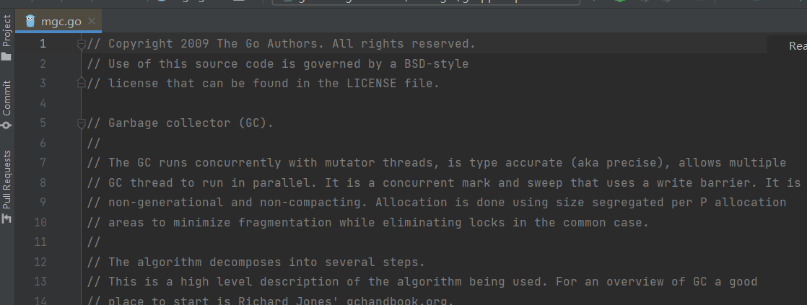

- Mutator: 业务线程，分配新对象，修改对象指向关系
- Collector: GC 线程，找到存活对象，回收死亡对象的内存空间

- Serial GC: 只有一个 collector

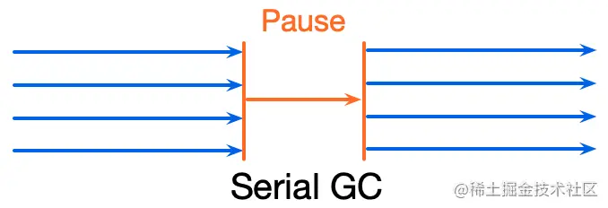

- Parallel GC: 并行 GC，支持多个 collectors 同时回收的 GC 算法

- Concurrent GC: 并发 GC，支持 mutator(s) 和 collector(s) **同时执行**的 GC 算法

  

  - **Collectors 必须感知对象指向关系的改变！**

     

> 评价GC算法

- 安全性（Safety）：不能回收存活的对象是**基本要求**

- 吞吐率（Throughput）：花在GC上的时间
  $$
  1- GC时间/程序执行总时间
  $$

- 暂停时间（Pause time）：stop world（STW）业务是否感知

- 内存开销（Space overhead）：GC 元数据开销

> 两种垃圾回收算法

- 追踪垃圾回收（Tracing garbage collection）
- 引用计数（Reference counting）

## 追踪垃圾回收

- 对象被回收的条件：指针指向关系不可达的对象

- 标记根对象

  - 静态变量、全局变量、常量、线程栈等

- 标记：找到可达对象

  - 求指针指向关系的传递闭包：从根对象出发，找到所有可达对象

- 清理：所有不可达对象

  - 将存活对象复制到另外的内存空间（Copying GC）

  

  - 将死亡对象的内存标记为“可分配”（Mark-sweep GC）

  

  - 移动并整理存活对象（Mark-compact GC）

  

- 根据对象的生命周期，使用不同的标记和清理策略

## 分代GC（Generational GC）

- 分代假说（Generational hypothesis）：most objects die young
- Intuition：很多对象在分配出来后很快就不再使用了
- 每个对象都有年龄：经历GC的次数
- 目的：对年轻和老年的对象，制定不同的GC策略，降低整体内存管理的开销
- 不同年龄的对象处于heap的不同区域

- 年轻代（Young generation）
  - 常规的对象分配
  - 由于**存活对象很少**，可以采用 copying collection
  - GC 吞吐率很高
- 老年代（Old generation）
  - **对象趋向于一直活着，反复复制开销较大**
  - 可以采用 mark-sweep collection

## 引用计数

- 每个对象都有个与之关联的引用数目
- 对象存活的条件：当且仅当与引用数大于0
- 优点
  - 内存管理的操作被平摊到程序执行过程中
  - 内存管理不需要了解runtime的实现细节：C++智能指针（smart pointer）
- 缺点
  - 维护引用计数的开销比较大：通过**原子操作**保证对引用计数操作的**原子性**和**可见性**
  - 无法回收环形的数据结构 —— weak reference
  - 内存开销：每个对象都引入的额外内存空间储存引用数目
  - 回收内存时依然可能存在暂停

## 总结

- 自动内存管理的背景和意义
- 概念和评价方法
- 追踪垃圾回收
- 引用计数
- 分代GC
- 学术界和工业界在一直致力于解决自动内存管理计数的不足之处
  - PLDI'22 Low-Latency, High-Throughput Garbage Collection

# Go内存管理及优化

## Go 内存管理分配

### 分块

- 目标：为对象在heap上分配内存
- 提前将内存分块
  - 调用系统调用mmap() 向 OS 申请一大块内存，例如4MB
  - 先将内存划分成大块，例如 8 kb，称作对象分配 mspan
  - 再将大块继续划分程**特定大小**的小块，用于对象分配
  - noscan mspan：分配不包含指针的对象 —— GC不需要扫描
  - scan mspan：分配包含指针的对象 —— GC需要扫描
- 对象分配：根据对象的大小，选择最合适的块返回

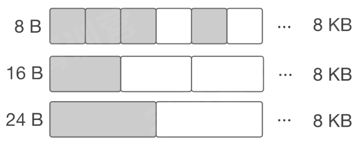

### 缓存

Go 内存管理构成了多级缓存机制，从 OS 分配得的内存被内存管理回收后，也不会立刻归还给 OS，而是在 Go runtime 内部先缓存起来，从而避免频繁向 OS 申请内存。内存分配的路线图如下。

- TCMalloc：thread caching
- 每个 p 包含一个 mcache 用于快速分配，用于为绑定于 p 上的 g 分配对象
- mcache 管理一组 mspan
- 当 mcache 中的 mspan 分配完毕，向mcentral 申请带有未分配块的 mspan
- 当 mspan 中没有分配的对象，mspan 会被缓存在 mcentral 中，而不是立刻释放并归还给 OS

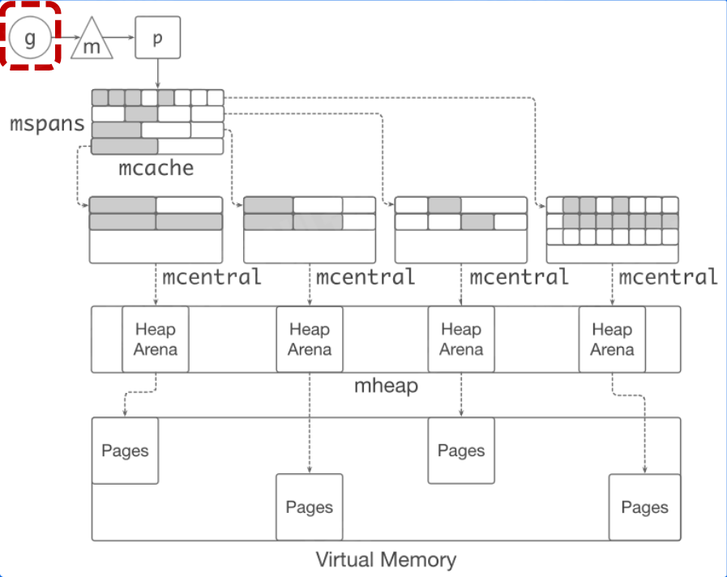

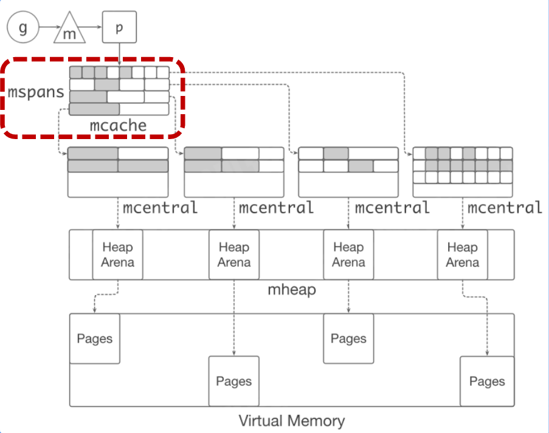

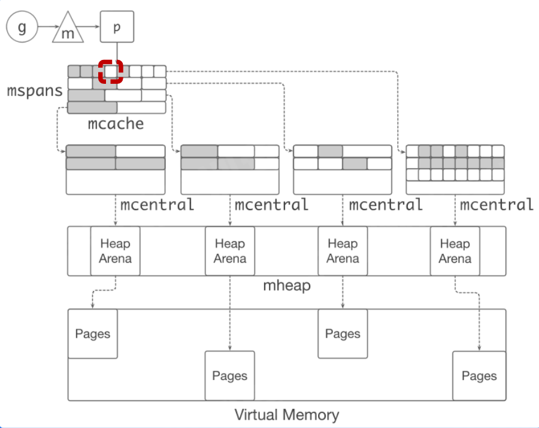

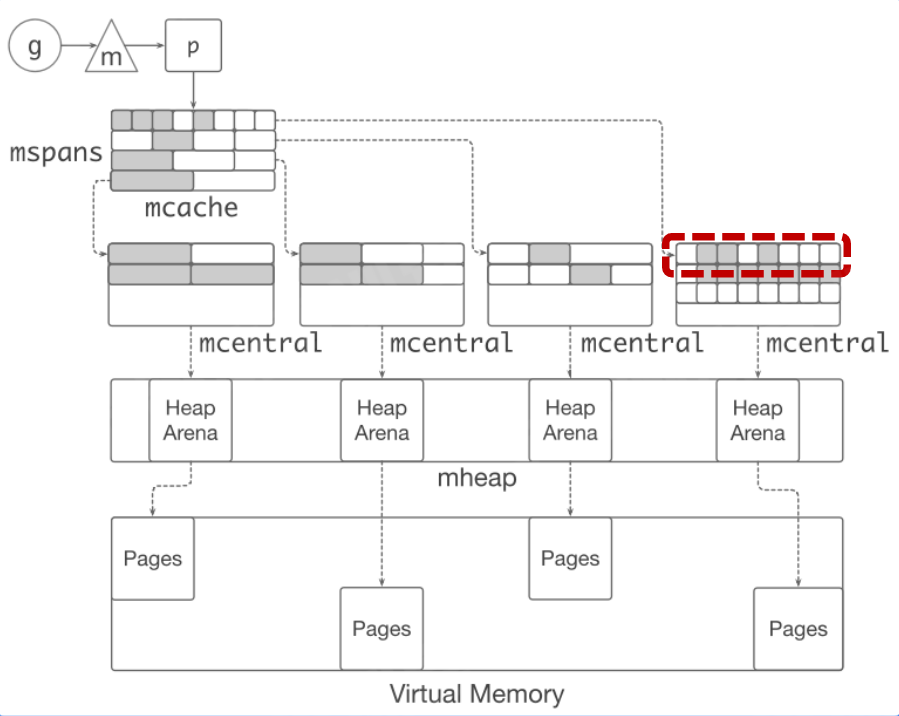

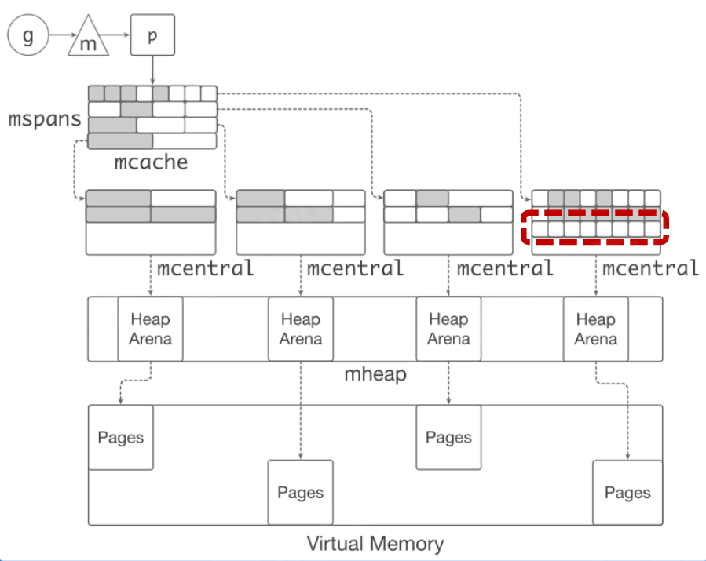

## Go 内存管理优化

- 对象分配时非常高频的操作：每秒分配 GB 级别的内存
- 小对象占比较高

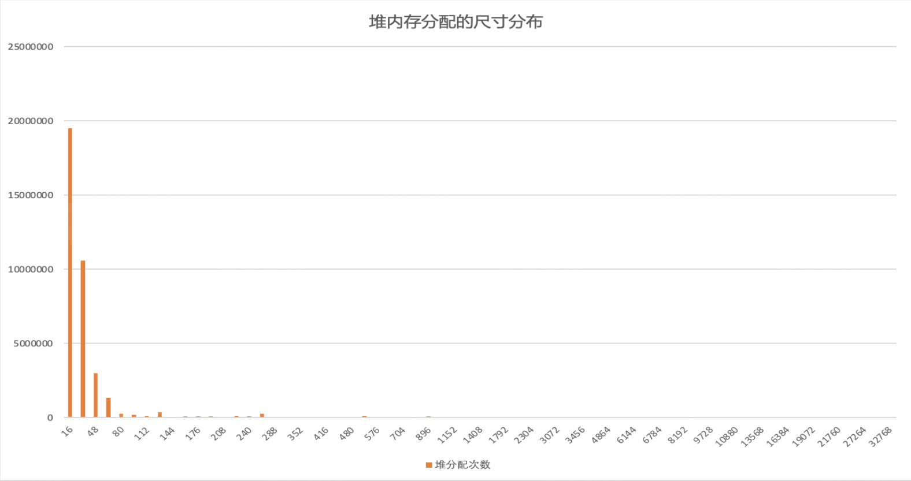

- Go 内存分配比较耗时

  - 分配路径长：g -> m -> p -> mcache -> msapn ->memory block -> return pointer
  - pprof：对象分配的函数是最频繁调用的函数之一

  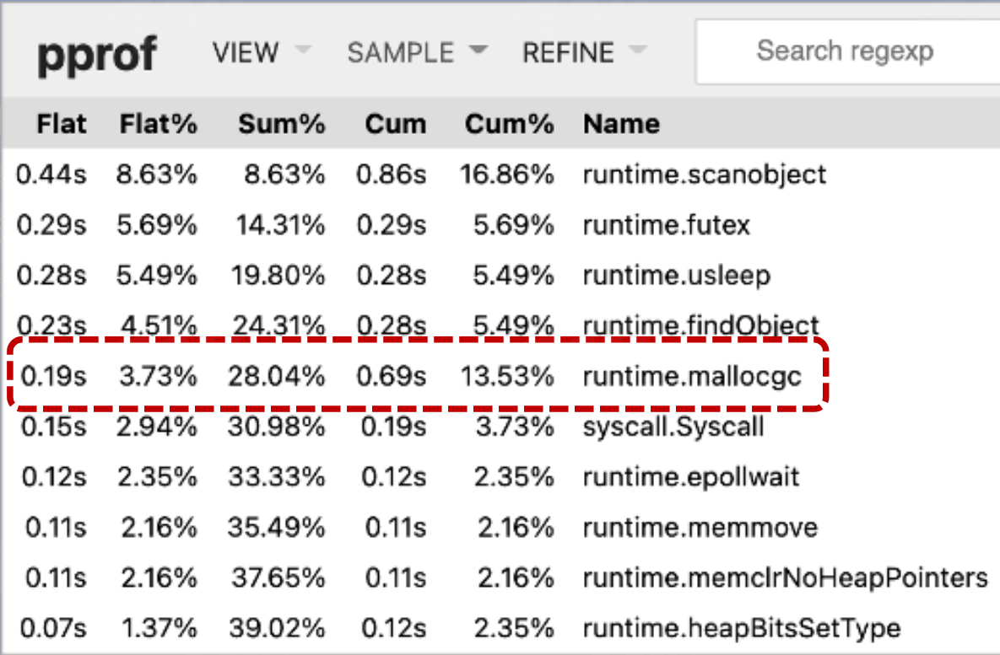

### 字节的优化方案：Balanced GC

- 每个 g 都绑定一大块内存（1kb），称作 goroutine allocation buffer（GAB）
- GAB 用于 noscan 类型的小对象分配：< 128 B
- 使用三个指针维护 GAB：base，end，top

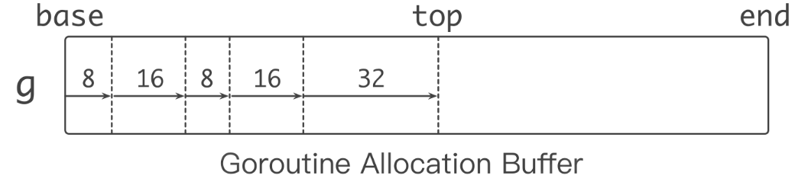

- Bump pointer（指针碰撞）风格对象分配
  - 无须和其他分配请求互斥
  - 分配动作简单高效

**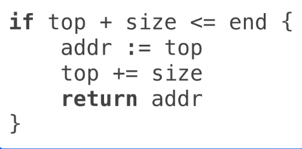**

- GAB 对于 Go 内存管理来说是**一个大对象**

- 本质：**将多个小对象的分配合并成一次大对象的分配**
- 问题：GAB 的对象分配方式会导致内存被延迟释放

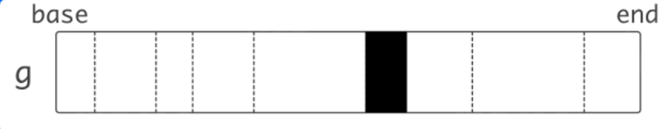

- 方案：移动 GAB 中存活的对象

  - 当 GAB 总大小超过一定阈值时，将 GAB 中存活的对象复制到另外分配的 GAB 中
  - 原先的 GAB 可以释放，避免内存泄漏
  - 本质：用 copying GC 的算法管理小对象（根据对象的生命周期，使用不同的标记和清理策略）

  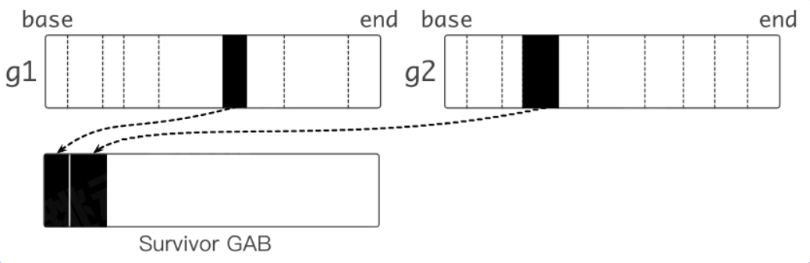

> Balanced GC 性能收益

- 高峰期 CPU usage 降低 4.6%，核心接口时延下降 4.5% ~ 7.7%

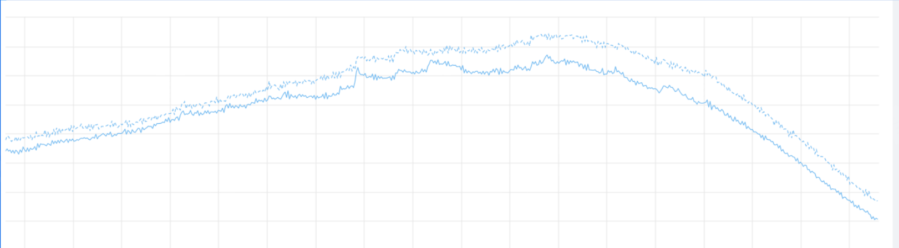

## 总结

- Go 内存管理 - 分块
- Go 内存管理- 缓存
- Go 对象分配的性能问题
  - 分配路径过长
  - 小对象居多
- Balanced GC
  - 指针碰撞风格的对象分配
  - 实现了copying GC
  - 性能收益

# 编译器和静态分析

## 编译器的结构

- 重要的系统软件
  - 识别符合语法和非法的程序
  - 生成正确且高效的代码
- 分析部分（前端 front end）
  - 语法分析，生成词素（lexeme）
  - 语法分析，生成语法树
  - 语义分析，收集类型信息，进行语义检查
  - 中间代码生成，生成 intermediate representation（IR）
- 综合部分（后端back end）
  - 代码优化，机器无关优化，生成优化后的 IR
  - 代码生成，生成目标代码

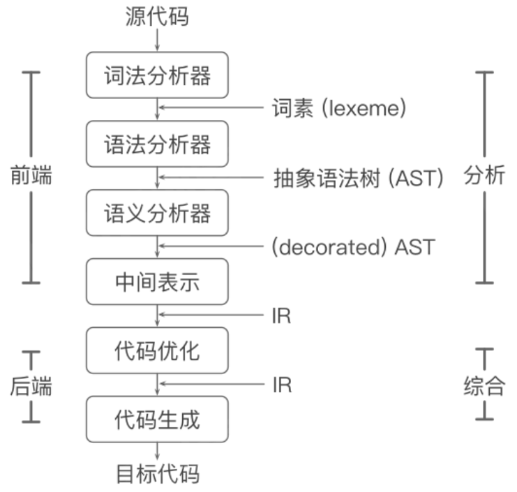

## 静态分析

静态分析：不执行程序代码，推导程序的行为，分析程序的性质。

### 数据流和控制流

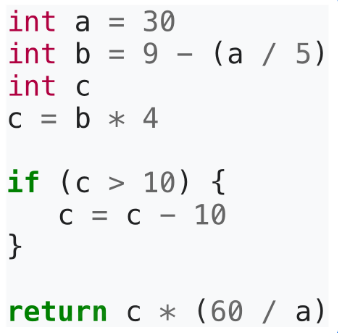

- 控制流（Control flow）：程序执行的流程

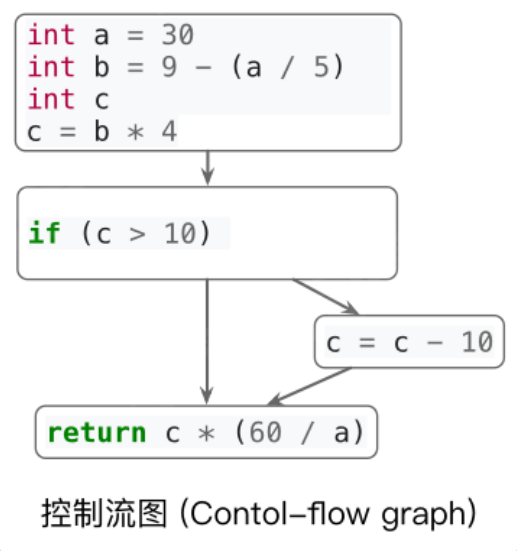

- 数据流（Data flow）：数据在控制流上的传递
- 通过分析控制流和数据流，我们可以知道更多**关于程序的性质（properties）**

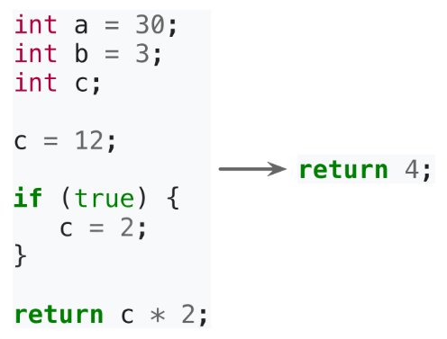

- 根据这些性质优化代码

### 过程内和过程间分析

- 过程内分析（Intra-procedural analysis）
  - 仅在过程内部进行分析
- 过程间分析（Inter-procedural analysis）
  - 考虑过程调用时参数传递和返回值的数据流和控制流

- 为什么过程间分析是个问题？

  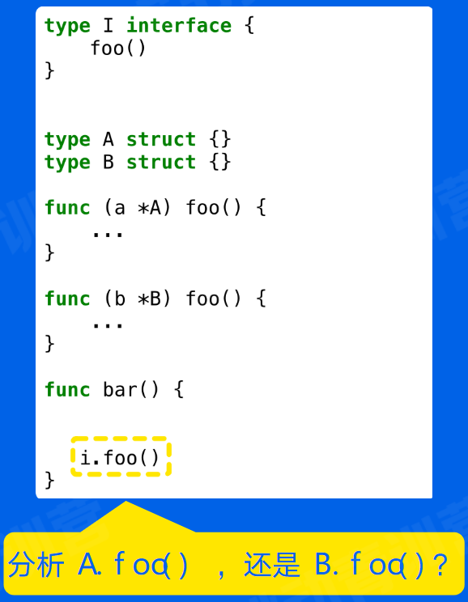

  - 需要通过**数据流分析**得知 i 的具体类型，才能知道 i.foo() 调用的是哪个 foo()
  - 根据 i 的具体类型，**产生了新的控制流**，i.foo()，分析继续
  - 过程间分析需要**同时**分析控制流和数据流 —— **联合求解，比较复杂**

## 总结

- 编译器的结构和编译的流程
- 编译器后端优化
- 静态分析
  - 数据流分析和控制流分析
  - 过程内分析和过程间分析

# Go编译器优化

- 为什么做编译器优化

  - 用户无感知，重新编译即可获得性能收益

  - 通用的优化手段

- 现状

  - 采用的优化较少
  - 追求编译时间短，因此没有进行复杂的代码分析和优化

- 编译优化的思路

  - 面向后端长期执行的任务
  - Tradeoff：**用编译时间换取更高效的的机器码**

- Best mode

  - **函数内联**
  - **逃逸分析**
  - 默认栈大小调整
  - 边界检查消除
  - 循环展开
  - ....

## 函数内联

- 将被调用函数的函数体（callee）的副本替换到调用位置（caller）上，同时重写代码以反映参数的绑定
- 优点
  - 消除函数调用开销，例如传递参数，保存寄存器等
  - **将过程间分析转化为过程内分析**，帮助其他优化，例如**逃逸分析**
- 函数内联能多大程度影响性能？ —— 使用 micro - benchmark 验证以下~

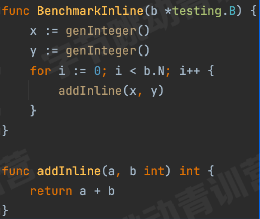

通过编译器指令强行不函数内联

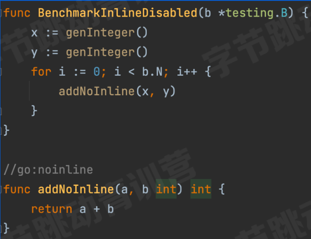

- 使用 micro-benchmark 快速验证和对比性能优化结果

- 缺点

  - 函数体变大，instruction cache（icache）不友好

  - 编译生成的 Go 镜像变大

- 函数内联在**大多情况下**是正向优化

- 内联策略

  - 调用和背调函数的规模
  - ...

## Beast Mode

- Go 函数内联受到的限制较多
  - 语言特性，例如 interface，defer 等，限制了函数内联
  - 内联策略非常保守
- Beast mode：调整函数内联的策略，使更多函数内联
  - 降低函数调用的开销
  - 增加了其他优化的机会：**逃逸分析**
- 开销
  - Go 镜像增加 ~ 10%
  - 编译时间增加

### 逃逸分析

- 逃逸分析：分析代码中指针的动态作用域：指针在何处可以被访问
- 大致思路
  - 从对象分配处出发，沿着控制流，观察对象的数据流
  - 若发现指针 p 在当前作用域 s：
    - 作为参数传递给其他函数
    - 传递给全局变量
    - 传递给其他的 goroutine
    - 传递给已逃逸的指针指向的对象
  - 则指针 p 指向的对象逃逸出 s，反之则没有逃逸出 s
- Beast mode：函数内联扩展了函数边界，更多对象**不逃逸**
- 优化：未逃逸的对象可以在**栈上分配**
  - 对象在栈上分配和回收很快：移动sp
  - 减少 heap 上的分配，降低 GC负担

### 性能收益

- 高峰期 CPU usage 降低 9%，时延降低 10%

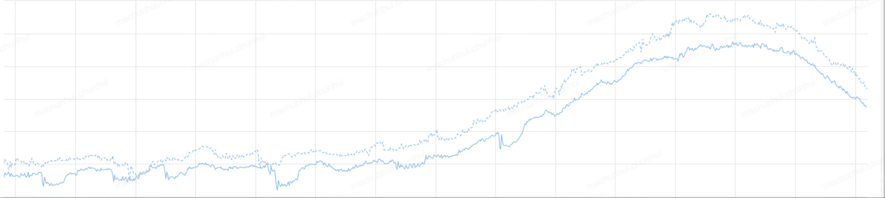

- 内存使用降低 3 %

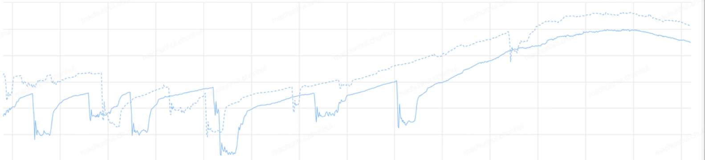

## 总结

- Go 编译器优化的问题
- Beast mode
- 函数内联
- 逃逸分析
- 通过 micro-benchmark 快速验证性能优化
- 性能收益

# 课程总结

- 本节课程：高性能 Go 语言发行版优化与落地实践
- 性能优化
  - 自动内存管理
  - Go 内存管理
  - 编译器优化与静态分析
  - 编译器优化
- 实践
  - Balanced GC 优化对象分配
  - Beast mode 提升代码性能
- 分析问题的方法和解决问题的思路，不仅适用于 Go 语言，其他语言的优化也同样适用