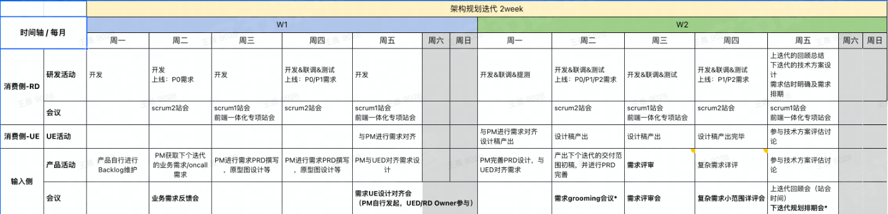
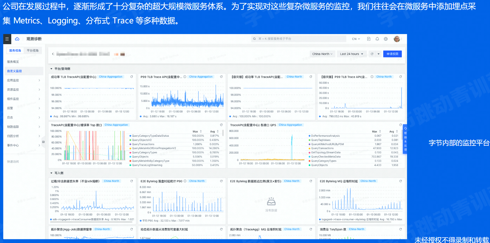
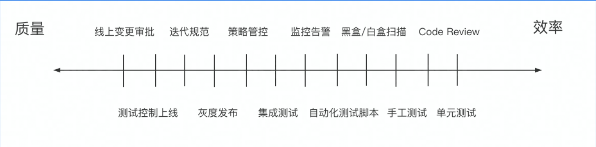

# 为什么需要有流程

## 团队规模和流程的关系

> 为什么要有流程？

- 个人开发者是不需要流程的
- 超过一个人的团队就需要协作
- 随着团队规模上升，会出现全新的问题

> 复杂项目没有流程会有什么问题：

- 需求阶段：每个人都有自己的想法，团队决策需要有一个过程
- 开发阶段：多人/多端协作开发，每个人都有自己的安排，相互配合需要有一个流程
- 测试阶段：产物怎样交互，测试如何开展，BUG怎么修都需要流程
- 发布阶段：怎样确保发布过程平稳丝滑，版本和流量如何控制，需要有规范
- 运维阶段：线上问题如何应急响应，处理用户反馈和线上问题需要有流程

## 传统的瀑布模型

- 工作流程的直观表达
- 定义了标准的研发阶段
- 以流程为本，理想化模型

## 敏捷开发

- 以小团队快速迭代
- 团队成员之间的合作更加紧密
- 以人为本，和用户沟通

## The Scaled Agile Framework（SAFe）简介

现代的 Scrum

- 敏捷教练
- 产品负责人
- 敏捷团队
- 敏捷发布火车

## 我们团队的流程

> 人员&名词解释

- RD：研发
- PM：产品经理
- PRD：需求文档
- UED：用户体验设计
- QA：测试
- Scrum1：敏捷团队1
- P0/P1：优先级0/优先级1
- Backlog：规划列表

> 会议解释

- 代办事项整理会议（Back Grooming Metting）产品负责人描述下个迭代希望实现的用户故事，PM提出需求
- 迭代计划会议（Sprint Palnning Metting）选择迭代的任务和估算工作量
- 每日站会（Standip Metting）
  - 昨天你做了什么
  - 今天你将要做什么
  - 你有什么需要帮助的地方吗？
- 评审会（Review Metting）小组向产品负责人展示迭代工作结果
- 反思会（Retrospective Metting）在每个迭代后召开简短的反思会，总结哪些事情做得好，哪些事情做得不好

# 有哪些流程

## 需求阶段

> MVP（minimum viable product，最小化可行产品）思想

- 站在用户的角度思考
- 收集用户反馈

## 开发阶段

> 云原生下的开发

- 传统虚拟机
  - 在物理机中虚拟出多个虚拟机，每个虚拟机用偶遇自己的操作系统
  - 运维人员负责维护和交付虚拟机
  - 每个虚拟机中都要安装相应的依赖环境
- 容器化
  - 容器是在操作系统中虚拟出来的
  - 通过cgroup，namespace和Union Mount等技术实现了容器之间的相互隔离，同时容器只有很低的开销
  - 应用和其依赖作为一个整体，打包成镜像交付

- 单体架构
  - 多个模块共同组成一个服务，服务体量较大
  - 模块之间直接调用，不需要RPC通信
  - 服务整体扩缩容量
  - 多人开发一个代码仓库，需要充分集成测试
- 微服务架构
  - 多个功能在不同的服务中
  - 不同模块需要RPC通信
  - 不同模块可以独立扩缩容
  - 每个服务的代码仓库仅由少部分人维护

- 开发环境逐渐云原生化
- FaaS，PaaS等等技术，让开发逐渐从本地IDE向线上转变
- 从入职领到电脑搭建完一套完整的开发环境需要很久，通过WEB IDE等技术，环境未来将会开箱即用

> 团队的分支策略

- 多个团队之间各自用什么分支开发？
- 修改之间有冲突怎样解决？
- 除了问题的代码如何回退到之前版本？

> 代码规范、自测和文档

- 代码规范
  - 养成良好对的注释习惯，超过三个月的代码，自己都会忘了当时在想什么
  - 不要有魔法数字，魔法字符串
  - 重复的逻辑抽象成公共的方法，不要copy代码
  - 正确使用IDE的重构功能，防止修改错误
- 自测
  - 单元测试
  - 功能环境测试
  - 测试数据构造
- 文档
  - 大型改造需要有技术设计文档，方案评审
  - 好的接口文档能更方便的和前端沟通

## 测试阶段

- 功能环境
  - 需要一个能模拟线上的环境进行开发和测试
  - 环境和环境之间能够隔离，不影响其他功能的开发和测试
- 集成环境
  - 不同人开发的功能合并在一起测试，相互之间的影响可能产生缺陷
  - 迭代发布的所有功能合并在一起测试，确保发布的所有功能之间不影响产生缺陷
- 回归环境
  - 确保新的功能不对老的功能产生影响
  - 回归测试一般会借助自动化测试脚本

## 发布阶段

- 蛮力发布

- 金丝雀发布

- 滚动发布

- 蓝绿发布

- 红黑发布

## 运维阶段

- 用户增加引起流量洪峰（12306抢票）
- 数据库表的数据量增长导致查询速度变慢
- 内存/进程泄漏导致服务资源不足
- 光缆被挖断

# 流程怎么优化

质量和效率的关系就像天平的两端

> DevOps

- 代码管理
- 自动化测试
- 持续集成
- 持续交付

> 流程全自动化

# 团队流程案例

