> 课程依赖

- Linux/操作系统
- Wireshark软件
- Socket 网络编程开发环境

# 网络接入

## 网络接入—互联网

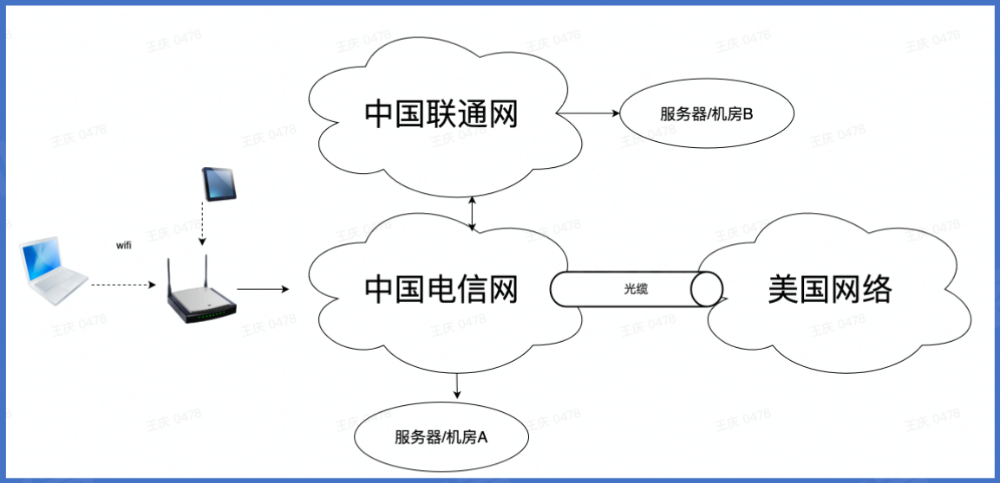

## 网络接入—路由

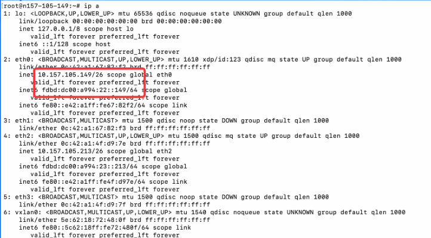

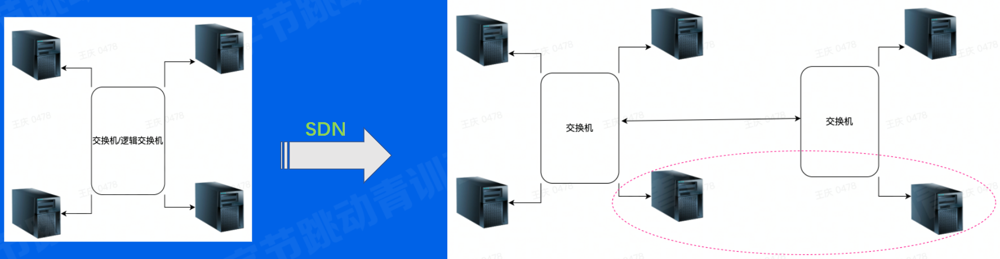

> 路由一定是对称的？

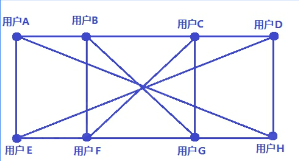

> 路由是工作在哪一层协议？

- 传输层

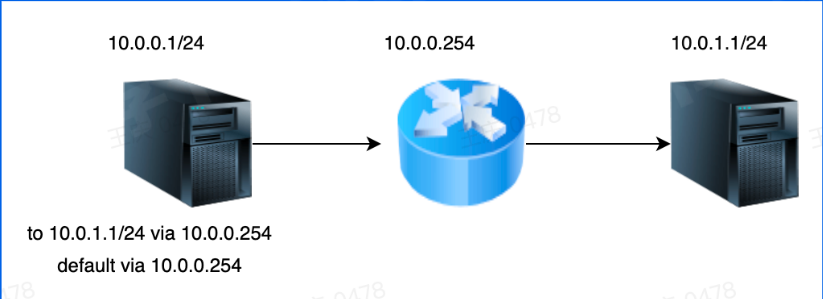

> 路由是改的IP地址吗？

路由是改MAC，找到发包口，路由过程中源IP地址和目标IP地址是不会改变的，只会改变源MAC地址和目标MAC地址

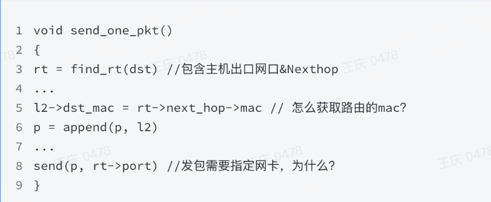

- 动态路由BGP/OSPF等

> 怎么找下一跳的MAC地址呢？

ARP协议

## 网络接入—ARP协议

- 逻辑同网段才能发送ARP
- ARP请求广播，ARP应答单播
- 免费ARP？ARP代理？

ARP代理：中介的作用，存放IP和MAC地址对应的地方，扩充边界

ARP本质是查找下一跳的MAC，不是请求目标地址

> 抖音客户端怎么请求到服务器？

- 因为同网段才能发送ARP，所以是在网络中不断的ARP路由跳转

## 网络接入—网络IP协议

- 唯一标识，互联网通用。抖音客户端一个，抖音服务端一个。
- MAC地址不能代理IP地址吗？
  - MAC不方便记忆，IP更方便记忆
  - MAC是二层的协议，二层不仅仅只有MAC协议，在很早之前的网络设备可能不支持MAC协议，为了所有的设备都能够使用网络，向上定义了一层IP层，统一不同的协议
- IPv4不够用，一般怎么解决？
  - IPv6扩充
  - NAT（路由器原理）

## 网络接入—NAT

- 家里路由器是怎样上网的？

本质上就是NAT，NAT的原理大致是：内部的用户通过一个NAT的设备，修改源地址，内部局域网的地址都是192.xxx.xxx.xxx，连接到互联网外部地址都是一个全局唯一的外网地址

- 多个内网客户端访问同一个目标地址+端口，源端口恰好一样，冲突了？

NAT是改变IP加端口（使用端口号的NAT也叫做NAPT），在NAT设备上维护一张表，当存在冲突的连接，NAT维护在外网开启不同的端口处理，然后分别映射到内网中访问冲突的请求

## 网络传输—数据包

之前都是介绍网络打通的过程，网络打通了数据怎么进行下载呢？数据包

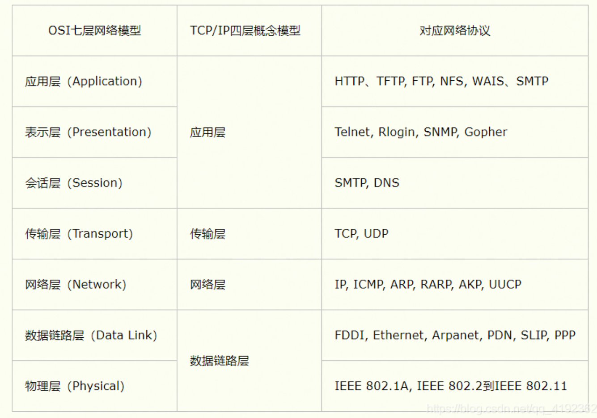

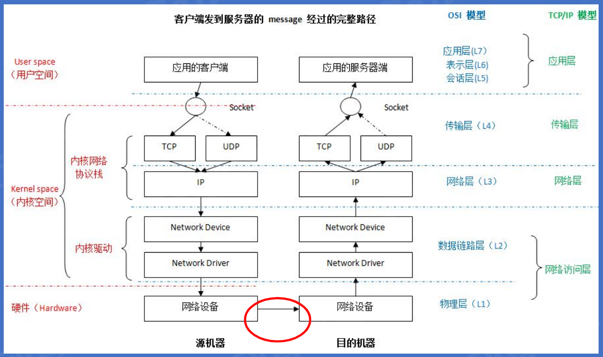

## 网络传输—先请求DNS

- 客户端发 www.baidu.com 的解析请求
- 递归解析器去问 "."，com. 去哪里解析
- 递归解析器去问 "com."，douyin.com 去哪里解析
- douyin.com 告诉递归解 www.douyin.com 解析到xxx

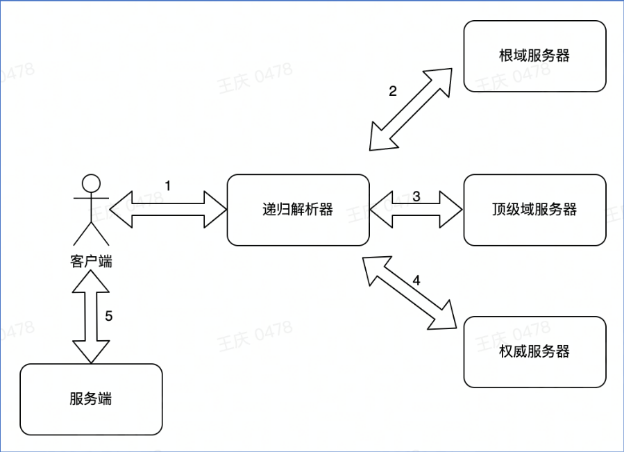

## 网络传输—DNS的传输协议UDP

> UDP本身相对简单

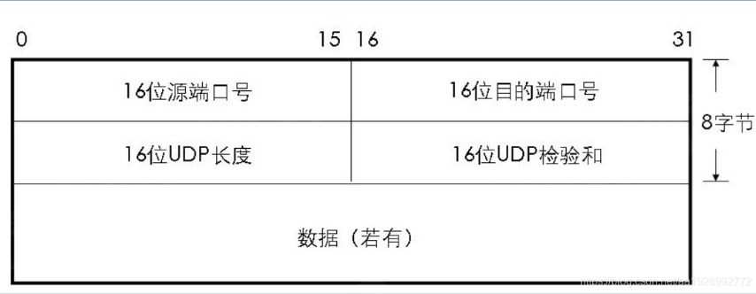

总结：想发什么包，就分配一个UDP的头，把payload里面塞数据发出去就好！

- DNS场景比较简单，发送DNS数据包，如果失败了就重发

> UDP用好很难

- 发包每次发多少？怎么避免分片？

MTU传输有限制，数据量大的话必须要分片，分片要消耗计算机资源，发送方分片i计算，接收方接收

- 怎么知道没有丢包？
- 怎么权衡传输效率和质量？
- ...

总结：怎么保证协议可靠？

## 网络传输—TCP三次握手

> 拔了网线，连接会断吗？

如果有探活（keep-alive），每隔指定时间发送探测是否正常连接，假如网线断开了，那么无法收到ack，那么就可以认为连接断开了，拔了网线是否会断开主要看是否具有TCP的保活

> 你真的了解TCP三次握手吗？

- 确保双方发送和连接都正常
- 同步双方的序列号和发送窗口等，确保双方都已经正确的建立连接
- 防止复用异时的连接
- 分片长度确认机制：TCP MSS（Maximum Segment Size，最大报文长度），https://zhuanlan.zhihu.com/p/139537936，需要确定双方都能够支持的MSS，如果中间还有代理网络服务器，需要三方都支持

## 网络传输—TCP传输

- sequence number：表示的是我方（发送方）这边，这个packet的数据部分的第一位应该在整个data stream中所在的位置
- acknowledge number：表示的是期望的对方（接收方）的下一次sequence number是多少。注意SYN/FIN的传输虽然没有data，但是会让下一次传输的packet seq增加一，但是，ACK的传输，不会让下一次的传输packet加一。（实际建立连接的时候seq不为0，这里为了方便表示为0）

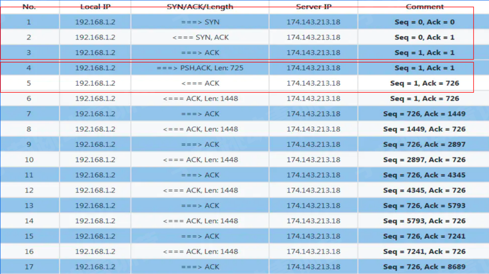

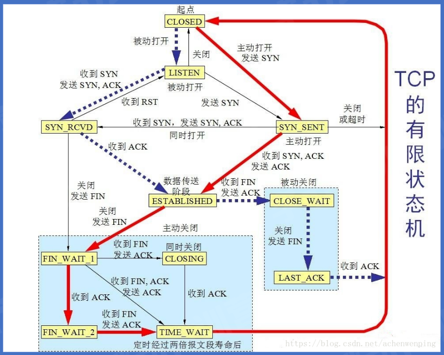

> 为什么老问你Timewait？

- 首先timewait状态比较复杂，确保连接正常关闭，防止前一次ACK丢失（如果前一次ACK丢失，那么在2MSL（最长报文寿命）时间内就会再次收到服务端的FIN，就要刷新Timewait状态，重新向服务端发送ACK）

- 以Linux服务器为例子，有两个字段time_wait_recycle和time_wait_reuse，再次连接可以不用进行三次握手，直接复用之前的连接，但是存在一定的风险
- 这是一个协议里面规定了的机制，但是会经常影响效率的地方，一旦服务器或者客户端有太多的time_wait，会占用端口影响效率，所以使用time_wait_recycle和time_wait_reuse在一定程度上提高效率

> 丢包怎么办

重传，判断丢包就是ACK机制

> 滑动窗口再结合基础概念去理解

> 流量控制/拥塞控制结合基础概念去理解

## 网络传输—HTTP/HTTP1.1

> 为什么不直接用TCP通信呢？

- TCP负责的内容已经够多了，让开发这能够更关注代码和业务的实现，而不是去关注于TCP数据传输，HTTP做好了和TCP交互的原则

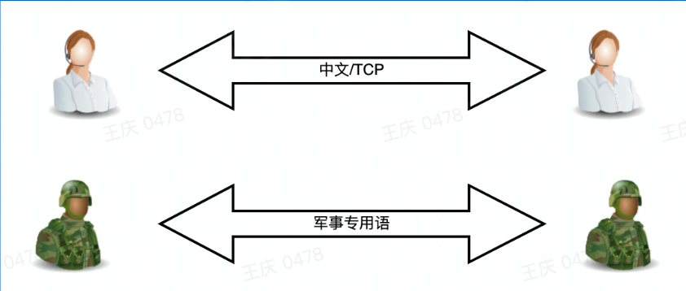

> 为什么互联网上那么多HTTP通信？

> 其实HTTP只是多加了一层规矩。HTTP依然是TCP，只是这个规矩让用户更清晰/更简洁。

> HTTP1.1哪些优化？

- 长连接
- 部分传输
- HOST
- 缓存

## 网络传输—HTTPS

传输中被插入小网站怎么办？

HTTPS解密出来依然是HTTP

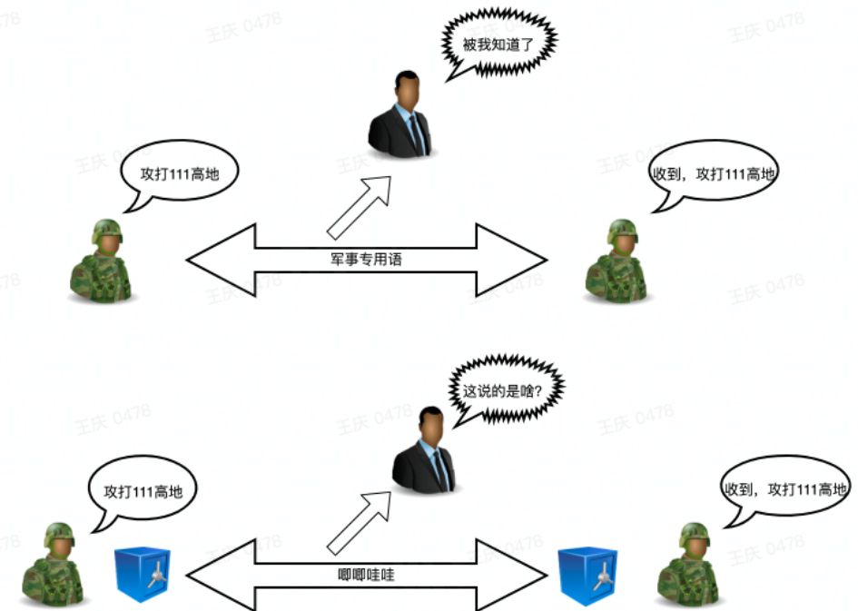

## 网络传输—SSL/TLS握手

SSL类似于TCP的三次握手，在HTTP链接建立之前进行四次握手，从而客户度和服务端沟通好HTTP传输时对称加密的密钥，大致过程如下图：

1、客户端请求建立SSL链接，并向服务端发送一个随机数–Client random和客户端支持的加密方法，比如RSA公钥加密，此时是明文传输。

2、服务端回复一种客户端支持的加密方法、一个随机数–Server random、授信的服务器证书和非对称加密的公钥。

3、客户端收到服务端的回复后利用服务端的公钥，加上新的随机数–Premaster secret 通过服务端下发的公钥及加密方法进行加密，发送给服务器。

4、服务端收到客户端的回复，利用已知的加解密方式进行解密，同时利用Client random、Server random和Premaster secret通过一定的算法生成HTTP链接数据传输的对称加密key – session key。

对称加密和非对称加密

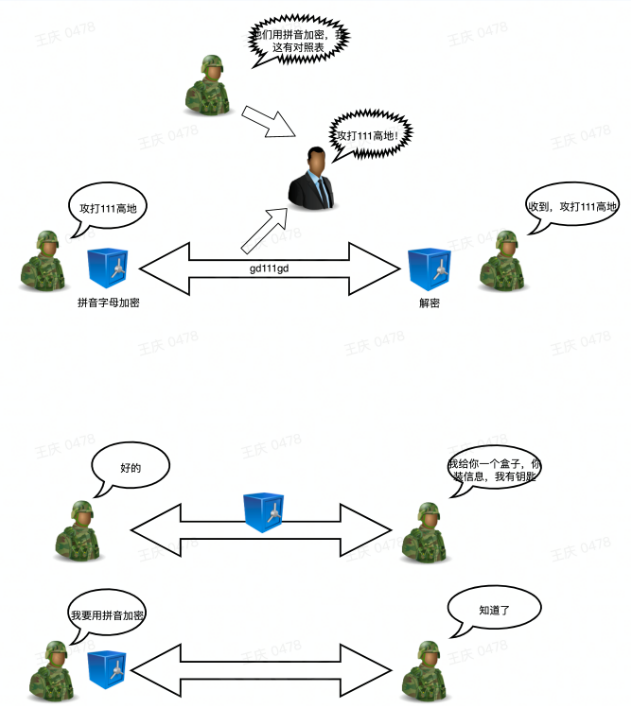

确保没有劫持，也确保私匙不泄密

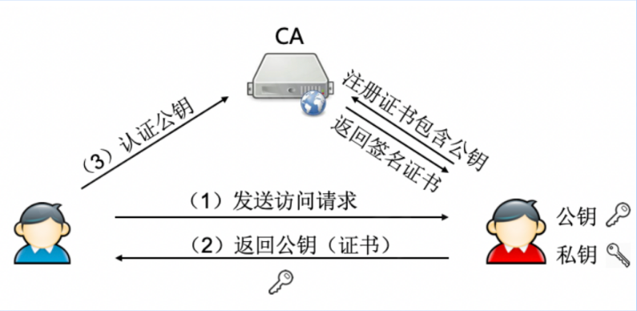

# 网络架构怎么给抖音提质

## 网络提速

### HTTP2.0

多路复用，并行的下载，并行的去访问

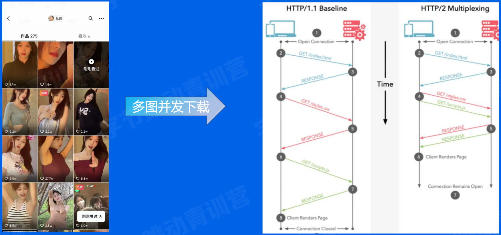

### 怎么理解多路复用/stream?

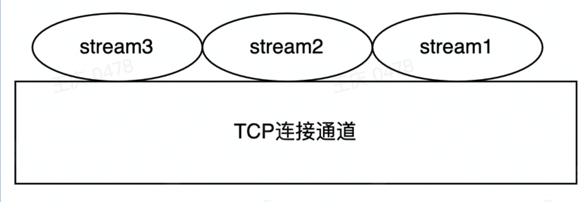

TCP本质上只能一个包一个包的传送，当网络传输质量很好的时候，TCP传一个包接着就传下一个包，在我们应用层看起来就像是在并行stream1、2、3都在进行传送，但其实在TCP传输过程中还是一个包一个包进行传输

> 单个TCP链接传输

> 如果TCP丢包怎么办？

专业的说法对头阻塞，一旦发生了丢包，就会一直重传这个包，后面哪些包都要等待，需要重传成功之后，后面的包才能继续发送，这种情况是灾难性的，上层做的多路复用就无法体现，TCP针对这个 场景也有很多优化（例如TCP首部的option字段，可以指定需要重传的的报文段，哪个地方丢失了重传哪个地方就行了，不需要阻塞在哪里，但是本质上没有解决对头阻塞的问题）

### QUIC/HTTP3.0

谷歌提出的QUICK协议，也逐渐发展成了HTTP3.0

> TCP or UDP?

TCP协议本身比较复杂，并且已经非常流行了，如果对TCP协议进行修改将会影响很多设备，所以选择基于UDP去设计

> Kernel or Userspcae

到底是在内核层去实现还是用户层去实现呢？

Kernel层需要考虑适配不同的系统windows、linux、ios，综合考虑做在了用户态userspace里面，在这个层面上去实现可靠传输和解决TCP传输中出现对头阻塞的问题

> 0 RTT

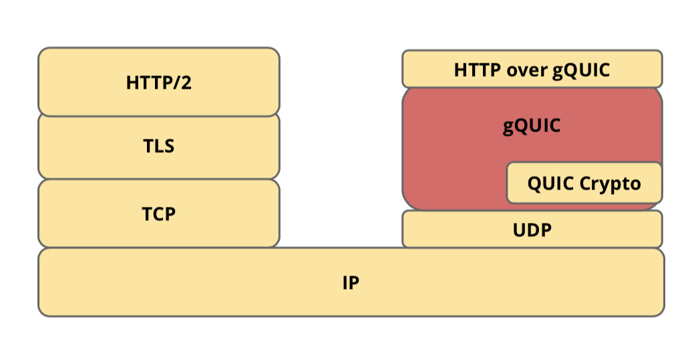

类似于session共享的机制：QUICK天然支持类似HTTPS的协议，HTTPS有SSL/TLS握手，非对称加密的握手类

详细请看这个介绍：https://cloud.tencent.com/developer/article/1594468

> 弱网优势

一旦弱网环境出现丢包，出现对头阻塞，那么HTTP2.0所做的优化都没有效果，具体是基于UDP去实现可靠传输和解决对头阻塞，详细需要再多了解

**除了协议优化？网络路径能不能优化呢？**

- CDN
- DSA

### 数据中心分布

- 核心机房：用户敏感数据、数据库（MySQL、MongoDB）等等
- POP接入：主要和运营商去接入网络，增加和互联网交互的出入口，可能POP机房有100多个，核心机房就只有几十个
- 边缘机房：更靠近用户，在例如不同城市就有移动、电信、联通和其他小型运营商的小型机房，

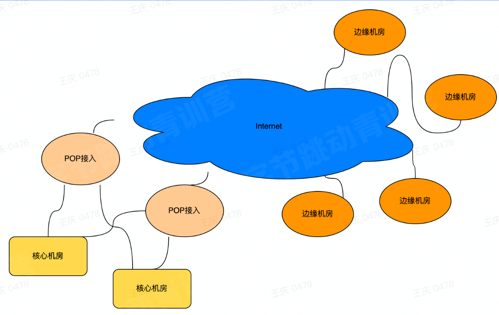

### 同运营商访问

- 针对我国的网络现状，跨运营商访问质量会比较差
- 针对客户端ip进行解析，解析到对应的运营商接入

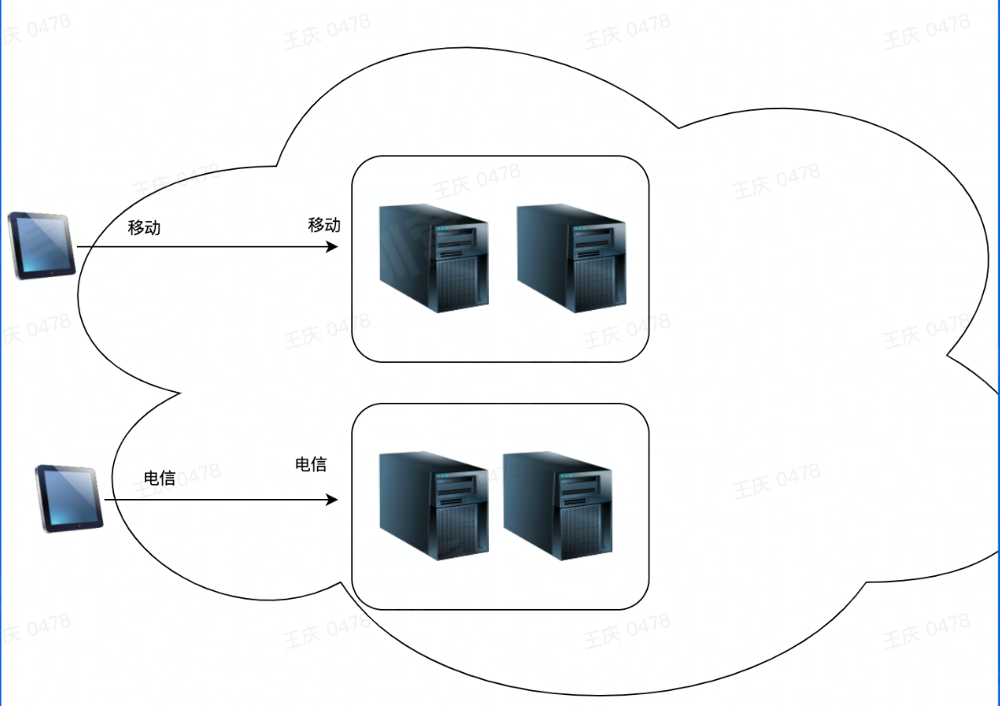

### 静态资源（图片视频）路径优化（CDN）

本质商是一个静态的缓存系统

### 动态API（播放/评论接口）路径优化（DSA）

每个机房对其他机房做延迟探测，并且记录数据做成一张表，通过这张表结合算法做一个最优路径计算

**刷的快，但是三天两天挂掉，谁刷抖音？**

## 网络稳定

### 容灾概念

- 故障发生

- 故障感知

- 自动切换

- 服务恢复

#### 网络容灾的具体案例一

专线比较快速直接，在互联网上比较乱，可能存在上海访问江苏，实际的访问路径为上海—>北京—>江苏

微服务部署可能存在跨机房调用，一般部署的时候走专线，并且做好外网容灾的考虑

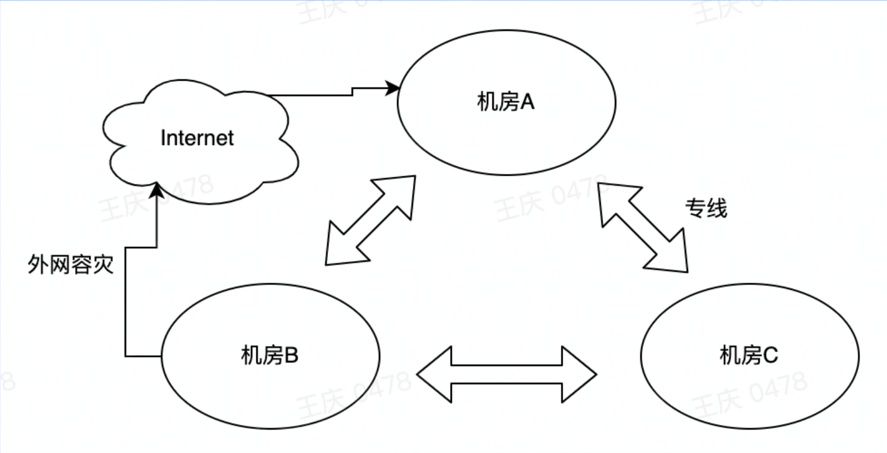

#### 网络容灾的具体案例二

- 首先故障感知确定机房A挂掉了
- 然后探测一下机房B是否可以承受机房A的流量
- 如果可以承受将流量请求切换到机房B
- 如果不能承受再考虑其它切换

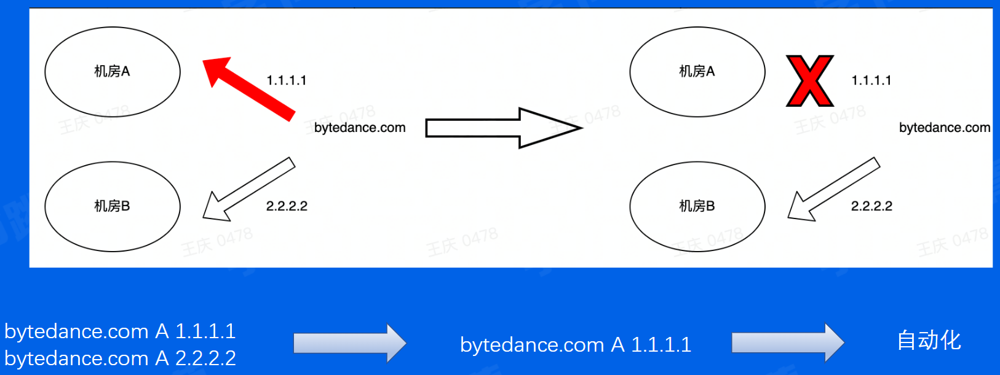

#### 网络容灾的具体案例三

不可用场景：

- 云控系统宕机
- SDK 需要授权，需要用户运行
- 浏览器页面，不可以嵌入SDK，无法控制客户端

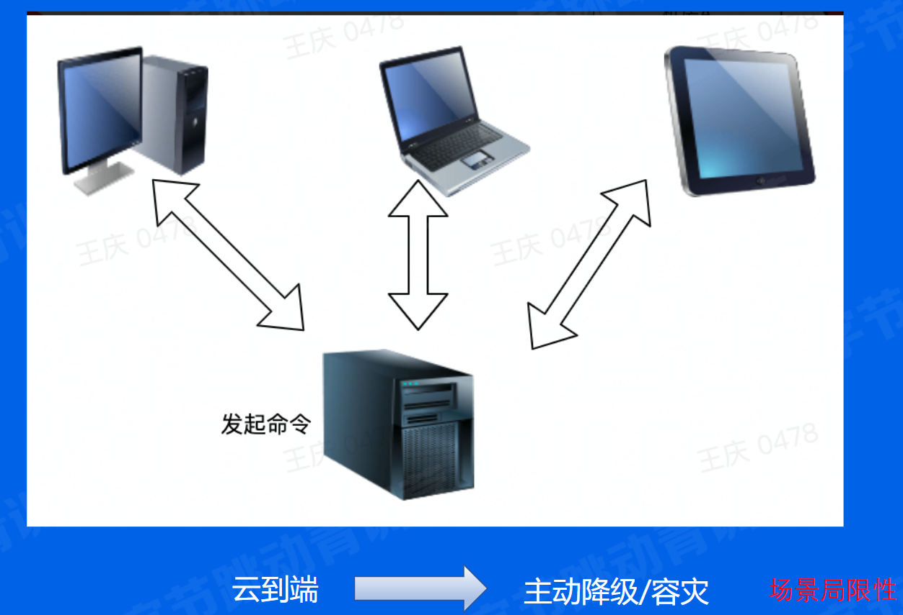

#### 网络容灾的具体案例四

服务降级，把上一次访问的数据继续返回给客户端

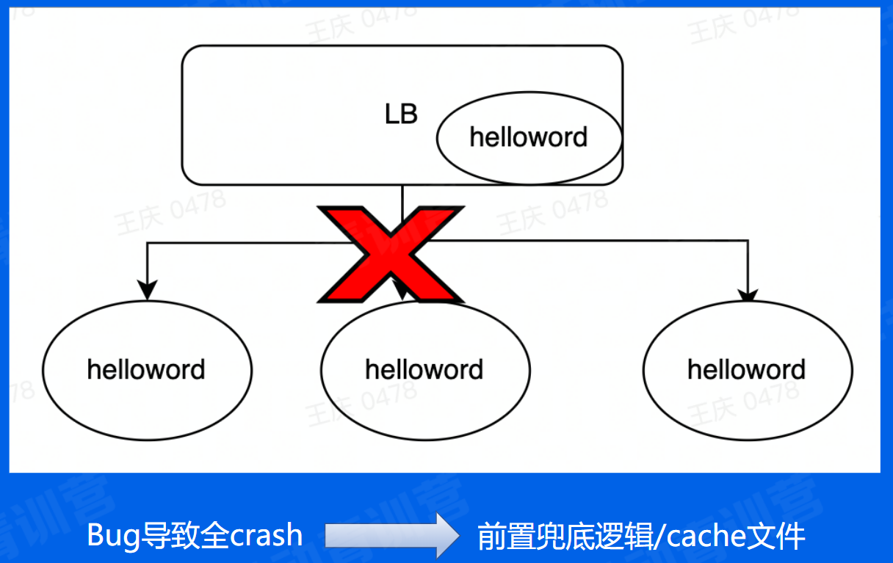

**没有容灾的故障怎么查?**

### 故障排查

- 故障明确
- 故障止损
- 分段排查

#### 故障明确

出现什么故障？->沟通是前提

- 什么业务？什么接口故障？
- 故障体现再哪里？
- 访问其他目标是否正常？
- 是否是修改导致的异常？

#### 故障止损

- 先止损再排查
  - 用户体验第一
  - 对公司的收入的影响是按照分钟甚至秒来计算
- 如何止损
  - 组件没有容灾，但是系统有没有？
  - 降级

#### 分段排查

- 客户端排查
  - 客户端访问其他服务没问题吗？
  - 其他客户端访问目标服务没问题吗？
- 服务端排查
  - 服务端监控/指标都正常吗？
  - 手动访问—下正常吗？
  - 分组件排查
- 中间链路排查
  - 服务端跟客户端确保都没有问题
  - 中间网络设备有没有问题？（交换机/路由器/网关LB）
  - 旁路DNS有没有问题？

#### 网络故障排查常用命令

- dig查询dns问题
- ping/telnet/nmap查询三层/四层连通性
- Traceroute排查中间链路
- iptables（客户端防火墙）
- tcpdump（客户端服务端抓包）

#### 网络故障排查案例一

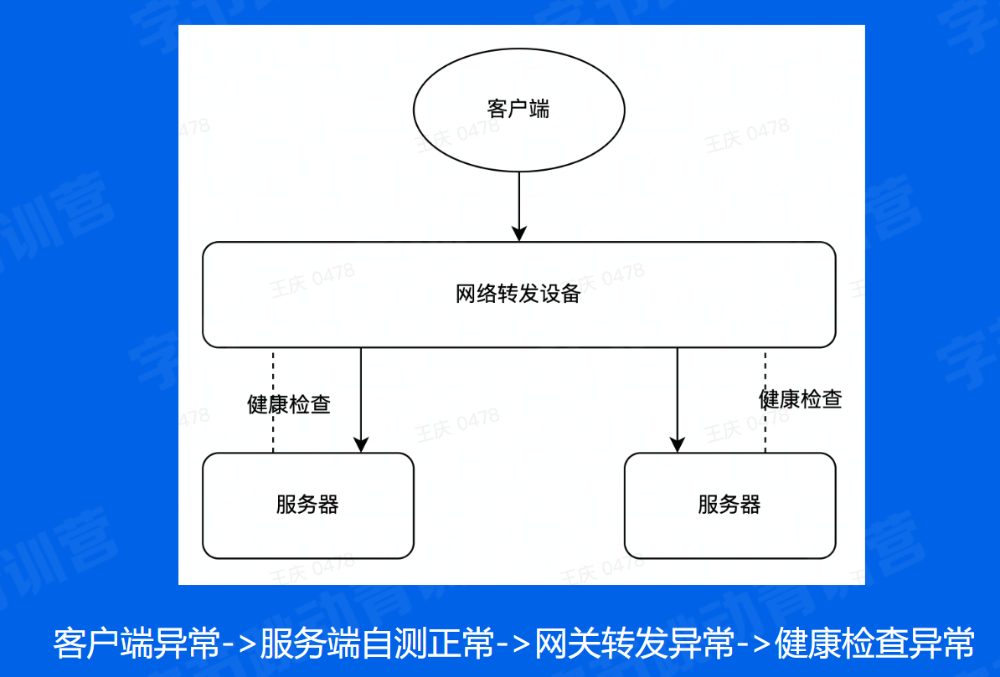

#### 网络故障排查案例二

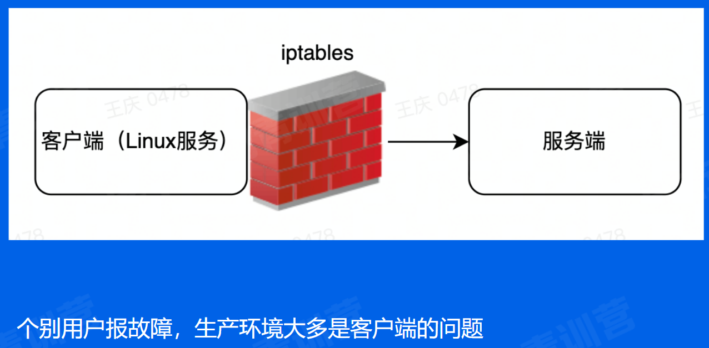

#### 网络故障排查案例三

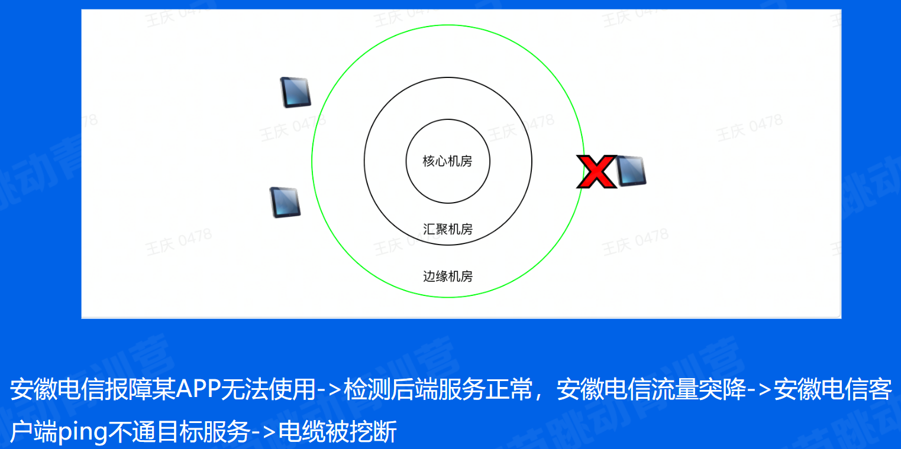

#### 网络故障排查案例四

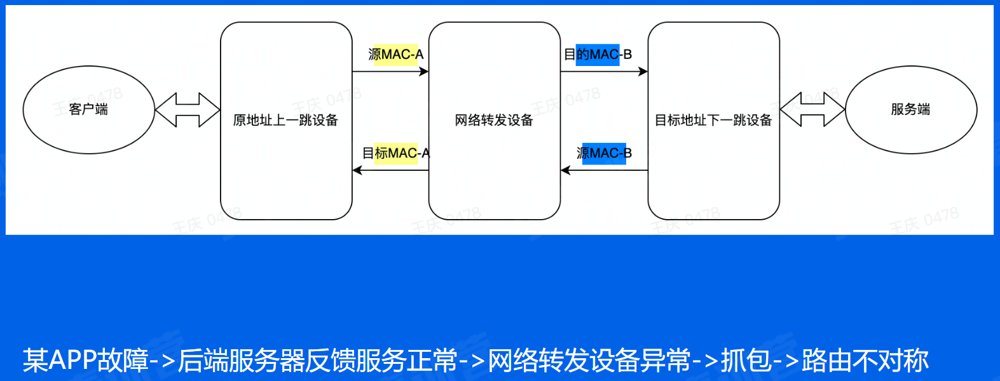

## 故障预防很重要

- 监控报警
- 故障演练/预案
- 故障降级/止损

# 总结

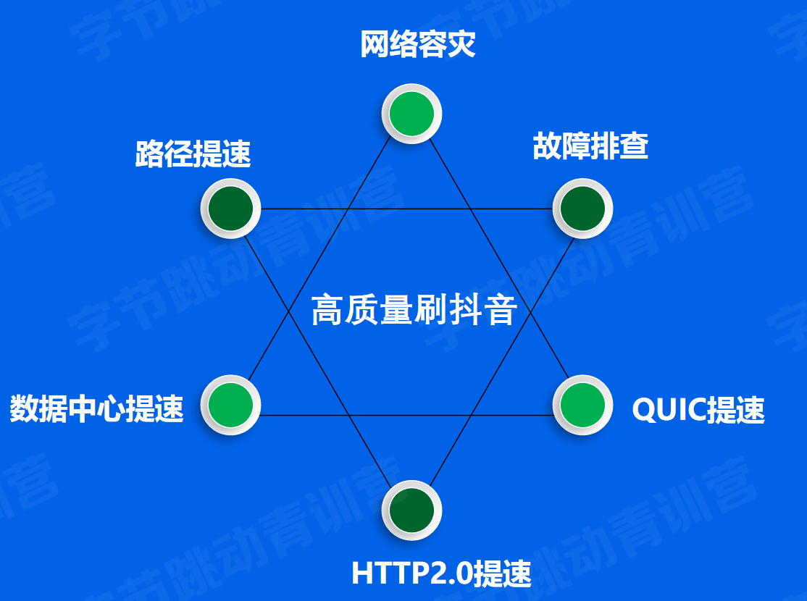
