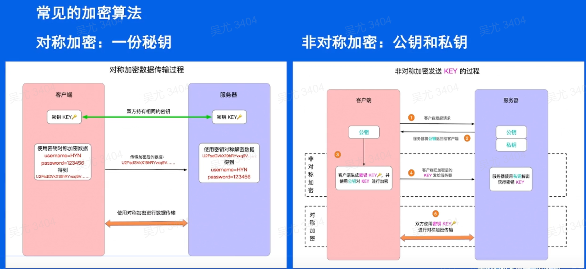
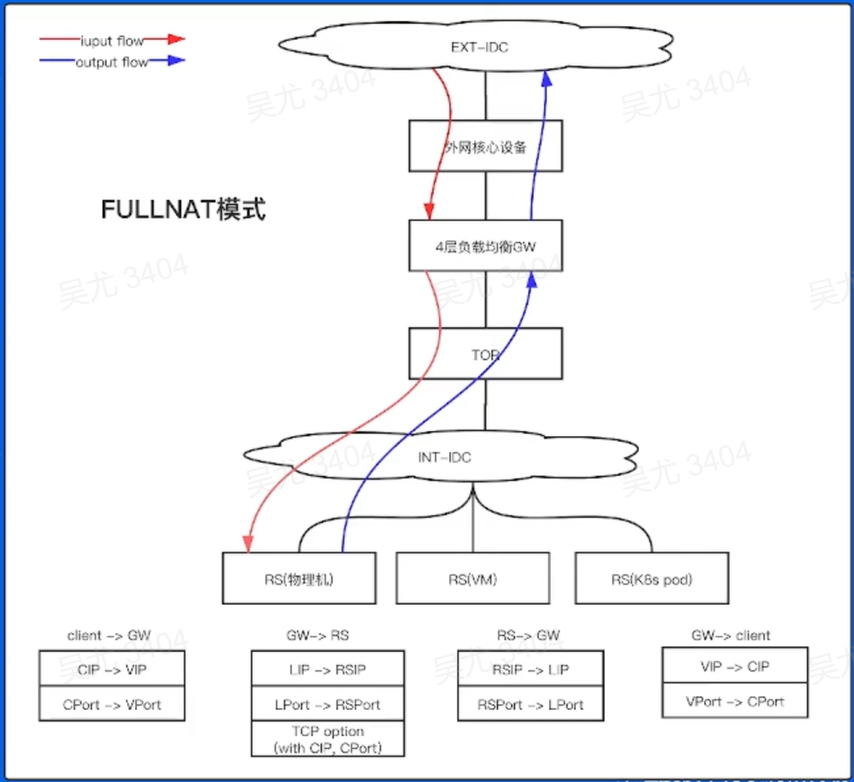

# 你能学到什么？

- 系统的熟悉和学习到企业级网络接入核心组件及基本原理
- 当面试时，别人问到你从输入网页到内容加载出来，可以泛泛而谈
- 可以自己从零到一搭建属于自己的网站/博客（网络基础设施）
- 当访问服务出现问题的时候，可以针对性的进行故障分析以及解决

# 接入问题引入

## 问题引入

> 经典问题：浏览器输入网站域名www.toutiao.com到网页加载出来，都经历了哪些过程？

- DNS域名解析

- TCP连接
- SSL/TLS握手
- HTTP请求


# 企业接入升级打怪之路

## 域名系统

### Host管理


> example 公司
>
> 主机表
>
> Host -> ip映射

随着 example 公司业务规模和员工数量的增长，使用该方式面临诸多问题：

- 流量和负载：用户规模指数级增长，文件大小越来越大，统一分发引起较大的网络流量和cpu负载
- 名称冲突：无法保证主机名称的唯一性，同名主机添加导致服务故障
- 时效性：分发靠人工上传，时效性太差

### 使用域名系统

> 使用域名系统替换hosts文件


关于域名空间：

- 域名空间被组织成树形结构
- 域名空间通过划分zone的方式进行分层授权管理
- 全球公共域名空间仅对应一棵树
- 根域名服务器：查询起点
- 域名组成格式：[a-zA-Z0-9_-]，以点划分label

顶级域gTLD：`general Top-level` 

`Domains`：`.gov政府` `.edu教育` `.com商业` `.mil军事` `.org非盈利组织` 

域名报文格式：


### 域名购买与配置迁移

- 域名购买


- 购买二级域名 `example.com`

域名备案：防止在网上从事非法的网站经营活动，打击不良互联网信息的传播，一般在云厂商处即可进行实名认证并备案

修改配置：

- 清空 `/etc/hosts`
- 配置 `/etc/resolv.conf`中`nameservers`为公共DNS
- 迁移原配置，通过控制台添加解析记录即可

### 如何开发外部用户访问

如何建设外部网站，提高公司外部影响力？

方案：租凭一个外网 ip，专用于外部用户访问门户网站，将 www.example.com 解析到外网 ip 100.1.2.3，将该ip绑定到一台物理机上，并发布公网 route，用于外部用户访问。


## 自建DNS服务器

### 问题背景

- 内网域名的解析也得出公网去获取，效率低下
- 外网用户看到内网 ip 地址，容易被黑客攻击
- 云厂商权威DNS容易出现故障，影响用户体验
- 持续扩大公司品牌技术影响力，使用自己的DNS系统

### DNS查询过程


### DNS记录类型

- A/AAAA：IP指向记录，用于指向IP，前者为IPv4记录，后者为IPv6记录
- CANAME：别名记录，配置值为别名或主机名，客户端根据别名继续解析以提取IP地址
- TXT：文本记录，购买证书时需要
- MX：邮件交换记录，用于指向邮件交换服务器
- NS：解析服务器记录，用于指定哪台服务器对于该域名解析
- SOA记录：起始授权机构记录，每个zone有且仅有唯一的一条SOA记录，SOA是描述zone属性以及主要权威服务器的记录


### 权威DNS系统架构

> 思考：在企业角度思考，我们需要的是哪种DNS服务器？

权威DNS、LocalDNS（可选）

常见的开源DNS：bind、nsd、knot、coredns

- DNS Query
- DNS Response
- DNS Update
- DNS Notify
- DNS XFR


## HTTPS协议

### 问题背景

- 页面出现白页/出现某些奇怪的东西
- 返回了403的页面
- 搜索不了东西
- 搜索问题带了小尾巴，页面总要闪几次
- 页面弹窗广告
- 搜索个汽车就有人给我打电话推销4s店和保险什么的
- ....

HTTP 明文传输，弊端越来约明显


### 对称加密和非对称加密



### SSL的通信过程

> - client random
> - server random
> - premaster secret
> - 加密算法协商
>
> 对称秘匙 session key


### 证书链

> 公匙确定是可信的吗？会不会劫持？

Client  收到会仍然需要验证：

- 是否是可信机构颁布
- 域名是否实际访问一致
- 检查好数字签名是否一致
- 检查证书的有效期
- 检查证书的撤回状态

Server 端发送的是带签名的证书链（左图）


证书摘要信息


- 数字签名


- 上级 CA 公匙


### 使用HTTPS


## 接入全站加速

### 问题背景

> 外网用户访问站点，一定是一帆风顺的吗？可能出现的问题有哪些？


- 源站容量低，可承载的并发请求数低，容易被打垮

- 报文经过的网络的设备越多，出现问题的概率也大，丢包、劫持、mtu问题
- 自主选路网络链长，时延高

极大的流失了大部分的用户群体，NPS留存率数据不乐观

### 解决方案

- 源站容量问题——增加后端机器扩容；静态内容，使用静态加速缓存

- 网络传输问题——动态加速DCDN
- 全站加速——静态加速+动态加速

### 静态加速CDN

当前访问过程


> 针对静态文件传输，网络优化方式？


- 解决服务器端的“第一公里”问题
- 缓解甚至消除了不同运营商之间互联的瓶颈造成的影响
- 减轻了各省的出口带宽压力
- 优化网上热点内容的分布

### 动态加速CND

> 针对POST等非静态请求等不能在用户边缘缓存业务的业务，基于智能选路技术，从众多回源线路中择优选择一条线路进行传输。


### DCDN原理

RTT示例：

- 用户到核心：35ms
- 用户到边缘：20ms
- 边缘到汇聚：10ms
- 汇聚到核心：10ms

Via DCDN：100ms `20(TCP) + 20*2(TLS) + 20 + 10 + 10(routine)`（边缘到核心不用TCP和TLS握手过程是因为有**预热的过程**）

Direct：140ms `35(TCP) + 35*2(TLS) + 35(routine)`


### 使用全站加速

请区分下列场景使用的加速类型

- 用户首次登录抖音，注册用户名手机号等用户信息（动态DCDN加速）
- 抖音用户点开某个特定的短视频加载后观看（静态加速CDN）
- 用户打开头条官网进行网页浏览（静态加速CDN+动态加速DCDN）


## 四层负载均衡

### 问题背景

> 提问：运营商处租用的100.1.2.3的公网IP，如何在企业内部使用最合理？

现状：直接找一个物理机，ifconfig将网卡配上这个IP，起server监听即可

应用多，起多个server监听不同的端口即可

租多个公网ip（数量优先）

**怎么尽可能的充分利用和管理有限的公网IP资源？**

### 什么是4层负载均衡？

基于IP + 端口，利用某种算法将报文转发给某个后端服务器，实现负载均衡地落在后端服务器上。

三个主要功能：

- 解耦 vip 和 rs
- NAT
- 防攻击：syn proxy


### 常见的调度算法

RR轮询：Round Robin，将所有的请求平均分配给每个真实服务器RS

加权RR轮询：给每个后端服务器一个权值比例，将请求按照比例分配

最小连接：把新的连接请求分配到当前连接数最小的服务器

五元组hash：根据sip、sport、proto、dip、dport对静态分配的服务器做散列取模（**缺点：当后端某个服务器故障后，所有连接都重新计算，影响整个hash环**）

一致hash：只影响故障服务器上的连接session，其余服务器上的连接不受影响

### 常见的实现方式 FULLNAT

> 提问：RS怎么知道真实的CIP

通过TCP option 字段传递，通过特殊的内核模块反解



### 4层负载均衡特点

- 大部分都是通过 dpdk 技术实现，技术成熟，大厂都在用

- 纯用户态协议栈，kernel bypass，消除协议瓶颈

- 无缓存，零拷贝，大页内存（减少cache miss）

- 仅仅针对4层数据包转发，小包转发可达到限速，可承受高cps

### 使用4层负载均衡


## 七层负载均衡

### 问题背景

> 提问：四层负载对100.1.2.3只能bind一个80端口，而有多个外部站点需要使用，该如何解决？
>
> 换一个说法：有一些7层相关的配置需求，该怎么做？

- SSL卸载：业务层是 http 服务，用户需要用https访问

- 请求重定向：浏览器访问 toutiao.com 自动跳转 www.toutiao.com
- 路由器添加匹配策略：完全、前缀、正则
- Header编辑
- 跨域支持
- 协议支持：websocket、grpc、quic

### Nginx简介

最灵活的高性能WEB SERVER，应用最广的7层反向代理


- 模块设计，较好的扩展性和可靠性
- 基于 master/worker 架构设计
- 支持热部署；可在线升级
- 不停机更新配置文件、更换日志文件、更新服务器二进制
- 较低的内存消耗：1万个 keep-alive 连接模式下的非活动连接仅消耗2.5M内存
- 事件驱动：异步非阻塞模型、支持aio、mmap（内存映射）

### Nginx和Apache性能对比


### Nginx反向代理示意图

- Keepalive
- 访问日志
- url rewrite重写
- 路径别名
- 基于 ip 的用户的访问控制
- 限速及并发连接数控制
- .....


### Nginx内部架构


### 事件驱动模型

- 以前：创建一个线程去监听鼠标点击的事件，可想而知，这样非常耗费资源


- 现在：每类事件都有独立的队列，往队列里面添加事件，CPU线程会去读取队列的事件处理


### 异步非阻塞

传统服务器：一个进程/线程处理一个连接/请求阻塞模型、依赖OS，实现并发

Nginx：一个进程/线程处理多个连接/请求异步非阻塞模型、减少OS进程切换


### 别让OS限制了Nginx的性能

> 优化内核网络参数

```nginx
fs.filemax=999999

net.ipv4.tcp_tw_reuse=1

net.ipv4.tcp_keepalive_time=600

net.ipv4.tcp_fin_timeout=30

net.ipv4.tcp_max_tw_buckets=5000

net.ipv4.tcp_local_port_range=1024 61000

net.ipv4.tcp_max_syn.backlog=1024

net.ipv4.tcp_syncookoies=1
```

### 提升CPU使用效率

合适的worker进程数：Worker进程数 = CPU核数

CPU亲和：每个worker线程绑定一个CPU核，提高缓存命中率


减少CPU开销：multi_accept允许worker同时接受新连接，accept_mutex解决惊群问题（），reuseport监听同端口，内核负载均衡


### 提升网络效率

- 连接复用：减少upstream建连
- 使用Cache：超时时间对业务的影响
- gzip压缩：会增加cpu开销，需平衡使用
- 开启proxy_buffering：谨慎设置proxy_buffer大小，磁盘io读写


### 使用7层负载均衡


# 动手实践

## DNS服务器搭建

Zone文件example.com.zone示例


Bind实现LocalDNS+权威DNS配置示例


请求权威DNS结果


本地未命中，转发公共DNS获取结果


## 四层负载均衡实验

- LVS：Linux virtual server，linux虚拟服务器，根据目标地址和目标端口实现用户请求转发，本身不产生流量，只做用户请求转发，详见：http://www.linuxvirtualserver.org/
- Keepalived：LVS集群高可用，解决某个节点故障问题

成功案例——阿里云CLB产品


Nginx stream模块：可进行四层协议tcp/udp报文进行转发、代理


4层转发配置样例


请求样例


日志转发


## 7层负载均衡实验


## SSL自签证书实验


## 如何将本地服务开发外网访问

> 提问：服务开发前期，如何低成本的让别人访问自己的服务

回答：Ngrok，Expose your localhost to the web

使用条件：使用Github账号授权登录，即可使用，详见https://dashboard.ngrok.com/get-started/setup


命令：`./gnrok http example.com:8082`


## 再看接入架构


