# 介绍

## 什么是Go语言

- 高性能、高并发
- 语法简单、学习曲线平滑
- 丰富的标准库
- 完善的工具链
- 静态链接
- 快速编译
- 跨平台
- 垃圾回收

```go
package main

import "net/http"

func main() {
   http.Handle("/", http.FileServer(http.Dir(".")))
   http.ListenAndServe(":8080", nil)
}
```

## 字节跳动为什么全面拥抱Go语言

- 最初使用Python，由于性能问题换成了Go
- C++不太适合在线Web业务
- 早期团队非Java背景
- 性能比较好
- 部署简单、学习成本低
- 内部RPC和HTTP框架的推广

# 入门

## Hello World

```go
package main

import (
	"fmt"
)

func main() {
	fmt.Println("hello world")
}
```

## 变量

```go
package main

import (
	"fmt"
	"math"
)

func main() {

	var a = "initial"

	var b, c int = 1, 2

	var d = true

	var e float64

	f := float32(e)

	g := a + "foo"
	fmt.Println(a, b, c, d, e, f) // initial 1 2 true 0 0
	fmt.Println(g)                // initialapple

	const s string = "constant"
	const h = 500000000
	const i = 3e20 / h
	fmt.Println(s, h, i, math.Sin(h), math.Sin(i))
}
```

## for

```go
package main

import "fmt"

func main() {

	i := 1
	for {
		fmt.Println("loop")
		break
	}
	for j := 7; j < 9; j++ {
		fmt.Println(j)
	}

	for n := 0; n < 5; n++ {
		if n%2 == 0 {
			continue
		}
		fmt.Println(n)
	}
	for i <= 3 {
		fmt.Println(i)
		i = i + 1
	}
}
```

## if else

```go
package main

import "fmt"

func main() {

	if 7%2 == 0 {
		fmt.Println("7 is even")
	} else {
		fmt.Println("7 is odd")
	}

	if 8%4 == 0 {
		fmt.Println("8 is divisible by 4")
	}

	if num := 9; num < 0 {
		fmt.Println(num, "is negative")
	} else if num < 10 {
		fmt.Println(num, "has 1 digit")
	} else {
		fmt.Println(num, "has multiple digits")
	}
}
```

## switch

```go
package main

import (
	"fmt"
	"time"
)

func main() {

	a := 2
	switch a {
	case 1:
		fmt.Println("one")
	case 2:
		fmt.Println("two")
	case 3:
		fmt.Println("three")
	case 4, 5:
		fmt.Println("four or five")
	default:
		fmt.Println("other")
	}

	t := time.Now()
	switch {
	case t.Hour() < 12:
		fmt.Println("It's before noon")
	default:
		fmt.Println("It's after noon")
	}
}
```

## array

```go
package main

import "fmt"

func main() {

	var a [5]int
	a[4] = 100
	fmt.Println("get:", a[2])
	fmt.Println("len:", len(a))

	b := [5]int{1, 2, 3, 4, 5}
	fmt.Println(b)

	var twoD [2][3]int
	for i := 0; i < 2; i++ {
		for j := 0; j < 3; j++ {
			twoD[i][j] = i + j
		}
	}
	fmt.Println("2d: ", twoD)
}
```

## slice

```go
package main

import "fmt"

func main() {

	s := make([]string, 3)
	s[0] = "a"
	s[1] = "b"
	s[2] = "c"
	fmt.Println("get:", s[2])   // c
	fmt.Println("len:", len(s)) // 3

	s = append(s, "d")
	s = append(s, "e", "f")
	fmt.Println(s) // [a b c d e f]

	c := make([]string, len(s))
	copy(c, s)
	fmt.Println(c) // [a b c d e f]

	fmt.Println(s[2:5]) // [c d e]
	fmt.Println(s[:5])  // [a b c d e]
	fmt.Println(s[2:])  // [c d e f]

	good := []string{"g", "o", "o", "d"}
	fmt.Println(good) // [g o o d]
}
```

## map

```go
package main

import "fmt"

func main() {
	m := make(map[string]int)
	m["one"] = 1
	m["two"] = 2
	fmt.Println(m)           // map[one:1 two:2]
	fmt.Println(len(m))      // 2
	fmt.Println(m["one"])    // 1
	fmt.Println(m["unknow"]) // 0

	r, ok := m["unknow"]
	fmt.Println(r, ok) // 0 false

	delete(m, "one")

	m2 := map[string]int{"one": 1, "two": 2}
	var m3 = map[string]int{"one": 1, "two": 2}
	fmt.Println(m2, m3)
}
```

## range

```go
package main

import "fmt"

func main() {
	nums := []int{2, 3, 4}
	sum := 0
	for i, num := range nums {
		sum += num
		if num == 2 {
			fmt.Println("index:", i, "num:", num) // index: 0 num: 2
		}
	}
	fmt.Println(sum) // 9

	m := map[string]string{"a": "A", "b": "B"}
	for k, v := range m {
		fmt.Println(k, v) // b 8; a A
	}
	for k := range m {
		fmt.Println("key", k) // key a; key b
	}
}
```

## func

```go
package main

import "fmt"

func add(a int, b int) int {
	return a + b
}

func add2(a, b int) int {
	return a + b
}

func exists(m map[string]string, k string) (v string, ok bool) {
	v, ok = m[k]
	return v, ok
}

func main() {
	res := add(1, 2)
	fmt.Println(res) // 3

	v, ok := exists(map[string]string{"a": "A"}, "a")
	fmt.Println(v, ok) // A True
}
```

## point

```go
package main

import "fmt"

func add2(n int) {
	n += 2
}

func add2ptr(n *int) {
	*n += 2
}

func main() {
	n := 5
	add2(n)
	fmt.Println(n) // 5
	add2ptr(&n)
	fmt.Println(n) // 7
}
```

## struct

```go
package main

import "fmt"

type user struct {
	name     string
	password string
}

func main() {
	a := user{name: "wang", password: "1024"}
	b := user{"wang", "1024"}
	c := user{name: "wang"}
	c.password = "1024"
	var d user
	d.name = "wang"
	d.password = "1024"

	fmt.Println(a, b, c, d)                 // {wang 1024} {wang 1024} {wang 1024} {wang 1024}
	fmt.Println(checkPassword(a, "haha"))   // false
	fmt.Println(checkPassword2(&a, "haha")) // false
}

func checkPassword(u user, password string) bool {
	return u.password == password
}

func checkPassword2(u *user, password string) bool {
	return u.password == password
}
```

## struct-method

```go
package main

import "fmt"

type user struct {
	name     string
	password string
}

func (u user) checkPassword(password string) bool {
	return u.password == password
}

func (u *user) resetPassword(password string) {
	u.password = password
}

func main() {
	a := user{name: "wang", password: "1024"}
	a.resetPassword("2048")
	fmt.Println(a.checkPassword("2048")) // true
}
```

## error

```go
package main

import (
	"errors"
	"fmt"
)

type user struct {
	name     string
	password string
}

func findUser(users []user, name string) (v *user, err error) {
	for _, u := range users {
		if u.name == name {
			return &u, nil
		}
	}
	return nil, errors.New("not found")
}

func main() {
	u, err := findUser([]user{{"wang", "1024"}}, "wang")
	if err != nil {
		fmt.Println(err)
		return
	}
	fmt.Println(u.name) // wang

	if u, err := findUser([]user{{"wang", "1024"}}, "li"); err != nil {
		fmt.Println(err) // not found
		return
	} else {
		fmt.Println(u.name)
	}
}
```

## string

```go
package main

import (
	"fmt"
	"strings"
)

func main() {
	a := "hello"
	fmt.Println(strings.Contains(a, "ll"))                // true
	fmt.Println(strings.Count(a, "l"))                    // 2
	fmt.Println(strings.HasPrefix(a, "he"))               // true
	fmt.Println(strings.HasSuffix(a, "llo"))              // true
	fmt.Println(strings.Index(a, "ll"))                   // 2
	fmt.Println(strings.Join([]string{"he", "llo"}, "-")) // he-llo
	fmt.Println(strings.Repeat(a, 2))                     // hellohello
	fmt.Println(strings.Replace(a, "e", "E", -1))         // hEllo
	fmt.Println(strings.Split("a-b-c", "-"))              // [a b c]
	fmt.Println(strings.ToLower(a))                       // hello
	fmt.Println(strings.ToUpper(a))                       // HELLO
	fmt.Println(len(a))                                   // 5
	b := "你好"
	fmt.Println(len(b)) // 6
}
```

## fmt

```go
package main

import (
	"fmt"
	"strings"
)

func main() {
	a := "hello"
	fmt.Println(strings.Contains(a, "ll"))                // true
	fmt.Println(strings.Count(a, "l"))                    // 2
	fmt.Println(strings.HasPrefix(a, "he"))               // true
	fmt.Println(strings.HasSuffix(a, "llo"))              // true
	fmt.Println(strings.Index(a, "ll"))                   // 2
	fmt.Println(strings.Join([]string{"he", "llo"}, "-")) // he-llo
	fmt.Println(strings.Repeat(a, 2))                     // hellohello
	fmt.Println(strings.Replace(a, "e", "E", -1))         // hEllo
	fmt.Println(strings.Split("a-b-c", "-"))              // [a b c]
	fmt.Println(strings.ToLower(a))                       // hello
	fmt.Println(strings.ToUpper(a))                       // HELLO
	fmt.Println(len(a))                                   // 5
	b := "你好"
	fmt.Println(len(b)) // 6
}
```

## json

```go
package main

import (
	"encoding/json"
	"fmt"
)

type userInfo struct {
	Name  string
	Age   int `json:"age"`
	Hobby []string
}

func main() {
	a := userInfo{Name: "wang", Age: 18, Hobby: []string{"Golang", "TypeScript"}}
	buf, err := json.Marshal(a)
	if err != nil {
		panic(err)
	}
	fmt.Println(buf)         // [123 34 78 97...]
	fmt.Println(string(buf)) // {"Name":"wang","age":18,"Hobby":["Golang","TypeScript"]}

	buf, err = json.MarshalIndent(a, "", "\t")
	if err != nil {
		panic(err)
	}
	fmt.Println(string(buf))

	var b userInfo
	err = json.Unmarshal(buf, &b)
	if err != nil {
		panic(err)
	}
	fmt.Printf("%#v\n", b) // main.userInfo{Name:"wang", Age:18, Hobby:[]string{"Golang", "TypeScript"}}
}
```

## time

```go
package main

import (
	"fmt"
	"time"
)

func main() {
	now := time.Now()
	fmt.Println(now) // 2022-03-27 18:04:59.433297 +0800 CST m=+0.000087933
	t := time.Date(2022, 3, 27, 1, 25, 36, 0, time.UTC)
	t2 := time.Date(2022, 3, 27, 2, 30, 36, 0, time.UTC)
	fmt.Println(t)                                                  // 2022-03-27 01:25:36 +0000 UTC
	fmt.Println(t.Year(), t.Month(), t.Day(), t.Hour(), t.Minute()) // 2022 March 27 1 25
	fmt.Println(t.Format("2006-01-02 15:04:05"))                    // 2022-03-27 01:25:36
	diff := t2.Sub(t)
	fmt.Println(diff)                           // 1h5m0s
	fmt.Println(diff.Minutes(), diff.Seconds()) // 65 3900
	t3, err := time.Parse("2006-01-02 15:04:05", "2022-03-27 01:25:36")
	if err != nil {
		panic(err)
	}
	fmt.Println(t3 == t)    // true
	fmt.Println(now.Unix()) // 1648738080
}
```

## strconv

```go
package main

import (
	"fmt"
	"strconv"
)

func main() {
	f, _ := strconv.ParseFloat("1.234", 64)
	fmt.Println(f) // 1.234

	n, _ := strconv.ParseInt("111", 10, 64)
	fmt.Println(n) // 111

	n, _ = strconv.ParseInt("0x1000", 0, 64)
	fmt.Println(n) // 4096

	n2, _ := strconv.Atoi("123")
	fmt.Println(n2) // 123

	n2, err := strconv.Atoi("AAA")
	fmt.Println(n2, err) // 0 strconv.Atoi: parsing "AAA": invalid syntax
}
```

## env

```go
package main

import (
	"fmt"
	"os"
	"os/exec"
)

func main() {
	// go run example/20-env/main.go a b c d
	fmt.Println(os.Args)           // [/var/folders/8p/n34xxfnx38dg8bv_x8l62t_m0000gn/T/go-build3406981276/b001/exe/main a b c d]
	fmt.Println(os.Getenv("PATH")) // /usr/local/go/bin...
	fmt.Println(os.Setenv("AA", "BB"))

	buf, err := exec.Command("grep", "127.0.0.1", "/etc/hosts").CombinedOutput()
	if err != nil {
		panic(err)
	}
	fmt.Println(string(buf)) // 127.0.0.1       localhost
}
```

# 实战

## 猜词游戏

### v1

没有指定随机数种子，每次数字都一样

```go
package main

import (
	"fmt"
	"math/rand"
)

func main() {
	maxNum := 100
	secretNumber := rand.Intn(maxNum)
	fmt.Println("The secret number is ", secretNumber)
}
```

### v2

指定了随机数种子

```go
package main

import (
	"fmt"
	"math/rand"
	"time"
)

func main() {
	maxNum := 100
	rand.Seed(time.Now().UnixNano())
	secretNumber := rand.Intn(maxNum)
	fmt.Println("The secret number is ", secretNumber)
}
```

### v3

读取用户输入

```go
package main

import (
	"bufio"
	"fmt"
	"math/rand"
	"os"
	"strconv"
	"strings"
	"time"
)

func main() {
	maxNum := 100
	rand.Seed(time.Now().UnixNano())
	secretNumber := rand.Intn(maxNum)
	fmt.Println("The secret number is ", secretNumber)

	fmt.Println("Please input your guess")
	reader := bufio.NewReader(os.Stdin)
	input, err := reader.ReadString('\n')
	if err != nil {
		fmt.Println("An error occured while reading input. Please try again", err)
		return
	}
	input = strings.TrimSuffix(input, "\r\n")

	guess, err := strconv.Atoi(input)
	if err != nil {
		fmt.Println("Invalid input. Please enter an integer value")
		return
	}
	fmt.Println("You guess is", guess)
}
```

### V4

对用户输入进行判断

```go
package main

import (
	"bufio"
	"fmt"
	"math/rand"
	"os"
	"strconv"
	"strings"
	"time"
)

func main() {
	maxNum := 100
	rand.Seed(time.Now().UnixNano())
	secretNumber := rand.Intn(maxNum)
	fmt.Println("The secret number is ", secretNumber)

	fmt.Println("Please input your guess")
	reader := bufio.NewReader(os.Stdin)
	input, err := reader.ReadString('\n')
	if err != nil {
		fmt.Println("An error occured while reading input. Please try again", err)
		return
	}
	input = strings.TrimSuffix(input, "\r\n")

	guess, err := strconv.Atoi(input)
	if err != nil {
		fmt.Println("Invalid input. Please enter an integer value")
		return
	}
	fmt.Println("You guess is", guess)
	if guess > secretNumber {
		fmt.Println("Your guess is bigger than the secret number. Please try again")
	} else if guess < secretNumber {
		fmt.Println("Your guess is smaller than the secret number. Please try again")
	} else {
		fmt.Println("Correct, you Legend!")
	}
}
```

###  v5

增加循环判断逻辑

```go
package main

import (
	"bufio"
	"fmt"
	"math/rand"
	"os"
	"strconv"
	"strings"
	"time"
)

func main() {
	maxNum := 100
	rand.Seed(time.Now().UnixNano())
	secretNumber := rand.Intn(maxNum)
	// fmt.Println("The secret number is ", secretNumber)

	fmt.Println("Please input your guess")
	reader := bufio.NewReader(os.Stdin)
	for {
		input, err := reader.ReadString('\n')
		if err != nil {
			fmt.Println("An error occured while reading input. Please try again", err)
			continue
		}
		input = strings.TrimSuffix(input, "\r\n")

		guess, err := strconv.Atoi(input)
		if err != nil {
			fmt.Println("Invalid input. Please enter an integer value")
			continue
		}
		fmt.Println("You guess is", guess)
		if guess > secretNumber {
			fmt.Println("Your guess is bigger than the secret number. Please try again")
		} else if guess < secretNumber {
			fmt.Println("Your guess is smaller than the secret number. Please try again")
		} else {
			fmt.Println("Correct, you Legend!")
			break
		}
	}
}
```

## 在线词典

> 浏览器打开网址：https://fanyi.caiyunapp.com/#/

> 抓包post请求api

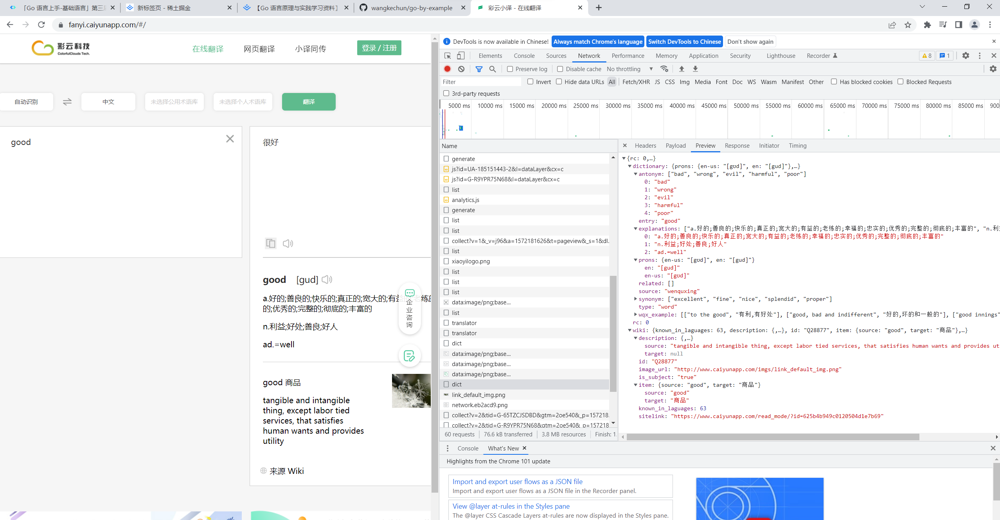

> 复制请求shell命令


```shell
curl 'https://api.interpreter.caiyunai.com/v1/dict' \
  -H 'Accept: application/json, text/plain, */*' \
  -H 'Accept-Language: zh-CN,zh;q=0.9' \
  -H 'Connection: keep-alive' \
  -H 'Content-Type: application/json;charset=UTF-8' \
  -H 'Origin: https://fanyi.caiyunapp.com' \
  -H 'Referer: https://fanyi.caiyunapp.com/' \
  -H 'Sec-Fetch-Dest: empty' \
  -H 'Sec-Fetch-Mode: cors' \
  -H 'Sec-Fetch-Site: cross-site' \
  -H 'User-Agent: Mozilla/5.0 (Windows NT 10.0; Win64; x64) AppleWebKit/537.36 (KHTML, like Gecko) Chrome/101.0.4951.54 Safari/537.36' \
  -H 'X-Authorization: token:qgemv4jr1y38jyq6vhvi' \
  -H 'app-name: xy' \
  -H 'device-id: ' \
  -H 'os-type: web' \
  -H 'os-version: ' \
  -H 'sec-ch-ua: " Not A;Brand";v="99", "Chromium";v="101", "Google Chrome";v="101"' \
  -H 'sec-ch-ua-mobile: ?0' \
  -H 'sec-ch-ua-platform: "Windows"' \
  --data-raw '{"trans_type":"en2zh","source":"good"}' \
  --compressed
```

> 打开网址：https://curlconverter.com/#go ，输入上述shell命令，自动生成代码


```go
package main

import (
	"fmt"
	"io/ioutil"
	"log"
	"net/http"
	"strings"
)

func main() {
	client := &http.Client{}
	var data = strings.NewReader(`{"trans_type":"en2zh","source":"good"}`)
	req, err := http.NewRequest("POST", "https://api.interpreter.caiyunai.com/v1/dict", data)
	if err != nil {
		log.Fatal(err)
	}
	req.Header.Set("Accept", "application/json, text/plain, */*")
	req.Header.Set("Accept-Language", "zh-CN,zh;q=0.9")
	req.Header.Set("Connection", "keep-alive")
	req.Header.Set("Content-Type", "application/json;charset=UTF-8")
	req.Header.Set("Origin", "https://fanyi.caiyunapp.com")
	req.Header.Set("Referer", "https://fanyi.caiyunapp.com/")
	req.Header.Set("Sec-Fetch-Dest", "empty")
	req.Header.Set("Sec-Fetch-Mode", "cors")
	req.Header.Set("Sec-Fetch-Site", "cross-site")
	req.Header.Set("User-Agent", "Mozilla/5.0 (Windows NT 10.0; Win64; x64) AppleWebKit/537.36 (KHTML, like Gecko) Chrome/101.0.4951.54 Safari/537.36")
	req.Header.Set("X-Authorization", "token:qgemv4jr1y38jyq6vhvi")
	req.Header.Set("app-name", "xy")
	req.Header.Set("os-type", "web")
	req.Header.Set("sec-ch-ua", `" Not A;Brand";v="99", "Chromium";v="101", "Google Chrome";v="101"`)
	req.Header.Set("sec-ch-ua-mobile", "?0")
	req.Header.Set("sec-ch-ua-platform", `"Windows"`)
	resp, err := client.Do(req)
	if err != nil {
		log.Fatal(err)
	}
	defer resp.Body.Close()
	bodyText, err := ioutil.ReadAll(resp.Body)
	if err != nil {
		log.Fatal(err)
	}
	fmt.Printf("%s\n", bodyText)
}
```

### v1

```go
package main

import (
	"fmt"
	"io/ioutil"
	"log"
	"net/http"
	"strings"
)

func main() {
	client := &http.Client{}
	var data = strings.NewReader(`{"trans_type":"en2zh","source":"good"}`)
	req, err := http.NewRequest("POST", "https://api.interpreter.caiyunai.com/v1/dict", data)
	if err != nil {
		log.Fatal(err)
	}
	req.Header.Set("Connection", "keep-alive")
	req.Header.Set("DNT", "1")
	req.Header.Set("os-version", "")
	req.Header.Set("sec-ch-ua-mobile", "?0")
	req.Header.Set("User-Agent", "Mozilla/5.0 (Macintosh; Intel Mac OS X 10_15_7) AppleWebKit/537.36 (KHTML, like Gecko) Chrome/99.0.4844.51 Safari/537.36")
	req.Header.Set("app-name", "xy")
	req.Header.Set("Content-Type", "application/json;charset=UTF-8")
	req.Header.Set("Accept", "application/json, text/plain, */*")
	req.Header.Set("device-id", "")
	req.Header.Set("os-type", "web")
	req.Header.Set("X-Authorization", "token:qgemv4jr1y38jyq6vhvi")
	req.Header.Set("Origin", "https://fanyi.caiyunapp.com")
	req.Header.Set("Sec-Fetch-Site", "cross-site")
	req.Header.Set("Sec-Fetch-Mode", "cors")
	req.Header.Set("Sec-Fetch-Dest", "empty")
	req.Header.Set("Referer", "https://fanyi.caiyunapp.com/")
	req.Header.Set("Accept-Language", "zh-CN,zh;q=0.9")
	req.Header.Set("Cookie", "_ym_uid=16456948721020430059; _ym_d=1645694872")
	resp, err := client.Do(req)
	if err != nil {
		log.Fatal(err)
	}
	defer resp.Body.Close()
	bodyText, err := ioutil.ReadAll(resp.Body)
	if err != nil {
		log.Fatal(err)
	}
	fmt.Printf("%s\n", bodyText)
}
```

### v2

生成请求消息体

```go
package main

import (
	"bytes"
	"encoding/json"
	"fmt"
	"io/ioutil"
	"log"
	"net/http"
)

type DictRequest struct {
	TransType string `json:"trans_type"`
	Source    string `json:"source"`
	UserID    string `json:"user_id"`
}

func main() {
	client := &http.Client{}
	request := DictRequest{TransType: "en2zh", Source: "good"}
	buf, err := json.Marshal(request)
	if err != nil {
		log.Fatal(err)
	}
	var data = bytes.NewReader(buf)
	req, err := http.NewRequest("POST", "https://api.interpreter.caiyunai.com/v1/dict", data)
	if err != nil {
		log.Fatal(err)
	}
	req.Header.Set("Connection", "keep-alive")
	req.Header.Set("DNT", "1")
	req.Header.Set("os-version", "")
	req.Header.Set("sec-ch-ua-mobile", "?0")
	req.Header.Set("User-Agent", "Mozilla/5.0 (Macintosh; Intel Mac OS X 10_15_7) AppleWebKit/537.36 (KHTML, like Gecko) Chrome/99.0.4844.51 Safari/537.36")
	req.Header.Set("app-name", "xy")
	req.Header.Set("Content-Type", "application/json;charset=UTF-8")
	req.Header.Set("Accept", "application/json, text/plain, */*")
	req.Header.Set("device-id", "")
	req.Header.Set("os-type", "web")
	req.Header.Set("X-Authorization", "token:qgemv4jr1y38jyq6vhvi")
	req.Header.Set("Origin", "https://fanyi.caiyunapp.com")
	req.Header.Set("Sec-Fetch-Site", "cross-site")
	req.Header.Set("Sec-Fetch-Mode", "cors")
	req.Header.Set("Sec-Fetch-Dest", "empty")
	req.Header.Set("Referer", "https://fanyi.caiyunapp.com/")
	req.Header.Set("Accept-Language", "zh-CN,zh;q=0.9")
	req.Header.Set("Cookie", "_ym_uid=16456948721020430059; _ym_d=1645694872")
	resp, err := client.Do(req)
	if err != nil {
		log.Fatal(err)
	}
	defer resp.Body.Close()
	bodyText, err := ioutil.ReadAll(resp.Body)
	if err != nil {
		log.Fatal(err)
	}
	fmt.Printf("%s\n", bodyText)
}
```

### v3

解析响应消息体

> 打开网址：https://oktools.net/json2go

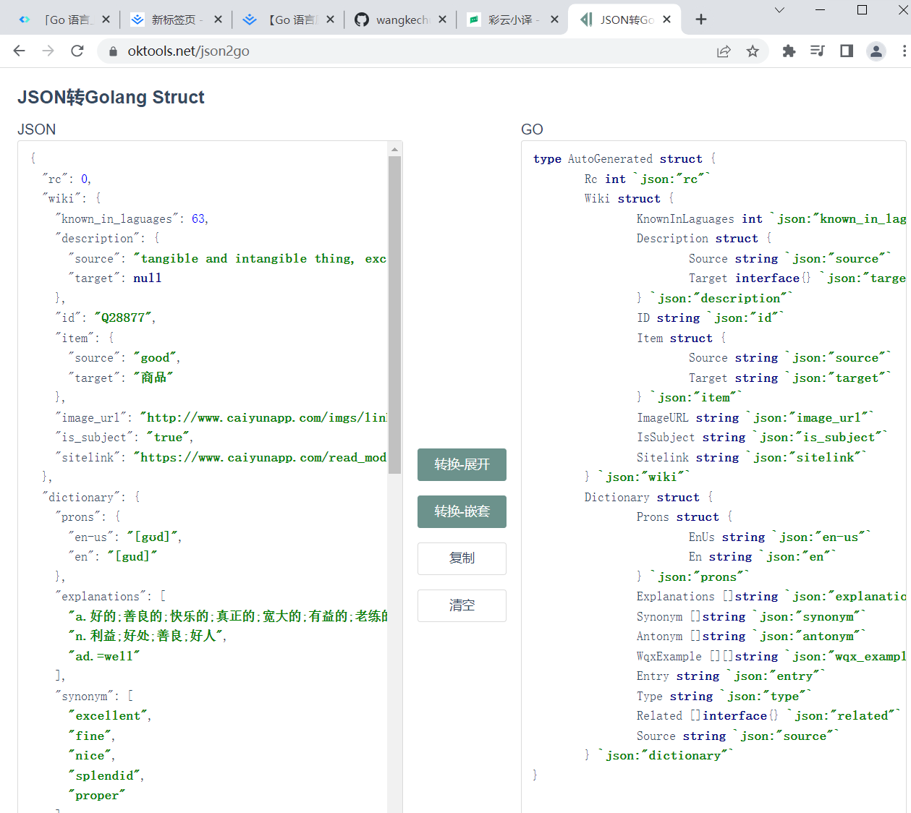

```go
package main

import (
	"bytes"
	"encoding/json"
	"fmt"
	"io/ioutil"
	"log"
	"net/http"
)

type DictRequest struct {
	TransType string `json:"trans_type"`
	Source    string `json:"source"`
	UserID    string `json:"user_id"`
}

type DictResponse struct {
	Rc   int `json:"rc"`
	Wiki struct {
		KnownInLaguages int `json:"known_in_laguages"`
		Description     struct {
			Source string      `json:"source"`
			Target interface{} `json:"target"`
		} `json:"description"`
		ID   string `json:"id"`
		Item struct {
			Source string `json:"source"`
			Target string `json:"target"`
		} `json:"item"`
		ImageURL  string `json:"image_url"`
		IsSubject string `json:"is_subject"`
		Sitelink  string `json:"sitelink"`
	} `json:"wiki"`
	Dictionary struct {
		Prons struct {
			EnUs string `json:"en-us"`
			En   string `json:"en"`
		} `json:"prons"`
		Explanations []string      `json:"explanations"`
		Synonym      []string      `json:"synonym"`
		Antonym      []string      `json:"antonym"`
		WqxExample   [][]string    `json:"wqx_example"`
		Entry        string        `json:"entry"`
		Type         string        `json:"type"`
		Related      []interface{} `json:"related"`
		Source       string        `json:"source"`
	} `json:"dictionary"`
}

func main() {
	client := &http.Client{}
	request := DictRequest{TransType: "en2zh", Source: "good"}
	buf, err := json.Marshal(request)
	if err != nil {
		log.Fatal(err)
	}
	var data = bytes.NewReader(buf)
	req, err := http.NewRequest("POST", "https://api.interpreter.caiyunai.com/v1/dict", data)
	if err != nil {
		log.Fatal(err)
	}
	req.Header.Set("Connection", "keep-alive")
	req.Header.Set("DNT", "1")
	req.Header.Set("os-version", "")
	req.Header.Set("sec-ch-ua-mobile", "?0")
	req.Header.Set("User-Agent", "Mozilla/5.0 (Macintosh; Intel Mac OS X 10_15_7) AppleWebKit/537.36 (KHTML, like Gecko) Chrome/99.0.4844.51 Safari/537.36")
	req.Header.Set("app-name", "xy")
	req.Header.Set("Content-Type", "application/json;charset=UTF-8")
	req.Header.Set("Accept", "application/json, text/plain, */*")
	req.Header.Set("device-id", "")
	req.Header.Set("os-type", "web")
	req.Header.Set("X-Authorization", "token:qgemv4jr1y38jyq6vhvi")
	req.Header.Set("Origin", "https://fanyi.caiyunapp.com")
	req.Header.Set("Sec-Fetch-Site", "cross-site")
	req.Header.Set("Sec-Fetch-Mode", "cors")
	req.Header.Set("Sec-Fetch-Dest", "empty")
	req.Header.Set("Referer", "https://fanyi.caiyunapp.com/")
	req.Header.Set("Accept-Language", "zh-CN,zh;q=0.9")
	req.Header.Set("Cookie", "_ym_uid=16456948721020430059; _ym_d=1645694872")
	resp, err := client.Do(req)
	if err != nil {
		log.Fatal(err)
	}
	defer resp.Body.Close()
	bodyText, err := ioutil.ReadAll(resp.Body)
	if err != nil {
		log.Fatal(err)
	}
	var dictResponse DictResponse
	err = json.Unmarshal(bodyText, &dictResponse)
	if err != nil {
		log.Fatal(err)
	}
	fmt.Printf("%#v\n", dictResponse)
}
```

### v4

完善代码，封装可执行程序

```go
package main

import (
	"bytes"
	"encoding/json"
	"fmt"
	"io/ioutil"
	"log"
	"net/http"
	"os"
)

type DictRequest struct {
	TransType string `json:"trans_type"`
	Source    string `json:"source"`
	UserID    string `json:"user_id"`
}

type DictResponse struct {
	Rc   int `json:"rc"`
	Wiki struct {
		KnownInLaguages int `json:"known_in_laguages"`
		Description     struct {
			Source string      `json:"source"`
			Target interface{} `json:"target"`
		} `json:"description"`
		ID   string `json:"id"`
		Item struct {
			Source string `json:"source"`
			Target string `json:"target"`
		} `json:"item"`
		ImageURL  string `json:"image_url"`
		IsSubject string `json:"is_subject"`
		Sitelink  string `json:"sitelink"`
	} `json:"wiki"`
	Dictionary struct {
		Prons struct {
			EnUs string `json:"en-us"`
			En   string `json:"en"`
		} `json:"prons"`
		Explanations []string      `json:"explanations"`
		Synonym      []string      `json:"synonym"`
		Antonym      []string      `json:"antonym"`
		WqxExample   [][]string    `json:"wqx_example"`
		Entry        string        `json:"entry"`
		Type         string        `json:"type"`
		Related      []interface{} `json:"related"`
		Source       string        `json:"source"`
	} `json:"dictionary"`
}

func query(word string) {
	client := &http.Client{}
	request := DictRequest{TransType: "en2zh", Source: word}
	buf, err := json.Marshal(request)
	if err != nil {
		log.Fatal(err)
	}
	var data = bytes.NewReader(buf)
	req, err := http.NewRequest("POST", "https://api.interpreter.caiyunai.com/v1/dict", data)
	if err != nil {
		log.Fatal(err)
	}
	req.Header.Set("Connection", "keep-alive")
	req.Header.Set("DNT", "1")
	req.Header.Set("os-version", "")
	req.Header.Set("sec-ch-ua-mobile", "?0")
	req.Header.Set("User-Agent", "Mozilla/5.0 (Macintosh; Intel Mac OS X 10_15_7) AppleWebKit/537.36 (KHTML, like Gecko) Chrome/99.0.4844.51 Safari/537.36")
	req.Header.Set("app-name", "xy")
	req.Header.Set("Content-Type", "application/json;charset=UTF-8")
	req.Header.Set("Accept", "application/json, text/plain, */*")
	req.Header.Set("device-id", "")
	req.Header.Set("os-type", "web")
	req.Header.Set("X-Authorization", "token:qgemv4jr1y38jyq6vhvi")
	req.Header.Set("Origin", "https://fanyi.caiyunapp.com")
	req.Header.Set("Sec-Fetch-Site", "cross-site")
	req.Header.Set("Sec-Fetch-Mode", "cors")
	req.Header.Set("Sec-Fetch-Dest", "empty")
	req.Header.Set("Referer", "https://fanyi.caiyunapp.com/")
	req.Header.Set("Accept-Language", "zh-CN,zh;q=0.9")
	req.Header.Set("Cookie", "_ym_uid=16456948721020430059; _ym_d=1645694872")
	resp, err := client.Do(req)
	if err != nil {
		log.Fatal(err)
	}
	defer resp.Body.Close()
	bodyText, err := ioutil.ReadAll(resp.Body)
	if err != nil {
		log.Fatal(err)
	}
	if resp.StatusCode != 200 {
		log.Fatal("bad StatusCode:", resp.StatusCode, "body", string(bodyText))
	}
	var dictResponse DictResponse
	err = json.Unmarshal(bodyText, &dictResponse)
	if err != nil {
		log.Fatal(err)
	}
	fmt.Println(word, "UK:", dictResponse.Dictionary.Prons.En, "US:", dictResponse.Dictionary.Prons.EnUs)
	for _, item := range dictResponse.Dictionary.Explanations {
		fmt.Println(item)
	}
}

func main() {
	if len(os.Args) != 2 {
		fmt.Fprintf(os.Stderr, `usage: simpleDict WORD
example: simpleDict hello
		`)
		os.Exit(1)
	}
	word := os.Args[1]
	query(word)
}
```


## SOCKS5

> 介绍

采用socks协议的代理服务器就是SOCKS服务器，是一种通用的[代理服务器](https://baike.baidu.com/item/代理服务器/97996)。Socks是个电路级的底层[网关](https://baike.baidu.com/item/网关/98992)，是DavidKoblas在1990年开发的，此后就一直作为Internet RFC标准的[开放标准](https://baike.baidu.com/item/开放标准/18751106)。Socks 不要求应用程序遵循特定的操作系统平台，Socks 代理与[应用层](https://baike.baidu.com/item/应用层/4329788)代理、 HTTP 层代理不同，Socks 代理只是简单地传递数据包，而不必关心是何种应用协议（比如[FTP](https://baike.baidu.com/item/FTP/13839)、HTTP和NNTP请求）。所以，[Socks代理](https://baike.baidu.com/item/Socks代理/10627160)比其他应用层代理要快得多。

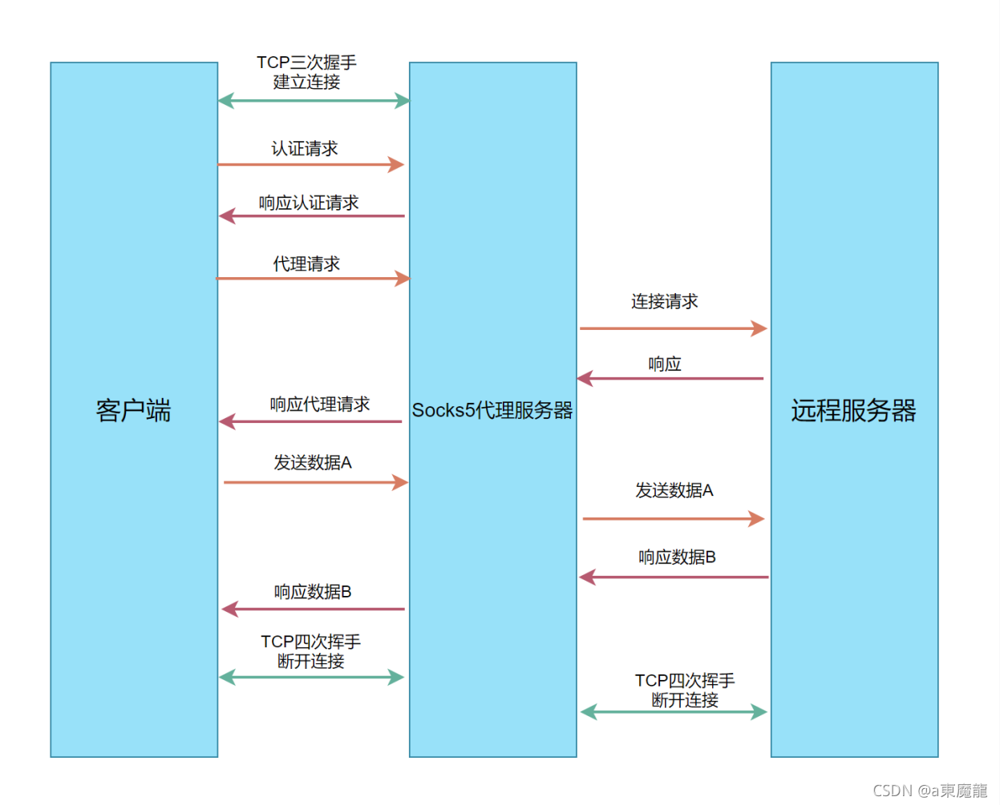

### v1

Socks5代理 TCP echo server

```go
package main

import (
	"bufio"
	"log"
	"net"
)

func main() {
	server, err := net.Listen("tcp", "127.0.0.1:1080")
	if err != nil {
		panic(err)
	}
	for {
		client, err := server.Accept()
		if err != nil {
			log.Printf("Accept failed %v", err)
			continue
		}
		go process(client)
	}
}

func process(conn net.Conn) {
	defer conn.Close()
	reader := bufio.NewReader(conn)
	for {
		b, err := reader.ReadByte()
		if err != nil {
			break
		}
		_, err = conn.Write([]byte{b})
		if err != nil {
			break
		}
	}
}
```

> windows使用powershell进行测试需要安装nc

下载: https://eternallybored.org/misc/netcat/

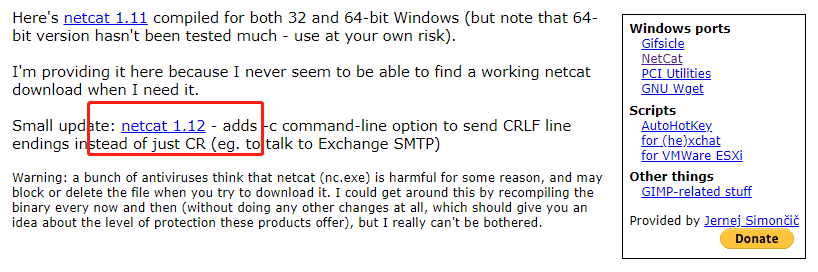

解压后,把`nc.exe`复制到`C:\Windows\System32`目录

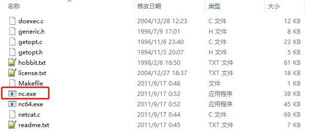

运行cmd,查看命令:`nc -h`

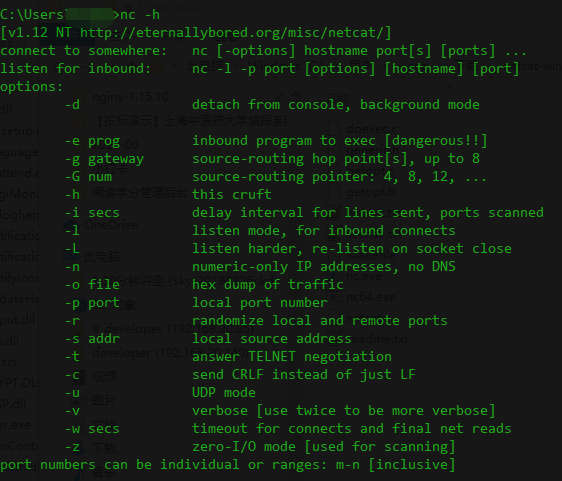

> shell测试，启动项目

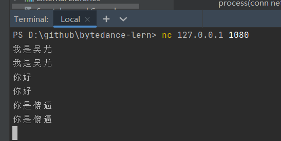

### v2

Socks5代理 auth

```go
package main

import (
	"bufio"
	"fmt"
	"io"
	"log"
	"net"
)

const socks5Ver = 0x05
const cmdBind = 0x01
const atypIPV4 = 0x01
const atypeHOST = 0x03
const atypeIPV6 = 0x04

func main() {
	server, err := net.Listen("tcp", "127.0.0.1:1080")
	if err != nil {
		panic(err)
	}
	for {
		client, err := server.Accept()
		if err != nil {
			log.Printf("Accept failed %v", err)
			continue
		}
		go process(client)
	}
}

func process(conn net.Conn) {
	defer conn.Close()
	reader := bufio.NewReader(conn)
	err := auth(reader, conn)
	if err != nil {
		log.Printf("client %v auth failed:%v", conn.RemoteAddr(), err)
		return
	}
	log.Println("auth success")
}

func auth(reader *bufio.Reader, conn net.Conn) (err error) {
	// +----+----------+----------+
	// |VER | NMETHODS | METHODS  |
	// +----+----------+----------+
	// | 1  |    1     | 1 to 255 |
	// +----+----------+----------+
	// VER: 协议版本，socks5为0x05
	// NMETHODS: 支持认证的方法数量
	// METHODS: 对应NMETHODS，NMETHODS的值为多少，METHODS就有多少个字节。RFC预定义了一些值的含义，内容如下:
	// X’00’ NO AUTHENTICATION REQUIRED
	// X’02’ USERNAME/PASSWORD

	ver, err := reader.ReadByte()
	if err != nil {
		return fmt.Errorf("read ver failed:%w", err)
	}
	if ver != socks5Ver {
		return fmt.Errorf("not supported ver:%v", ver)
	}
	methodSize, err := reader.ReadByte()
	if err != nil {
		return fmt.Errorf("read methodSize failed:%w", err)
	}
	method := make([]byte, methodSize)
	_, err = io.ReadFull(reader, method)
	if err != nil {
		return fmt.Errorf("read method failed:%w", err)
	}
	log.Println("ver", ver, "method", method)
	// +----+--------+
	// |VER | METHOD |
	// +----+--------+
	// | 1  |   1    |
	// +----+--------+
	_, err = conn.Write([]byte{socks5Ver, 0x00})
	if err != nil {
		return fmt.Errorf("write failed:%w", err)
	}
	return nil
}
```

> shell测试

`curl --socks5 127.0.0.1:1080 -v http://www.qq.com`

### v3

Socks5代理 请求阶段

```go
package main

import (
	"bufio"
	"encoding/binary"
	"errors"
	"fmt"
	"io"
	"log"
	"net"
)

const socks5Ver = 0x05
const cmdBind = 0x01
const atypIPV4 = 0x01
const atypeHOST = 0x03
const atypeIPV6 = 0x04

func main() {
	server, err := net.Listen("tcp", "127.0.0.1:1080")
	if err != nil {
		panic(err)
	}
	for {
		client, err := server.Accept()
		if err != nil {
			log.Printf("Accept failed %v", err)
			continue
		}
		go process(client)
	}
}

func process(conn net.Conn) {
	defer conn.Close()
	reader := bufio.NewReader(conn)
	err := auth(reader, conn)
	if err != nil {
		log.Printf("client %v auth failed:%v", conn.RemoteAddr(), err)
		return
	}
	err = connect(reader, conn)
	if err != nil {
		log.Printf("client %v auth failed:%v", conn.RemoteAddr(), err)
		return
	}
}

func auth(reader *bufio.Reader, conn net.Conn) (err error) {
	// +----+----------+----------+
	// |VER | NMETHODS | METHODS  |
	// +----+----------+----------+
	// | 1  |    1     | 1 to 255 |
	// +----+----------+----------+
	// VER: 协议版本，socks5为0x05
	// NMETHODS: 支持认证的方法数量
	// METHODS: 对应NMETHODS，NMETHODS的值为多少，METHODS就有多少个字节。RFC预定义了一些值的含义，内容如下:
	// X’00’ NO AUTHENTICATION REQUIRED
	// X’02’ USERNAME/PASSWORD

	ver, err := reader.ReadByte()
	if err != nil {
		return fmt.Errorf("read ver failed:%w", err)
	}
	if ver != socks5Ver {
		return fmt.Errorf("not supported ver:%v", ver)
	}
	methodSize, err := reader.ReadByte()
	if err != nil {
		return fmt.Errorf("read methodSize failed:%w", err)
	}
	method := make([]byte, methodSize)
	_, err = io.ReadFull(reader, method)
	if err != nil {
		return fmt.Errorf("read method failed:%w", err)
	}

	// +----+--------+
	// |VER | METHOD |
	// +----+--------+
	// | 1  |   1    |
	// +----+--------+
	_, err = conn.Write([]byte{socks5Ver, 0x00})
	if err != nil {
		return fmt.Errorf("write failed:%w", err)
	}
	return nil
}

func connect(reader *bufio.Reader, conn net.Conn) (err error) {
	// +----+-----+-------+------+----------+----------+
	// |VER | CMD |  RSV  | ATYP | DST.ADDR | DST.PORT |
	// +----+-----+-------+------+----------+----------+
	// | 1  |  1  | X'00' |  1   | Variable |    2     |
	// +----+-----+-------+------+----------+----------+
	// VER 版本号，socks5的值为0x05
	// CMD 0x01表示CONNECT请求
	// RSV 保留字段，值为0x00
	// ATYP 目标地址类型，DST.ADDR的数据对应这个字段的类型。
	//   0x01表示IPv4地址，DST.ADDR为4个字节
	//   0x03表示域名，DST.ADDR是一个可变长度的域名
	// DST.ADDR 一个可变长度的值
	// DST.PORT 目标端口，固定2个字节

	buf := make([]byte, 4)
	_, err = io.ReadFull(reader, buf)
	if err != nil {
		return fmt.Errorf("read header failed:%w", err)
	}
	ver, cmd, atyp := buf[0], buf[1], buf[3]
	if ver != socks5Ver {
		return fmt.Errorf("not supported ver:%v", ver)
	}
	if cmd != cmdBind {
		return fmt.Errorf("not supported cmd:%v", ver)
	}
	addr := ""
	switch atyp {
	case atypIPV4:
		_, err = io.ReadFull(reader, buf)
		if err != nil {
			return fmt.Errorf("read atyp failed:%w", err)
		}
		addr = fmt.Sprintf("%d.%d.%d.%d", buf[0], buf[1], buf[2], buf[3])
	case atypeHOST:
		hostSize, err := reader.ReadByte()
		if err != nil {
			return fmt.Errorf("read hostSize failed:%w", err)
		}
		host := make([]byte, hostSize)
		_, err = io.ReadFull(reader, host)
		if err != nil {
			return fmt.Errorf("read host failed:%w", err)
		}
		addr = string(host)
	case atypeIPV6:
		return errors.New("IPv6: no supported yet")
	default:
		return errors.New("invalid atyp")
	}
	_, err = io.ReadFull(reader, buf[:2])
	if err != nil {
		return fmt.Errorf("read port failed:%w", err)
	}
	port := binary.BigEndian.Uint16(buf[:2])

	log.Println("dial", addr, port)

	// +----+-----+-------+------+----------+----------+
	// |VER | REP |  RSV  | ATYP | BND.ADDR | BND.PORT |
	// +----+-----+-------+------+----------+----------+
	// | 1  |  1  | X'00' |  1   | Variable |    2     |
	// +----+-----+-------+------+----------+----------+
	// VER socks版本，这里为0x05
	// REP Relay field,内容取值如下 X’00’ succeeded
	// RSV 保留字段
	// ATYPE 地址类型
	// BND.ADDR 服务绑定的地址
	// BND.PORT 服务绑定的端口DST.PORT
	_, err = conn.Write([]byte{0x05, 0x00, 0x00, 0x01, 0, 0, 0, 0, 0, 0})
	if err != nil {
		return fmt.Errorf("write failed: %w", err)
	}
	return nil
}
```

> shell测试

`curl --socks5 127.0.0.1:1080 -v http://www.qq.com`

### v4

Socks5代理 relay阶段

```go
package main

import (
	"bufio"
	"context"
	"encoding/binary"
	"errors"
	"fmt"
	"io"
	"log"
	"net"
)

const socks5Ver = 0x05
const cmdBind = 0x01
const atypIPV4 = 0x01
const atypeHOST = 0x03
const atypeIPV6 = 0x04

func main() {
	server, err := net.Listen("tcp", "127.0.0.1:1080")
	if err != nil {
		panic(err)
	}
	for {
		client, err := server.Accept()
		if err != nil {
			log.Printf("Accept failed %v", err)
			continue
		}
		go process(client)
	}
}

func process(conn net.Conn) {
	defer conn.Close()
	reader := bufio.NewReader(conn)
	err := auth(reader, conn)
	if err != nil {
		log.Printf("client %v auth failed:%v", conn.RemoteAddr(), err)
		return
	}
	err = connect(reader, conn)
	if err != nil {
		log.Printf("client %v auth failed:%v", conn.RemoteAddr(), err)
		return
	}
}

func auth(reader *bufio.Reader, conn net.Conn) (err error) {
	// +----+----------+----------+
	// |VER | NMETHODS | METHODS  |
	// +----+----------+----------+
	// | 1  |    1     | 1 to 255 |
	// +----+----------+----------+
	// VER: 协议版本，socks5为0x05
	// NMETHODS: 支持认证的方法数量
	// METHODS: 对应NMETHODS，NMETHODS的值为多少，METHODS就有多少个字节。RFC预定义了一些值的含义，内容如下:
	// X’00’ NO AUTHENTICATION REQUIRED
	// X’02’ USERNAME/PASSWORD

	ver, err := reader.ReadByte()
	if err != nil {
		return fmt.Errorf("read ver failed:%w", err)
	}
	if ver != socks5Ver {
		return fmt.Errorf("not supported ver:%v", ver)
	}
	methodSize, err := reader.ReadByte()
	if err != nil {
		return fmt.Errorf("read methodSize failed:%w", err)
	}
	method := make([]byte, methodSize)
	_, err = io.ReadFull(reader, method)
	if err != nil {
		return fmt.Errorf("read method failed:%w", err)
	}

	// +----+--------+
	// |VER | METHOD |
	// +----+--------+
	// | 1  |   1    |
	// +----+--------+
	_, err = conn.Write([]byte{socks5Ver, 0x00})
	if err != nil {
		return fmt.Errorf("write failed:%w", err)
	}
	return nil
}

func connect(reader *bufio.Reader, conn net.Conn) (err error) {
	// +----+-----+-------+------+----------+----------+
	// |VER | CMD |  RSV  | ATYP | DST.ADDR | DST.PORT |
	// +----+-----+-------+------+----------+----------+
	// | 1  |  1  | X'00' |  1   | Variable |    2     |
	// +----+-----+-------+------+----------+----------+
	// VER 版本号，socks5的值为0x05
	// CMD 0x01表示CONNECT请求
	// RSV 保留字段，值为0x00
	// ATYP 目标地址类型，DST.ADDR的数据对应这个字段的类型。
	//   0x01表示IPv4地址，DST.ADDR为4个字节
	//   0x03表示域名，DST.ADDR是一个可变长度的域名
	// DST.ADDR 一个可变长度的值
	// DST.PORT 目标端口，固定2个字节

	buf := make([]byte, 4)
	_, err = io.ReadFull(reader, buf)
	if err != nil {
		return fmt.Errorf("read header failed:%w", err)
	}
	ver, cmd, atyp := buf[0], buf[1], buf[3]
	if ver != socks5Ver {
		return fmt.Errorf("not supported ver:%v", ver)
	}
	if cmd != cmdBind {
		return fmt.Errorf("not supported cmd:%v", ver)
	}
	addr := ""
	switch atyp {
	case atypIPV4:
		_, err = io.ReadFull(reader, buf)
		if err != nil {
			return fmt.Errorf("read atyp failed:%w", err)
		}
		addr = fmt.Sprintf("%d.%d.%d.%d", buf[0], buf[1], buf[2], buf[3])
	case atypeHOST:
		hostSize, err := reader.ReadByte()
		if err != nil {
			return fmt.Errorf("read hostSize failed:%w", err)
		}
		host := make([]byte, hostSize)
		_, err = io.ReadFull(reader, host)
		if err != nil {
			return fmt.Errorf("read host failed:%w", err)
		}
		addr = string(host)
	case atypeIPV6:
		return errors.New("IPv6: no supported yet")
	default:
		return errors.New("invalid atyp")
	}
	_, err = io.ReadFull(reader, buf[:2])
	if err != nil {
		return fmt.Errorf("read port failed:%w", err)
	}
	port := binary.BigEndian.Uint16(buf[:2])

	dest, err := net.Dial("tcp", fmt.Sprintf("%v:%v", addr, port))
	if err != nil {
		return fmt.Errorf("dial dst failed:%w", err)
	}
	defer dest.Close()
	log.Println("dial", addr, port)

	// +----+-----+-------+------+----------+----------+
	// |VER | REP |  RSV  | ATYP | BND.ADDR | BND.PORT |
	// +----+-----+-------+------+----------+----------+
	// | 1  |  1  | X'00' |  1   | Variable |    2     |
	// +----+-----+-------+------+----------+----------+
	// VER socks版本，这里为0x05
	// REP Relay field,内容取值如下 X’00’ succeeded
	// RSV 保留字段
	// ATYPE 地址类型
	// BND.ADDR 服务绑定的地址
	// BND.PORT 服务绑定的端口DST.PORT
	_, err = conn.Write([]byte{0x05, 0x00, 0x00, 0x01, 0, 0, 0, 0, 0, 0})
	if err != nil {
		return fmt.Errorf("write failed: %w", err)
	}
	ctx, cancel := context.WithCancel(context.Background())
	defer cancel()

	go func() {
		_, _ = io.Copy(dest, reader)
		cancel()
	}()
	go func() {
		_, _ = io.Copy(conn, dest)
		cancel()
	}()

	<-ctx.Done()
	return nil
}
```

> shell测试

`curl --socks5 127.0.0.1:1080 -v http://www.qq.com`

> 使用插件测试

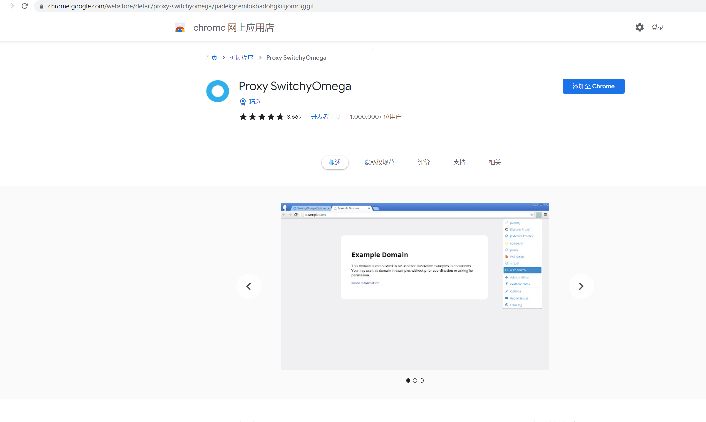

配置好之后切换代理

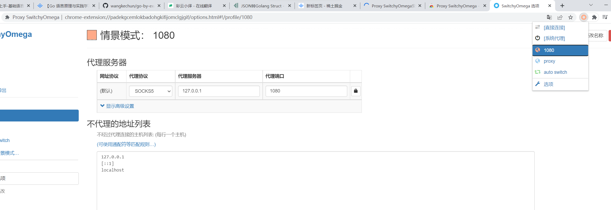

测试截图


# 课后作业

## 1. 修改第一个例子猜谜游戏里面的最终代码，使用fmt.Scanf来简化代码实现

要点：在`fmt.Scanf("%s", &input)`之后还要执行一次`fmt.Scanf("\n")`，这样才能保证每一次输入的读取完整，不会影响下一次输入

```go
package main

import (
	"fmt"
	"math/rand"
	"strconv"
	"time"
)

func main() {
	maxNum := 100
	rand.Seed(time.Now().UnixNano())
	secretNumber := rand.Intn(maxNum)
	// fmt.Println("The secret number is ", secretNumber)

	fmt.Println("Please input your guess")
	var input string
	for {
		fmt.Scanf("%s", &input)
		fmt.Scanf("\n")

		guess, err := strconv.Atoi(input)
		if err != nil {
			fmt.Println("Invalid input. Please enter an integer value")
			continue
		}
		fmt.Println("You guess is", guess)
		if guess > secretNumber {
			fmt.Println("Your guess is bigger than the secret number. Please try again")
		} else if guess < secretNumber {
			fmt.Println("Your guess is smaller than the secret number. Please try again")
		} else {
			fmt.Println("Correct, you Legend!")
			break
		}
	}
}
```

## 2. 修改第二个例子命令行词典里面的最终代码，增加对另外一种翻译引擎的支持

使用的百度翻译，想用谷歌翻译但是表单数据比较难解析

```go
package main

import (
	"encoding/json"
	"fmt"
	"io/ioutil"
	"log"
	"net/http"
	"os"
	"strings"
)

// FReqPrefix Baidu翻译Request前缀
const FReqPrefix = "kw="

// BaiduTranslationUrl Baidu翻译RequestURL
const BaiduTranslationUrl = "https://fanyi.baidu.com/sug"

// BaiduDictResponse Baidu翻译返回结果
type BaiduDictResponse struct {
	Errno int `json:"errno"`
	Data  []struct {
		K string `json:"k"`
		V string `json:"v"`
	} `json:"data"`
}

func query(word string) {
	client := &http.Client{}
	// 封装请求参数
	requestBuilder := strings.Builder{}
	requestBuilder.WriteString(FReqPrefix)
	requestBuilder.WriteString("hello")
	var data = strings.NewReader(requestBuilder.String())
	req, err := http.NewRequest("POST", BaiduTranslationUrl, data)
	if err != nil {
		log.Fatal(err)
	}

	req.Header.Set("Accept", "*/*")
	req.Header.Set("Accept-Language", "zh-CN,zh;q=0.9")
	req.Header.Set("Connection", "keep-alive")
	req.Header.Set("Content-Type", "application/x-www-form-urlencoded; charset=UTF-8")
	req.Header.Set("Cookie", `BAIDUID_BFESS=41BC552B3AB37D0D8D06C86AE79D7BAA:FG=1; RT="z=1&dm=baidu.com&si=9i8im6r7y6s&ss=l2vkyse0&sl=3&tt=39k&bcn=https%3A%2F%2Ffclog.baidu.com%2Flog%2Fweirwood%3Ftype%3Dperf&ld=44r&ul=j8n2&hd=j8o1"; Hm_lvt_64ecd82404c51e03dc91cb9e8c025574=1651915928; REALTIME_TRANS_SWITCH=1; FANYI_WORD_SWITCH=1; HISTORY_SWITCH=1; SOUND_SPD_SWITCH=1; SOUND_PREFER_SWITCH=1; Hm_lpvt_64ecd82404c51e03dc91cb9e8c025574=1651915943; ab_sr=1.0.1_OTBlNzIyZjViOTBmZGYwNmFmNzgxMDExMzQ3ZDY3MDQ5NzRhZTNhM2ExNTY1NjhmM2I2MDUzYzBkOTg0N2Y0NDA0Njk4ODNmYTcxMGIxY2NlNjhjNmU0NmUwYWEzZDQ5MzZjZmE3NTRmYjM5ODA3ZjY0YmE4NzEzYjJhZmM5NTMyY2Q5YzRlMDk0YjIxODY3N2FjMmRiZjRiMGNmNmZjMw==`)
	req.Header.Set("Origin", "https://fanyi.baidu.com")
	req.Header.Set("Referer", "https://fanyi.baidu.com/")
	req.Header.Set("Sec-Fetch-Dest", "empty")
	req.Header.Set("Sec-Fetch-Mode", "cors")
	req.Header.Set("Sec-Fetch-Site", "same-origin")
	req.Header.Set("User-Agent", "Mozilla/5.0 (Windows NT 10.0; Win64; x64) AppleWebKit/537.36 (KHTML, like Gecko) Chrome/101.0.4951.54 Safari/537.36")
	req.Header.Set("X-Requested-With", "XMLHttpRequest")
	req.Header.Set("sec-ch-ua", `" Not A;Brand";v="99", "Chromium";v="101", "Google Chrome";v="101"`)
	req.Header.Set("sec-ch-ua-mobile", "?0")
	req.Header.Set("sec-ch-ua-platform", `"Windows"`)
	resp, err := client.Do(req)
	if err != nil {
		log.Fatal(err)
	}
	defer resp.Body.Close()
	bodyText, err := ioutil.ReadAll(resp.Body)
	if err != nil {
		log.Fatal(err)
	}

	// 处理返回结果
	var baiduDictResponse BaiduDictResponse
	err = json.Unmarshal(bodyText, &baiduDictResponse)
	if err != nil {
		log.Fatal(err)
	}
	for _, item := range baiduDictResponse.Data {
		fmt.Println(item.V)
	}
}

func main() {
	if len(os.Args) != 2 {
		fmt.Fprintf(os.Stderr, `usage: simpleDict WORD
	example: simpleDict hello
			`)
		os.Exit(1)
	}
	word := os.Args[1]
	query(word)
}
```

运行结果

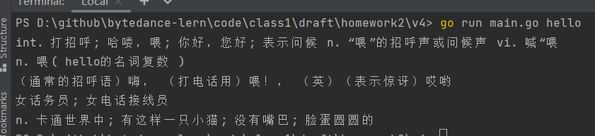

## 3. 在上一步的基础上，修改代码实现并行请求两个翻译引擎来提高响应速度

目录结构

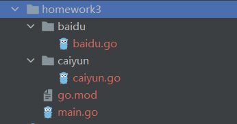

baidu.go

```go
package baidu

import (
	"encoding/json"
	"io/ioutil"
	"log"
	"net/http"
	"strings"
)

// FReqPrefix Baidu翻译Request前缀
const FReqPrefix = "kw="

// TranslationUrl Baidu翻译RequestURL
const TranslationUrl = "https://fanyi.baidu.com/sug"

// DictResponse Baidu翻译返回结果
type DictResponse struct {
	Errno int `json:"errno"`
	Data  []struct {
		K string `json:"k"`
		V string `json:"v"`
	} `json:"data"`
}

func Query(word string, rep chan string) {
	client := &http.Client{}
	// 封装请求参数
	requestBuilder := strings.Builder{}
	requestBuilder.WriteString(FReqPrefix)
	requestBuilder.WriteString("hello")
	var data = strings.NewReader(requestBuilder.String())
	req, err := http.NewRequest("POST", TranslationUrl, data)
	if err != nil {
		log.Fatal(err)
	}

	req.Header.Set("Accept", "*/*")
	req.Header.Set("Accept-Language", "zh-CN,zh;q=0.9")
	req.Header.Set("Connection", "keep-alive")
	req.Header.Set("Content-Type", "application/x-www-form-urlencoded; charset=UTF-8")
	req.Header.Set("Cookie", `BAIDUID_BFESS=41BC552B3AB37D0D8D06C86AE79D7BAA:FG=1; RT="z=1&dm=baidu.com&si=9i8im6r7y6s&ss=l2vkyse0&sl=3&tt=39k&bcn=https%3A%2F%2Ffclog.baidu.com%2Flog%2Fweirwood%3Ftype%3Dperf&ld=44r&ul=j8n2&hd=j8o1"; Hm_lvt_64ecd82404c51e03dc91cb9e8c025574=1651915928; REALTIME_TRANS_SWITCH=1; FANYI_WORD_SWITCH=1; HISTORY_SWITCH=1; SOUND_SPD_SWITCH=1; SOUND_PREFER_SWITCH=1; Hm_lpvt_64ecd82404c51e03dc91cb9e8c025574=1651915943; ab_sr=1.0.1_OTBlNzIyZjViOTBmZGYwNmFmNzgxMDExMzQ3ZDY3MDQ5NzRhZTNhM2ExNTY1NjhmM2I2MDUzYzBkOTg0N2Y0NDA0Njk4ODNmYTcxMGIxY2NlNjhjNmU0NmUwYWEzZDQ5MzZjZmE3NTRmYjM5ODA3ZjY0YmE4NzEzYjJhZmM5NTMyY2Q5YzRlMDk0YjIxODY3N2FjMmRiZjRiMGNmNmZjMw==`)
	req.Header.Set("Origin", "https://fanyi.baidu.com")
	req.Header.Set("Referer", "https://fanyi.baidu.com/")
	req.Header.Set("Sec-Fetch-Dest", "empty")
	req.Header.Set("Sec-Fetch-Mode", "cors")
	req.Header.Set("Sec-Fetch-Site", "same-origin")
	req.Header.Set("User-Agent", "Mozilla/5.0 (Windows NT 10.0; Win64; x64) AppleWebKit/537.36 (KHTML, like Gecko) Chrome/101.0.4951.54 Safari/537.36")
	req.Header.Set("X-Requested-With", "XMLHttpRequest")
	req.Header.Set("sec-ch-ua", `" Not A;Brand";v="99", "Chromium";v="101", "Google Chrome";v="101"`)
	req.Header.Set("sec-ch-ua-mobile", "?0")
	req.Header.Set("sec-ch-ua-platform", `"Windows"`)
	resp, err := client.Do(req)
	if err != nil {
		log.Fatal(err)
	}
	defer resp.Body.Close()
	bodyText, err := ioutil.ReadAll(resp.Body)
	if err != nil {
		log.Fatal(err)
	}

	// 处理返回结果
	var baiduDictResponse DictResponse
	err = json.Unmarshal(bodyText, &baiduDictResponse)
	if err != nil {
		log.Fatal(err)
	}

	builder := strings.Builder{}
	for _, item := range baiduDictResponse.Data {
		builder.WriteString(item.V + "\n")
	}
	rep <- builder.String()
}
```

caiyun.go

```go
package caiyun

import (
	"bytes"
	"encoding/json"
	"io/ioutil"
	"log"
	"net/http"
	"strings"
)

type DictRequest struct {
	TransType string `json:"trans_type"`
	Source    string `json:"source"`
	UserID    string `json:"user_id"`
}

type DictResponse struct {
	Rc   int `json:"rc"`
	Wiki struct {
		KnownInLaguages int `json:"known_in_laguages"`
		Description     struct {
			Source string      `json:"source"`
			Target interface{} `json:"target"`
		} `json:"description"`
		ID   string `json:"id"`
		Item struct {
			Source string `json:"source"`
			Target string `json:"target"`
		} `json:"item"`
		ImageURL  string `json:"image_url"`
		IsSubject string `json:"is_subject"`
		Sitelink  string `json:"sitelink"`
	} `json:"wiki"`
	Dictionary struct {
		Prons struct {
			EnUs string `json:"en-us"`
			En   string `json:"en"`
		} `json:"prons"`
		Explanations []string      `json:"explanations"`
		Synonym      []string      `json:"synonym"`
		Antonym      []string      `json:"antonym"`
		WqxExample   [][]string    `json:"wqx_example"`
		Entry        string        `json:"entry"`
		Type         string        `json:"type"`
		Related      []interface{} `json:"related"`
		Source       string        `json:"source"`
	} `json:"dictionary"`
}

func Query(word string, rep chan string) {
	client := &http.Client{}
	request := DictRequest{TransType: "en2zh", Source: word}
	buf, err := json.Marshal(request)
	if err != nil {
		log.Fatal(err)
	}
	var data = bytes.NewReader(buf)
	req, err := http.NewRequest("POST", "https://api.interpreter.caiyunai.com/v1/dict", data)
	if err != nil {
		log.Fatal(err)
	}
	req.Header.Set("Connection", "keep-alive")
	req.Header.Set("DNT", "1")
	req.Header.Set("os-version", "")
	req.Header.Set("sec-ch-ua-mobile", "?0")
	req.Header.Set("User-Agent", "Mozilla/5.0 (Macintosh; Intel Mac OS X 10_15_7) AppleWebKit/537.36 (KHTML, like Gecko) Chrome/99.0.4844.51 Safari/537.36")
	req.Header.Set("app-name", "xy")
	req.Header.Set("Content-Type", "application/json;charset=UTF-8")
	req.Header.Set("Accept", "application/json, text/plain, */*")
	req.Header.Set("device-id", "")
	req.Header.Set("os-type", "web")
	req.Header.Set("X-Authorization", "token:qgemv4jr1y38jyq6vhvi")
	req.Header.Set("Origin", "https://fanyi.caiyunapp.com")
	req.Header.Set("Sec-Fetch-Site", "cross-site")
	req.Header.Set("Sec-Fetch-Mode", "cors")
	req.Header.Set("Sec-Fetch-Dest", "empty")
	req.Header.Set("Referer", "https://fanyi.caiyunapp.com/")
	req.Header.Set("Accept-Language", "zh-CN,zh;q=0.9")
	req.Header.Set("Cookie", "_ym_uid=16456948721020430059; _ym_d=1645694872")
	resp, err := client.Do(req)
	if err != nil {
		log.Fatal(err)
	}
	defer resp.Body.Close()
	bodyText, err := ioutil.ReadAll(resp.Body)
	if err != nil {
		log.Fatal(err)
	}
	if resp.StatusCode != 200 {
		log.Fatal("bad StatusCode:", resp.StatusCode, "body", string(bodyText))
	}
	var dictResponse DictResponse
	err = json.Unmarshal(bodyText, &dictResponse)
	if err != nil {
		log.Fatal(err)
	}

	builder := strings.Builder{}
	//builder.WriteString(fmt.Sprintf(word, "UK:", dictResponse.Dictionary.Prons.En, "US:", dictResponse.Dictionary.Prons.EnUs))
	for _, item := range dictResponse.Dictionary.Explanations {
		builder.WriteString(item + "\n")
	}
	rep <- builder.String()
}
```

main.go

```go
package main

import (
	"context"
	"fmt"
	"homework3/baidu"
	"homework3/caiyun"
	"os"
	"time"
)

func main() {
	if len(os.Args) != 2 {
		fmt.Fprintf(os.Stderr, `usage: simpleDict WORD
	example: simpleDict hello
			`)
		os.Exit(1)
	}
	word := os.Args[1]

	// 创建上下文对象
	rep := make(chan string)
	// 关闭chan
	defer close(rep)
	ctx, cancel := context.WithTimeout(context.Background(), time.Second*3)

	go baidu.Query(word, rep)
	go caiyun.Query(word, rep)

	select {
	case <-ctx.Done():
		fmt.Println("Time out")
	case res := <-rep:
		fmt.Println(res)
		cancel()
	}
}
```

执行结果

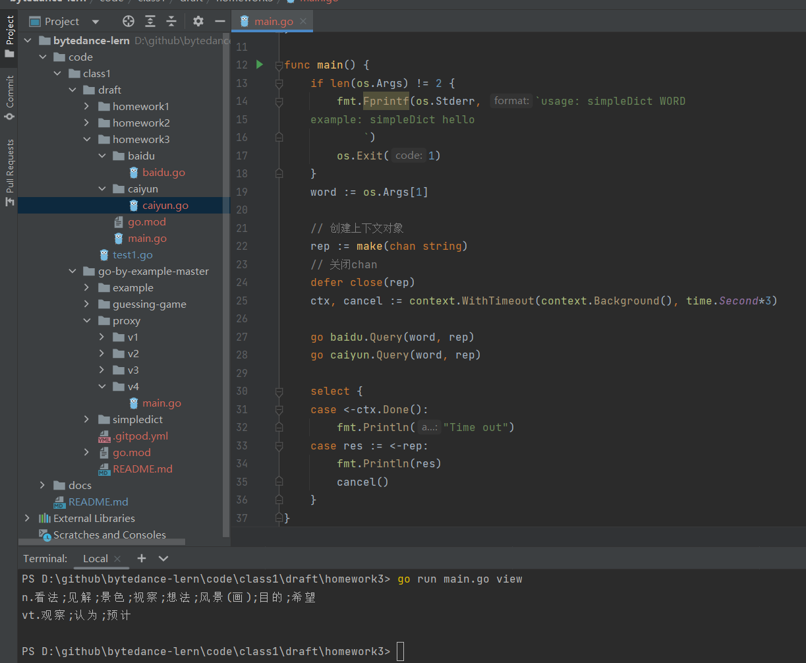