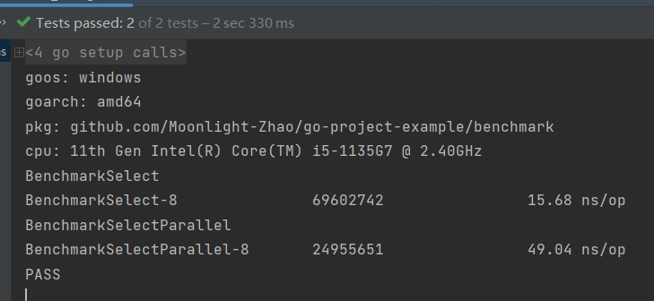
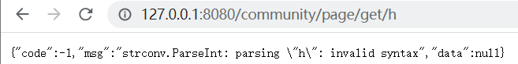

# 语言进阶

## 并发和并行

Go可以充分发挥多核优势，高效运行


## Goroutine

- 协程：用户态，轻量级线程，栈KB级别
- 线程：内核态，线程跑多个协程，栈MB级别


```go
package concurrence

import (
   "fmt"
   "time"
)

func hello(i int) {
   println("hello goroutine : " + fmt.Sprint(i))
}

func HelloGoRoutine() {
   for i := 0; i < 5; i++ {
      go func(j int) {
         hello(j)
      }(i)
   }
   time.Sleep(time.Second)
}
```

## CSP Communicating Sequential Process

**Do not communicate by sharing memory; instead, share memory by communicating.**

“不要以共享内存的方式来通信，相反，要通过通信来共享内存。”


go也保存着通过共享内存实现通信的机制（通过互斥量对内存进行加锁），但是**提倡通过通信共享内存**

## Channel

`make(chan 元素类型, [缓冲大小])`

- 无缓冲通道 `make(chan int)`，只有通道中的元素被消费了，才能继续推送，不然就会阻塞
- 有缓冲通道 `make(chan int, 2)`


使用带缓冲的channel结果生产者和消费者执行效率差距带来的问题

```go
package concurrence

func CalSquare() {
	src := make(chan int)
	dest := make(chan int, 3)
	// 生产者
	go func() {
		defer close(src)
		for i := 0; i < 10; i++ {
			src <- i
		}
	}()
	// 消费者 -> 生产者
	go func() {
		defer close(dest)
		for i := range src {
			dest <- i * i
		}
	}()
	for i := range dest {
		//复杂操作
		println(i)
	}
}
```

运行结果


## 并发安全Lock

```go
package concurrence

import (
   "sync"
   "time"
)

var (
   x    int64
   lock sync.Mutex
)

func addWithLock() {
   for i := 0; i < 2000; i++ {
      lock.Lock()
      x += 1
      lock.Unlock()
   }
}
func addWithoutLock() {
   for i := 0; i < 2000; i++ {
      x += 1
   }
}

func Add() {
   x = 0
   for i := 0; i < 5; i++ {
      go addWithoutLock()
   }
   time.Sleep(time.Second)
   println("WithoutLock:", x)
   x = 0
   for i := 0; i < 5; i++ {
      go addWithLock()
   }
   time.Sleep(time.Second)
   println("WithLock:", x)
}

func ManyGoWait() {
   var wg sync.WaitGroup
   wg.Add(5)
   for i := 0; i < 5; i++ {
      go func(j int) {
         defer wg.Done()
         hello(j)
      }(i)
   }
   wg.Wait()
}
```

对遍历执行2000次+1操作，5个协程并发执行，TestAdd执行结果


## WaitGroup

Add：计数器+delta

Done：计数器-1

Wait：阻塞知道计数器为0


计数器

开启协程+1；执行结束-1；主协程阻塞知道计数器为0

```go
package concurrence

import (
   "sync"
   "time"
)

func hello(i int) {
	println("hello goroutine : " + fmt.Sprint(i))
}

func ManyGoWait() {
   var wg sync.WaitGroup
   wg.Add(5)
   for i := 0; i < 5; i++ {
      go func(j int) {
         defer wg.Done()
         hello(j)
      }(i)
   }
   wg.Wait()
}
```

# 依赖管理

## 背景

- 工程项目不可能基于标准库0~1编码搭建
- 管理依赖库


## Go依赖管理演进

> 第一阶段：GOPATH
>
> 第二阶段：Go Vendor
>
> 第三阶段：Go Module（目前广泛运用）

- 不同环境（项目）依赖的版本不同
- 控制依赖库的版本

## GOPATH

- 环境变量$GOPATH

`go env`


- 项目代码直接依赖src下的代码
  - bin：项目编译的二进制文件
  - pkg：项目编译的中间产物，加速编译
  - src：项目源码


- go get 下载最小版本的包到src目录下

> 弊端

场景：A和B依赖于某一个package的不同版本

问题：无法实现package的多版本控制

## Go Vendor

- 项目目录增加vendor文件，所以依赖包副本形式放在 $ProjectRoot/vendor下
- 依赖寻址方式：vendor => GOPATH
- 通过每个项目引入一份依赖的副本，解决了多个项目需要同一个package依赖的冲突问题

> 弊端

- 无法控制依赖的版本
- 更新项目又可能出现依赖冲突，导致编译出错
- 依赖于项目的源代码，不能清晰的标识依赖的版本的概念

## Go Module实践

- 通过`go.mod`文件管理依赖包版本

- 通过`go get/go mod` 指令工具管理依赖包
- 终极目标：定义版本规则和管理项目依赖关系

### 依赖管理三要素

- 配置文件，描述依赖`go.mod`
- 中心仓库管理依赖库`Proxy`
- 本地工具`go get/mod`

### 依赖配置-go.mod

```go
//依赖基本单元
module github.com/Moonlight-Zhao/go-project-example

// 原生库
go 1.16

// 单元依赖
require (
	// 依赖标识：[Module Path][Version/Pseudo-version]
	bou.ke/monkey v1.0.2
	github.com/bytedance/gopkg v0.0.0-20220401081311-c38fb59326b7
	github.com/gin-contrib/sse v0.1.0 // indirect
	github.com/gin-gonic/gin v1.3.0 // indirect
	github.com/golang/protobuf v1.5.2 // indirect
	github.com/json-iterator/go v1.1.12 // indirect
	github.com/kr/pretty v0.3.0 // indirect
	github.com/mattn/go-isatty v0.0.14 // indirect
	github.com/modern-go/concurrent v0.0.0-20180306012644-bacd9c7ef1dd // indirect
	github.com/rogpeppe/go-internal v1.8.0 // indirect
	github.com/stretchr/testify v1.7.1
	github.com/ugorji/go v1.2.7 // indirect
	golang.org/x/net v0.0.0-20211112202133-69e39bad7dc2 // indirect
	golang.org/x/sys v0.0.0-20220408201424-a24fb2fb8a0f // indirect
	golang.org/x/xerrors v0.0.0-20200804184101-5ec99f83aff1 // indirect
	google.golang.org/protobuf v1.28.0 // indirect
	gopkg.in/check.v1 v1.0.0-20201130134442-10cb98267c6c // indirect
	gopkg.in/gin-gonic/gin.v1 v1.3.0
	gopkg.in/go-playground/assert.v1 v1.2.1 // indirect
	gopkg.in/go-playground/validator.v8 v8.18.2 // indirect
	gopkg.in/yaml.v2 v2.4.0 // indirect
	gopkg.in/yaml.v3 v3.0.0-20210107192922-496545a6307b // indirect
)
```

### 依赖配置-version

- 语义化版本`${MAJOR}.${MINOR}.${PATCH}`
  - MAJOR：大版本，代码隔离
  - MINOR：新增函数或者新增功能，在当前MAJOR下做到前后兼容
  - PATCH：代码Bug的修复

```
V1.3.0
V2.3.0
```

- 基于commit伪版本`vX.0.0-yyyymmddhhmmss-abcdefg1234`

```
v0.0.0-20180306012644-bacd9c7ef1dd
v0.0.0-20211112202133-69e39bad7dc2
```

### 依赖配置-indirect

A -> B -> C

- A和B直接依赖
- A和C间接依赖


在go.mod中，对于没有直接导入的模块，就会标识为非直接依赖，用indirect标识出来

### 依赖配置-incompatible

- 主版本2+模块会在模块路径增加/vN 后缀（作用，允许不同的major版本之间进行相互兼容）
- 对于没有 go.mod 文件并且主版本2+的依赖，会+incompatible（标识出来不同版本之间可能存在不兼容的逻辑）

### 依赖配置-依赖图


答案：B（选择最低兼容版本）

### 依赖分发-回源

Github、SVN....

> 缺点

- 无法保证构建稳定性（增加/修改/删除软件版本）
- 无法保证依赖可用性（作者可以删除软件）
- 增加第三方压力（代码托管平台负载问题）


### 依赖分发-Proxy

- 公共GOPROXY


- 私有GOPROXY


### 依赖分发-变量GOPROXY

`GOPROXY="https://proxy1.cn,https://proxy2.cn,direct"`

服务站点URL列表，"direct"表示源站

执行顺序：proxy1 -> proxy2 -> Direct

### 工具-go get

- `go get example.org/pkg[后缀]`
  - `@update` 默认
  - `@none` 删除依赖
  - `@v1.1.2`tag版本，语义定义
  - `@23dfdd5`特定的commit
  - `@master`分支的最新commit、

### 工具-go mod

- `go mod [后缀]`
  - `init [module name]` 初始化go.mod文件
  - `download`下载模块到本地缓存
  - `tidy`增加需要的依赖，删除不需要的依赖

### 总结

- 配置文件，描述依赖`go.mod`
- 中心仓库管理依赖库`Proxy`
- 本地工具`go get/mod`

# 测试

测试关系系统的质量，质量关系到系统线上的稳定性

- 回归测试
- 集成测试
- 单元测试（保证质量，提升效率）

## 单元测试

### 单元测试-规则

- 所有测试文件以`_test.go`结尾
- 测试函数名`func TestXxx(t *testing.T)`
- 初始化逻辑放在`TestMain`中

```go
package service

import (
	"github.com/Moonlight-Zhao/go-project-example/repository"
	"github.com/stretchr/testify/assert"
	"os"
	"testing"
)

func TestMain(m *testing.M) {
	repository.Init("../data/")
	os.Exit(m.Run())
}
func TestQueryPageInfo(t *testing.T) {
	pageInfo, _ := QueryPageInfo(1)
	assert.NotEqual(t, nil, pageInfo)
	assert.Equal(t, 5, len(pageInfo.PostList))
}
```

### 单元测试-例子

```go
func HelloTom() string {
	return "Tom"
}
```

```go
package test

import (
	"github.com/stretchr/testify/assert"
	"testing"
)

func TestHelloTom(t *testing.T) {
	output := HelloTom()
	expectOutput := "Tom"
	assert.Equal(t, expectOutput, output)
}
```


### 单元测试-覆盖率

- 衡量代码是否经过了足够的测试
- 评价项目的测试水准
- 评估项目是否达到了高水准测试等级？

```go
package test

func JudgePassLine(score int16) bool {
	if score >= 60 {
		return true
	}
	return false
}
```

```go
package test

import (
	"github.com/stretchr/testify/assert"
	"testing"
)

func TestJudgePassLineTrue(t *testing.T) {
	isPass := JudgePassLine(70)
	assert.Equal(t, true, isPass)
}

func TestJudgePassLineFail(t *testing.T) {
	isPass := JudgePassLine(50)
	assert.Equal(t, false, isPass)
}
```

> shell执行

`go test judgment_test.go judgment.go --cover`


> IDE执行


### 单元测试-Tips

- 一般覆盖率：50%~60%，较高覆盖率80%+
- 测试分支相对独立、全面覆盖
- 测试单元粒度足够小，函数单一职责

### 单元测试-依赖

外部依赖 => 稳定（测试不同的函数不同情况都是隔离的）&幂等（重复相同测试结果相等）


### 单元测试-文件处理

log文件

```log
line11
line22
line33
line44
line55
```

```go
package test

import (
   "bufio"
   "os"
   "strings"
)

func ReadFirstLine() string {
   open, err := os.Open("log")
   defer open.Close()
   if err != nil {
      return ""
   }
   scanner := bufio.NewScanner(open)
   for scanner.Scan() {
      return scanner.Text()
   }
   return ""
}

func ProcessFirstLine() string {
   line := ReadFirstLine()
   destLine := strings.ReplaceAll(line, "11", "00")
   return destLine
}
```

```go
package test

import (
   "bou.ke/monkey"
   "github.com/stretchr/testify/assert"
   "testing"
)

func TestProcessFirstLine(t *testing.T) {
   firstLine := ProcessFirstLine()
   assert.Equal(t, "line00", firstLine)
}
```

## Mock测试

https://github.com/bouk/monkey

> 快速Mock函数

- 为一个函数打桩

```go
// Patch replaces a function with another
func Patch(target, replacement interface{}) *PatchGuard {
	t := reflect.ValueOf(target)
	r := reflect.ValueOf(replacement)
	patchValue(t, r)

	return &PatchGuard{t, r}
}
```

- 为一个方法打桩

```go
// Unpatch removes any monkey patches on target
// returns whether target was patched in the first place
func Unpatch(target interface{}) bool {
	return unpatchValue(reflect.ValueOf(target))
}
```

原理就是主要在运行时，通过go的unsafe包，将地址进行替换

- 测试

```go
package test

import (
	"bufio"
	"os"
	"strings"
)

func ReadFirstLine() string {
	open, err := os.Open("log")
	defer open.Close()
	if err != nil {
		return ""
	}
	scanner := bufio.NewScanner(open)
	for scanner.Scan() {
		return scanner.Text()
	}
	return ""
}

func ProcessFirstLine() string {
	line := ReadFirstLine()
	destLine := strings.ReplaceAll(line, "11", "00")
	return destLine
}
```

```go
func TestProcessFirstLineWithMock(t *testing.T) {
	// 在调用的过程中其实调用的是打桩函数
	monkey.Patch(ReadFirstLine, func() string {
		return "line110"
	})
	// 卸载桩
	defer monkey.Unpatch(ReadFirstLine)
	line := ProcessFirstLine()
	assert.Equal(t, "line000", line)
}
```

对ReadFirstLine()打桩测试，不再依赖本地文件

## 基准测试

- 优化代码，需要对当前代码分析
- 内置的测试框架提供了基准测试的能力

### 基准测试-例子

随机选择服务器

```go
package benchmark

import (
	// 字节的fast随机库
	"github.com/bytedance/gopkg/lang/fastrand"
	// 为了保证随机性，其实有一把全局锁，性能会低一点
	"math/rand"
)

var ServerIndex [10]int

func InitServerIndex() {
	for i := 0; i < 10; i++ {
		ServerIndex[i] = i + 100
	}
}

func Select() int {
	return ServerIndex[rand.Intn(10)]
}

func FastSelect() int {
	return ServerIndex[fastrand.Intn(10)]
}
```

测试

```go
package benchmark

import (
	"testing"
)

func BenchmarkSelect(b *testing.B) {
	InitServerIndex()
	// InitServerIndex()执行时间不属于我们测试的范围，需要将时间进行重置
	b.ResetTimer()
	for i := 0; i < b.N; i++ {
		Select()
	}
}

func BenchmarkSelectParallel(b *testing.B) {
	InitServerIndex()
	b.ResetTimer()
	b.RunParallel(func(pb *testing.PB) {
		for pb.Next() {
			Select()
		}
	})
}
```



优化

```go
func BenchmarkFastSelectParallel(b *testing.B) {
   InitServerIndex()
   b.ResetTimer()
   b.RunParallel(func(pb *testing.PB) {
      for pb.Next() {
         FastSelect()
      }
   })
}
```


# 项目实战

## 需求背景

> 社区话题页面

- 展示话题（标题，文字描述）和回帖列表
- 暂不考虑前端页面实现，仅仅实现一个本地web服务
- 话题和回帖数据用文件存储

## 需求用例


## ER图-Entity Realationship Diagram


## 分层结构


- 数据层：数据层Model，外部数据的增删改查
- 逻辑层：业务Entity，处理核心业务逻辑输出
- 视图层：视图View，处理和外部的交互逻辑

## 组件工具

> Gin 高性能 go web框架

https://github.com/gin-gonic/gin#installation

> Go Mod

`go mod init`

`go get gopkg.in/gin-gonic/gin.v1@1.3.0`

## Repository


## Repository-index


```go
var (
   topicIndexMap map[int64]*Topic
   postIndexMap  map[int64][]*Post
)
```

初始化话题数据索引

```go
func initTopicIndexMap(filePath string) error {
   // 打卡文件
   open, err := os.Open(filePath + "topic")
   if err != nil {
      return err
   }
   scanner := bufio.NewScanner(open)
   topicTmpMap := make(map[int64]*Topic)
   for scanner.Scan() {
      text := scanner.Text()
      var topic Topic
      // 将json数据转换为结构体，存储到内存map之中
      if err := json.Unmarshal([]byte(text), &topic); err != nil {
         return err
      }
      topicTmpMap[topic.Id] = &topic
   }
   // 初始化话题内存索引
   topicIndexMap = topicTmpMap
   return nil
}
```

## Repository-查询

- 索引：话题ID
- 数据：话题

```go
package repository

import (
	"sync"
)

type Topic struct {
	Id         int64  `json:"id"`
	Title      string `json:"title"`
	Content    string `json:"content"`
	CreateTime int64  `json:"create_time"`
}
type TopicDao struct {
}

var (
	topicDao *TopicDao
	// Once 是将只执行一个操作的对象。
	topicOnce sync.Once
)

// NewTopicDaoInstance 初始化TopicDao的单例，为外部调用提供一个接收者对象
func NewTopicDaoInstance() *TopicDao {
	topicOnce.Do(
		func() {
			topicDao = &TopicDao{}
		})
	return topicDao
}

// QueryTopicById 通过*TopicDao函数接收者调用执行查询方法
func (*TopicDao) QueryTopicById(id int64) *Topic {
	// 返回数据
	return topicIndexMap[id]
}
```

## Service

- 实体

```go
type PageInfo struct {
   Topic    *repository.Topic
   PostList []*repository.Post
}
```

- 流程


- 流程编排

```go
// Do 业务流程编排
func (f *QueryPageInfoFlow) Do() (*PageInfo, error) {
   // 参数校验
   if err := f.checkParam(); err != nil {
      return nil, err
   }
   // 准备数据
   if err := f.prepareInfo(); err != nil {
      return nil, err
   }
   // 组装实体
   if err := f.packPageInfo(); err != nil {
      return nil, err
   }
   return f.pageInfo, nil
}
```

- 可用性保证

并行处理


```go
// 对接受者*QueryPageInfoFlow进行数据准备
func (f *QueryPageInfoFlow) prepareInfo() error {
   //获取topic信息
   var wg sync.WaitGroup
   wg.Add(2)
   go func() {
      defer wg.Done()
      topic := repository.NewTopicDaoInstance().QueryTopicById(f.topicId)
      f.topic = topic
   }()
   //获取post列表
   go func() {
      defer wg.Done()
      posts := repository.NewPostDaoInstance().QueryPostsByParentId(f.topicId)
      f.posts = posts
   }()
   wg.Wait()
   return nil
}
```

## Controller

- 构建view对象
- 业务错误码

```go
package cotroller

import (
	"strconv"

	"github.com/Moonlight-Zhao/go-project-example/service"
)

type PageData struct {
	Code int64       `json:"code"`
	Msg  string      `json:"msg"`
	Data interface{} `json:"data"`
}

func QueryPageInfo(topicIdStr string) *PageData {
	topicId, err := strconv.ParseInt(topicIdStr, 10, 64)
	// 如果参数错误返回参数错误码
	if err != nil {
		return &PageData{
			Code: -1,
			Msg:  err.Error(),
		}
	}
	pageInfo, err := service.QueryPageInfo(topicId)
	// 如果业务错误返回业务错误码
	if err != nil {
		return &PageData{
			Code: -1,
			Msg:  err.Error(),
		}
	}
	// 返回封装实体消息
	return &PageData{
		Code: 0,
		Msg:  "success",
		Data: pageInfo,
	}
}
```

## Router

- 初始化数据索引
- 初始化引擎配置
- 构建路由
- 启动服务

```go
package main

import (
	"github.com/Moonlight-Zhao/go-project-example/cotroller"
	"github.com/Moonlight-Zhao/go-project-example/repository"
	"gopkg.in/gin-gonic/gin.v1"
	"os"
)

func main() {
	// 初始化数据索引
	if err := Init("./data/"); err != nil {
		os.Exit(-1)
	}
	// 初始化gin框架引擎配置
	r := gin.Default()
	// 构建路由
	r.GET("/community/page/get/:id", func(c *gin.Context) {
		topicId := c.Param("id")
		data := cotroller.QueryPageInfo(topicId)
		c.JSON(200, data)
	})
	// 启动服务
	err := r.Run()
	if err != nil {
		return
	}
}

func Init(filePath string) error {
	if err := repository.Init(filePath); err != nil {
		return err
	}
	return nil
}
```

## 运行

运行测试`go run server.go`





## 总结

- 项目拆解
- 代码设计
- 测试运行

# 课后作业

1. 支持发布帖子

2. 本地Id生成需要保证不重复、唯一性

3. Append文件，更新索引，注意Map的并发安全问题

## 完成结果

> 完成发布帖子和发布评论

```go
package main

import (
	"gopkg.in/gin-gonic/gin.v1"
	"homework4/controller"
	"homework4/repository"
	"os"
)

func main() {
	// 初始化数据索引
	if err := Init("./data/"); err != nil {
		os.Exit(-1)
	}
	// 初始化gin框架引擎配置
	r := gin.Default()
	// 构建路由
	// 查询帖子
	r.GET("/community/page/get/:id", func(c *gin.Context) {
		topicId := c.Param("id")
		data := cotroller.QueryPageInfo(topicId)
		c.JSON(200, data)
	})
	// 新增帖子
	r.POST("/community/topic/add", func(c *gin.Context) {
		// 传入控制器处理
		data := cotroller.AddTopic(c)
		c.JSON(200, data)
	})
	// 新增评论
	r.POST("/community/post/add", func(c *gin.Context) {
		// 传入控制器处理
		data := cotroller.AddPost(c)
		c.JSON(200, data)
	})
	// 启动服务
	err := r.Run()
	if err != nil {
		return
	}
}

func Init(filePath string) error {
	if err := repository.Init(filePath); err != nil {
		return err
	}
	return nil
}
```

以新增topic为例

- 路由Post请求调用`controller`的`AddTopic`方法，因为是post请求，消息采用了raw格式的json数据存储在http body中，所以调用方法的时候传入参数`*gin.Context`获取数据

```go
package controller

import (
	"encoding/json"
	"gopkg.in/gin-gonic/gin.v1"
	"homework4/repository"
	"homework4/service"
)

// AddTopic 新增帖子控制器
func AddTopic(c *gin.Context) *PageData {
	// 获取请求body
	data, err := c.GetRawData()
	// 如果获取请求体错误就返回错误码
	if err != nil {
		return &PageData{
			Code: -1,
			Msg:  err.Error(),
		}
	}
	// 解析json实体
	var topic = repository.Topic{}
	err = json.Unmarshal(data, &topic)
	// 如果解析json错误返回错误码
	if err != nil {
		return &PageData{
			Code: -1,
			Msg:  err.Error(),
		}
	}
	ok, err := service.AddTopic(&topic)
	// 如果业务错误返回业务错误码
	if err != nil {
		return &PageData{
			Code: -1,
			Msg:  err.Error(),
		}
	}
	// 返回封装实体消息
	if ok {
		return &PageData{
			Code: 0,
			Msg:  "success",
			Data: nil,
		}
	} else {
		return &PageData{
			Code: 500,
			Msg:  "fail",
			Data: "新增topic，未知错误!",
		}
	}
}
```

- `controller`对数据进行简单的校验，然后调用`service`的`AddTopic`方法，传入参数为`repository.Topic{}`结构体对象
  - 封装`AddTopicFlow`结构体对象执行业务流程
  - 参数校验，这里设置的逻辑为标题长度不能超过20，内容长度不能超过500，如果不满足，返回错误信息
  - 加锁，防止计算id、更新/写入数据因为并发问题出现不可控情况
  - 完善数据，封装创建时间和id，内部逻辑封闭所以没有抛出异常
  - 处理数据，通过`WaitGroup`控制开启两个协程，分别执行更新内存Map中的数据和写入本地文件
  - 解锁，保证了数据的隔离性和一致性

```go
package service

import (
   "bufio"
   "encoding/json"
   "errors"
   "homework4/repository"
   "homework4/util"
   "os"
   "sync"
   "time"
)

var (
   addTopicLock sync.Mutex
)

// AddTopic 新增帖子
func AddTopic(topic *repository.Topic) (bool, error) {
   return NewAddTopicFlow(topic).Do()
}

func NewAddTopicFlow(topic *repository.Topic) *AddTopicFlow {
   return &AddTopicFlow{
      topic: topic,
   }
}

type AddTopicFlow struct {
   topic *repository.Topic
}

// Do 业务流程编排
func (f *AddTopicFlow) Do() (bool, error) {
   // 参数校验
   if err := f.checkParam(); err != nil {
      return false, err
   }
   // 加锁，防止并发造成数据异常
   addTopicLock.Lock()
   // 完善数据，内部数据正确，不会抛出异常
   f.prepareInfo()
   // 存储数据,内部系统稳定运行，暂不考虑异常
   f.solveData()
   // 解锁
   addTopicLock.Unlock()
   return true, nil
}

// 对新增topic的参数进行校验
func (f *AddTopicFlow) checkParam() error {
   if len(f.topic.Title) > 20 {
      return errors.New("topic title length must be less than 20")
   }
   if len(f.topic.Content) > 500 {
      return errors.New("topic content length must be less than 500")
   }
   return nil
}

// 对数据进行封装
func (f *AddTopicFlow) prepareInfo() {
   // 设置创建时间
   f.topic.CreateTime = time.Now().Unix()
   // 获取全部id数组
   ids := repository.NewTopicDaoInstance().QueryTopicIds()
   // 设置id
   f.topic.Id = int64(util.GetUniId(ids))
}

// 处理数据
func (f *AddTopicFlow) solveData() {
   wg := sync.WaitGroup{}
   wg.Add(2)
   // 向map里面新增
   go func() {
      defer wg.Done()
      repository.AddTopic(f.topic.Id, f.topic)
   }()
   // 向文件里面写入
   go func() {
      defer wg.Done()
      open, _ := os.OpenFile(repository.FilePath+"topic", os.O_WRONLY|os.O_APPEND, 0666)
      defer open.Close()
      writer := bufio.NewWriter(open)
      buf, _ := json.Marshal(f.topic)
      topicStr := string(buf)
      writer.WriteString("\n" + topicStr)
      writer.Flush()
   }()
   wg.Wait()
}
```

> 完成生成唯一Id（新增帖子和新增评论），保证了id的不重复性、唯一性

- 该功能实现主要是封装了一个方法，通过传入所有id的数组，然后查询id最大值，返回id最大值+1，即保证了id的唯一性，并且该函数在`service`中是加锁调用的，所以不会出现并发问题

```go
package util

import (
	"math"
)

// GetUniId 获取唯一id
func GetUniId(ids []int) int {
	//// 获取最后一个数下标
	//idx := len(ids) - 1
	//// 对id进行排序
	//sort.Ints(ids)
	//return ids[idx] + 1
	max := math.MinInt
	for _, id := range ids {
		max = Max(max, id)
	}
	return max + 1
}

func Max(a int, b int) int {
	if a > b {
		return a
	}
	return b
}
```

> Append文件，更新文件索引，保障了并发安全的问题

文件写入一行，也是封装了这么一个函数，并且该函数在`service`中是加锁调用的，所以不会出现并发问题

```go
// 处理数据
func (f *AddTopicFlow) solveData() {
   wg := sync.WaitGroup{}
   wg.Add(2)
   // 向map里面新增
   go func() {
      defer wg.Done()
      repository.AddTopic(f.topic.Id, f.topic)
   }()
   // 向文件里面写入
   go func() {
      defer wg.Done()
      open, _ := os.OpenFile(repository.FilePath+"topic", os.O_WRONLY|os.O_APPEND, 0666)
      defer open.Close()
      writer := bufio.NewWriter(open)
      buf, _ := json.Marshal(f.topic)
      topicStr := string(buf)
      writer.WriteString("\n" + topicStr)
      writer.Flush()
   }()
   wg.Wait()
}
```