作者：青训营官方账号
链接：https://juejin.cn/post/7095977466094682148/
来源：稀土掘金

# 课程背景与目标

## 课程背景

在大家已经学完前 5节 Go 原理与实践课程的基础上，通过项目实战帮助大家把前面学过的知识应用起来

## 课程目标

- 将前面所学的知识应用到项目中

- 熟悉项目的代码,可以将项目正常运行

- 熟悉 Kitex/Gorm 的使用

# 课程了解

## Linux安装Go

- 官网下载安装包
- 将Go文件夹解压复制到推荐位置

```sh
tar -C /usr/local -xzf goX.XX.X.linux-amd64.tar.gz
```

- 打开环境遍历配置文件

```sh
sudo vim /etc/profile
```

- 新增一行配置

```ini
export PATH=$PATH:/usr/local/go/bin
```

- 配置生效

```sh
source /etc/profile
```

- 查看go安装版本

```go
go version
```

- 配置代理，控制台输入

```sh
go env -w GO111MODULE=on
go env -w GOPROXY=https://goproxy.cn,direct
```

- 查看go配置

```sh
go env
```

## Linux安装docker-compose

- 安装docker-compose

```sh
yum -y install docker-compose
```

- 查看是否安装成功

```sh
docker-compose -version
```

## Windows下的sh文件在Linux上执行出错

- 安装工具

```sh
yum -y install dos2unix
```

- 操作文件

```sh
dos2unix 文件名
```

## 安装 Docker/Postman/Git

- Linux安装Docker：https://cloud.tencent.com/developer/article/1605163、https://blog.csdn.net/m0_51338272/article/details/122801639
- 安装 Minikube 或 Docker Desktop [安装教程](https://link.juejin.cn/?target=https%3A%2F%2Fwww.runoob.com%2Fdocker%2Fwindows-docker-install.html)

- 可以使用 Minikube 或者使用 Docker Desktop 启动 Docker

- 安装 Postman

- 安装 Git [安装教程](https://link.juejin.cn/?target=https%3A%2F%2Fwww.liaoxuefeng.com%2Fwiki%2F896043488029600%2F896067074338496)

```sh
# 安装git
yum install git 
# 卸载git
yum remove git
```

## Kitex初体验

> https://www.cloudwego.io/zh/docs/kitex/getting-started/
>
> - 通过阅读 [www.cloudwego.io/zh/docs/kit…](https://link.juejin.cn/?target=https%3A%2F%2Fwww.cloudwego.io%2Fzh%2Fdocs%2Fkitex%2Fgetting-started%2F) 尝试运行 Kitex 的示例代码
>
> - kitex 暂时没有针对 Windows 做支持，如果本地开发环境是 Windows 建议使用 [WSL2](https://link.juejin.cn/?target=https%3A%2F%2Fdocs.microsoft.com%2Fzh-cn%2Fwindows%2Fwsl%2Finstall)

> 操作过程

- 为了保证安装之后能执行，需要将`$GOPATH/bin`目录加入到环境变量

```sh
sudo vim /etc/profile

GOPATH=/root/go
export PATH=$PATH:$GOPATH/bin

source /etc/profile
```

- 安装 kitex，默认下载在`/root/go/pkg/mod/github.com/cloudwego/kitex@v0.3.1`

```sh
go install github.com/cloudwego/kitex/tool/cmd/kitex@latest
```

- 安装安装 thriftgo，默认下载在`/root/go/pkg/mod/github.com/cloudwego/thriftgo@v0.1.7`

```sh
go install github.com/cloudwego/thriftgo@latest
```

- 安装成功后，执行 `kitex --version` 和 `thriftgo --version` 应该能够看到具体版本号的输出（版本号有差异，以 x.x.x 示例）
- 运行成功效果如下

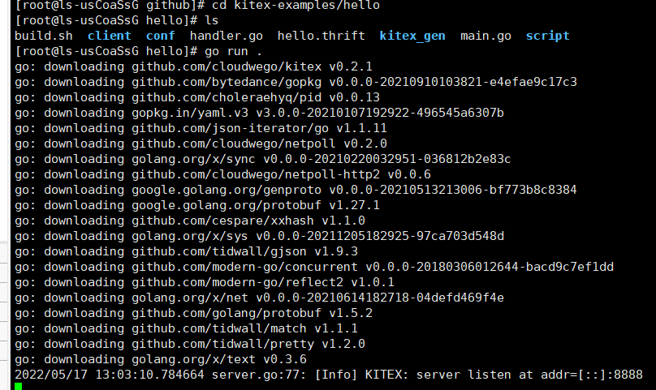

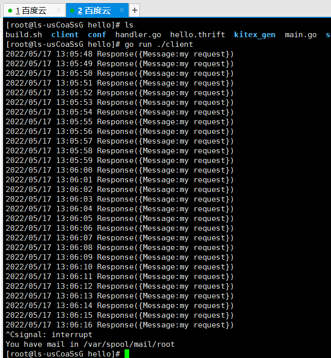

## Gorm初体验

https://gorm.io/zh_CN/docs/query.html

通过阅读 [gorm.cn/docs/#Insta…](https://link.juejin.cn/?target=https%3A%2F%2Fgorm.cn%2Fdocs%2F%23Install) 尝试运行 Gorm 的示例代码

## 了解Etcd和Opentracing

了解Etcd是什么以及Opentracing是什么

# 项目介绍

## 项目简介

> EasyNote 提供了一套比较完整的笔记后端API服务
>
> GitHub：https://github.com/cloudwego/kitex-examples/tree/main/bizdemo/easy_note
>
> 推荐版本：Golang >= 1.15

## 项目模块介绍

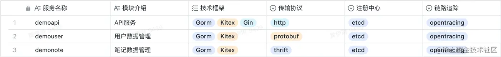

## 项目服务调用关系


## 项目模块功能介绍


## 项目技术栈

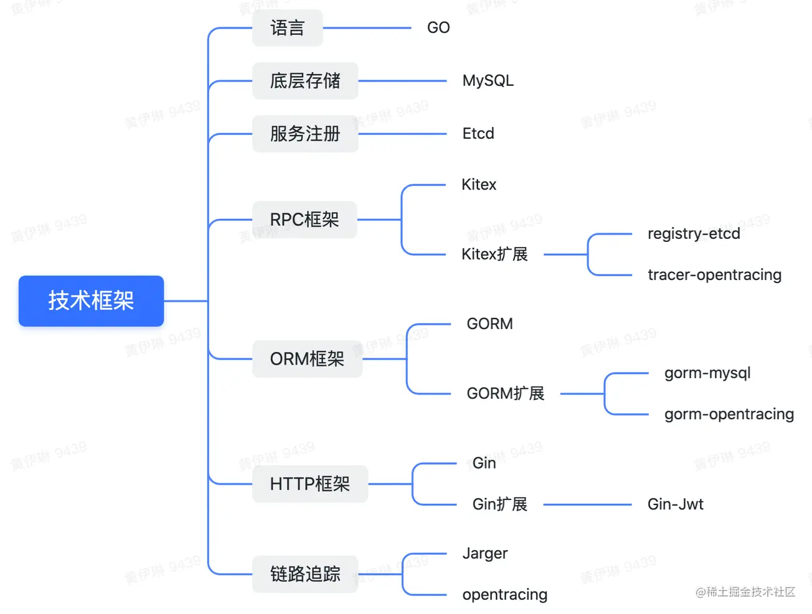

## 项目相关的使用框架资料

|                       |                                                              | 框架文档地址                                                 | github地址                                                   | 拓展文档 |
| --------------------- | ------------------------------------------------------------ | ------------------------------------------------------------ | ------------------------------------------------------------ | -------- |
| RPC框架Kitex          | 框架文档                                                     | [www.cloudwego.io/zh/docs/kit…](https://link.juejin.cn?target=https%3A%2F%2Fwww.cloudwego.io%2Fzh%2Fdocs%2Fkitex%2Foverview%2F) | [github.com/cloudwego/k…](https://link.juejin.cn?target=https%3A%2F%2Fgithub.com%2Fcloudwego%2Fkitex) |          |
| Kitex-etcd扩展        | [github.com/kitex-contr…](https://link.juejin.cn?target=https%3A%2F%2Fgithub.com%2Fkitex-contrib%2Fregistry-etcd) | [github.com/kitex-contr…](https://link.juejin.cn?target=https%3A%2F%2Fgithub.com%2Fkitex-contrib%2Fregistry-etcd) | [www.cloudwego.io/zh/docs/kit…](https://link.juejin.cn?target=https%3A%2F%2Fwww.cloudwego.io%2Fzh%2Fdocs%2Fkitex%2Ftutorials%2Fframework-exten%2Fregistry%2F)[www.cloudwego.io/zh/docs/kit…](https://link.juejin.cn?target=https%3A%2F%2Fwww.cloudwego.io%2Fzh%2Fdocs%2Fkitex%2Ftutorials%2Fframework-exten%2Fservice_discovery%2F) |          |
| Kitex-OpenTracing扩展 | [www.cloudwego.io/zh/docs/kit…](https://link.juejin.cn?target=https%3A%2F%2Fwww.cloudwego.io%2Fzh%2Fdocs%2Fkitex%2Ftutorials%2Fservice-governance%2Ftracing%2F) | [github.com/kitex-contr…](https://link.juejin.cn?target=https%3A%2F%2Fgithub.com%2Fkitex-contrib%2Ftracer-opentracing) | [www.cloudwego.io/zh/docs/kit…](https://link.juejin.cn?target=https%3A%2F%2Fwww.cloudwego.io%2Fzh%2Fdocs%2Fkitex%2Ftutorials%2Fframework-exten%2Fmiddleware%2F) |          |
| ORM框架Gorm           | 框架                                                         | [gorm.cn/zh_CN/](https://link.juejin.cn?target=https%3A%2F%2Fgorm.cn%2Fzh_CN%2F) | [github.com/go-gorm/gor…](https://link.juejin.cn?target=https%3A%2F%2Fgithub.com%2Fgo-gorm%2Fgorm) |          |
| Gorm-Opentracing扩展  | [github.com/go-gorm/ope…](https://link.juejin.cn?target=https%3A%2F%2Fgithub.com%2Fgo-gorm%2Fopentracing) | [github.com/go-gorm/ope…](https://link.juejin.cn?target=https%3A%2F%2Fgithub.com%2Fgo-gorm%2Fopentracing) | [gorm.cn/zh_CN/docs/…](https://link.juejin.cn?target=https%3A%2F%2Fgorm.cn%2Fzh_CN%2Fdocs%2Fwrite_plugins.html) |          |
| HTTP框架Gin           | 框架                                                         | [github.com/gin-gonic/g…](https://link.juejin.cn?target=https%3A%2F%2Fgithub.com%2Fgin-gonic%2Fgin%23gin-web-framework) | [github.com/gin-gonic/g…](https://link.juejin.cn?target=https%3A%2F%2Fgithub.com%2Fgin-gonic%2Fgin) |          |
| Gin-JWT扩展           | [github.com/appleboy/gi…](https://link.juejin.cn?target=https%3A%2F%2Fgithub.com%2Fappleboy%2Fgin-jwt%23usage) | [github.com/appleboy/gi…](https://link.juejin.cn?target=https%3A%2F%2Fgithub.com%2Fappleboy%2Fgin-jwt) |                                                              |          |

# 项目代码介绍

## 运行基础依赖

```sh
docker-compose up
```

## 运行 demonote 服务

```sh
cd cmd/note 
sh build.sh 
sh output/bootstrap.sh
```

## 运行 demouser 服务

```sh
cd cmd/user 
sh build.sh 
sh output/bootstrap.sh
```

## 运行 demoapi 服务

```sh
cd cmd/api 
chmod +x run.sh 
sh run.sh
```

## 运行截图

数据库没有使用镜像，用的单独的数据库服务器

- 运行docker基础依赖

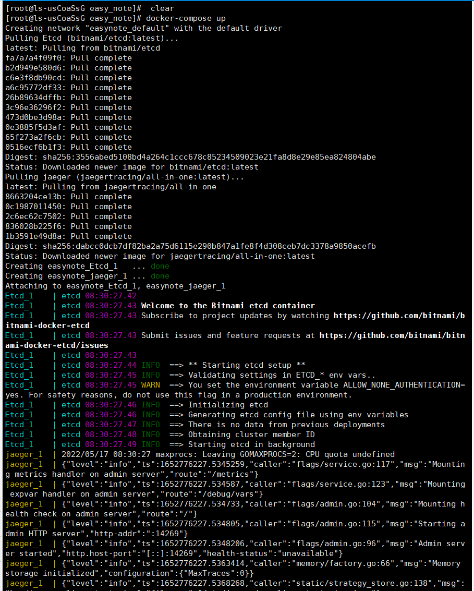

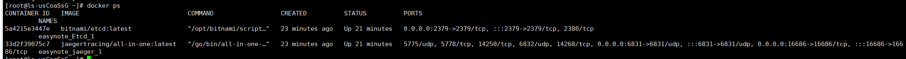

- 笔记服务启动效果，主要需要注意将脚本文件进行unix转码

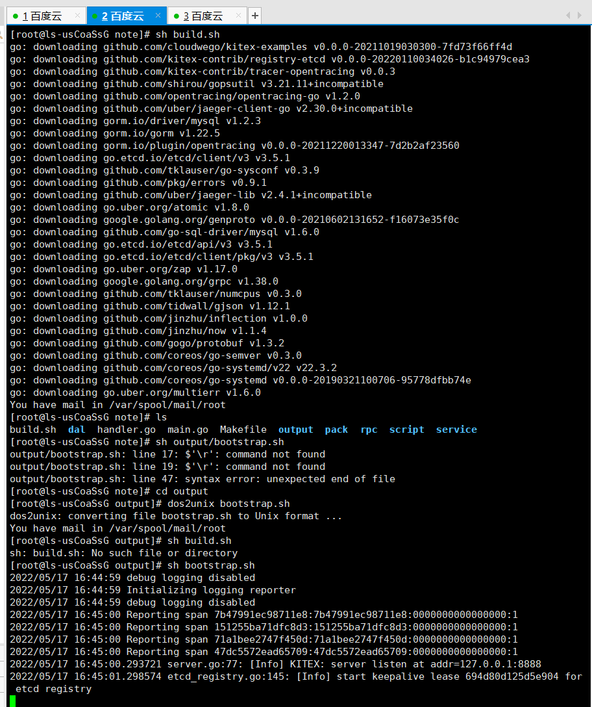

- 用户服务启动效果

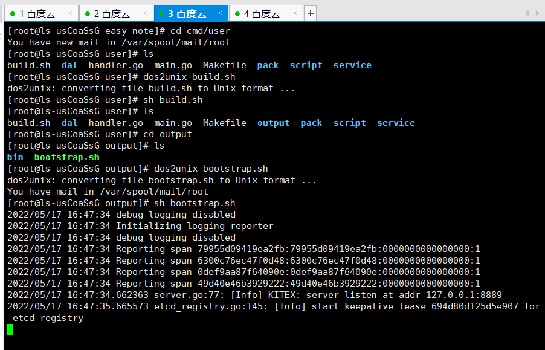

- api服务启动效果

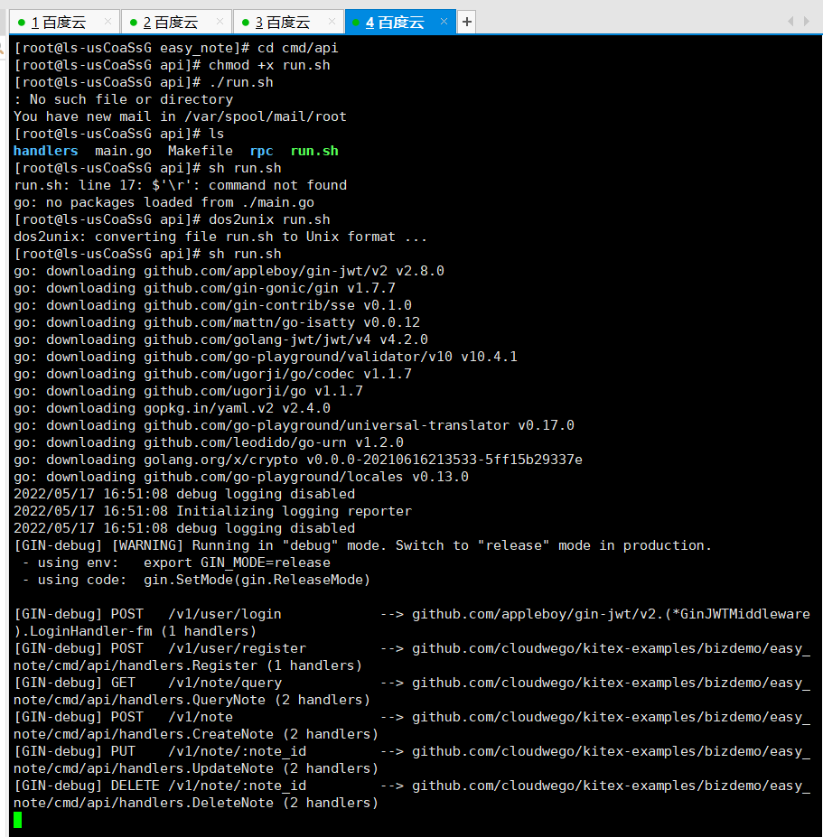

## 接口测试截图

- 用户注册

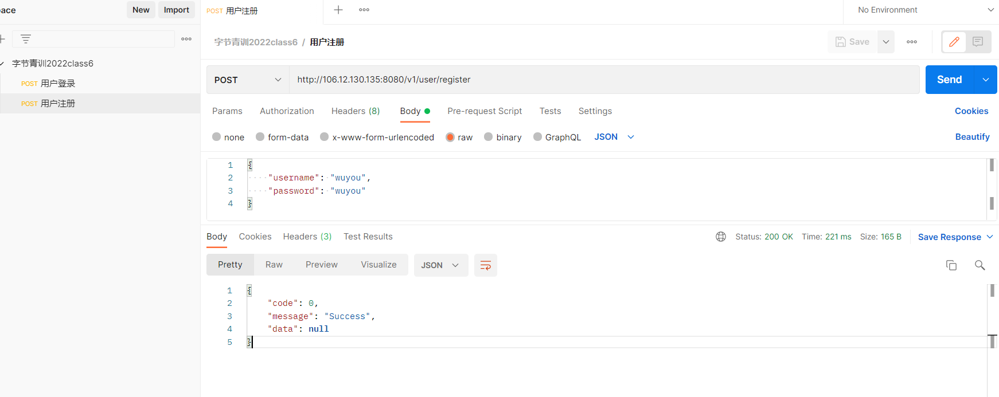

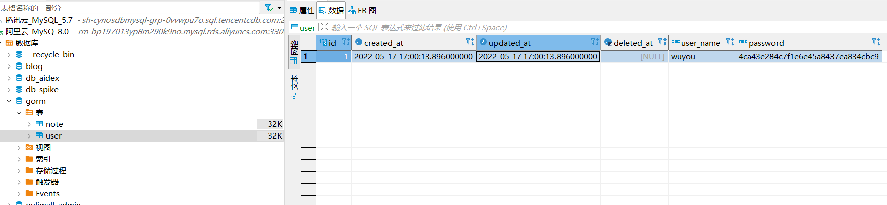

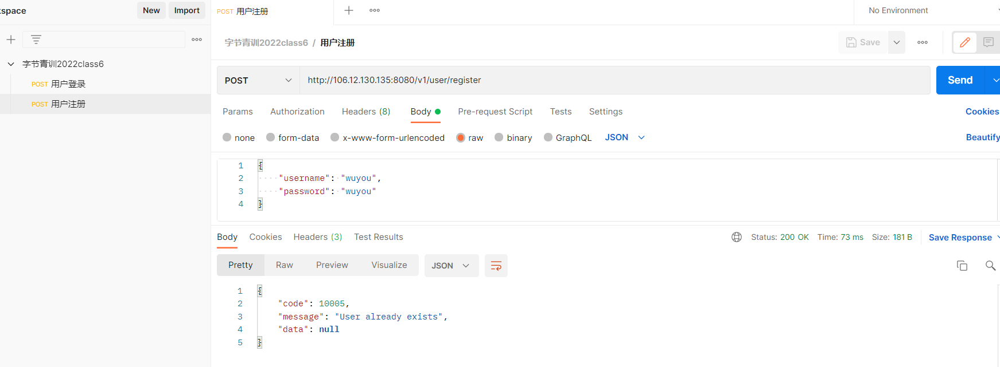

- 用户登录

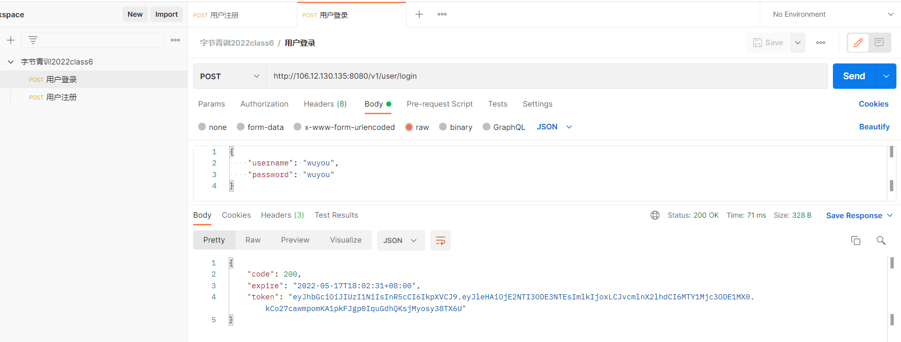

- 新增笔记，需要设置token

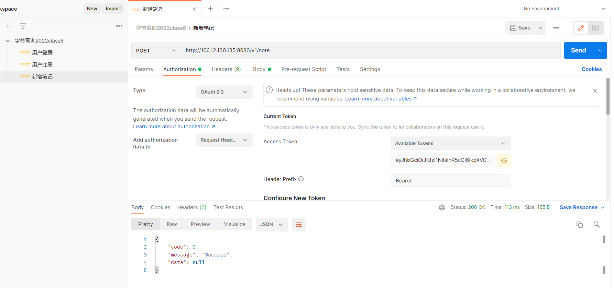

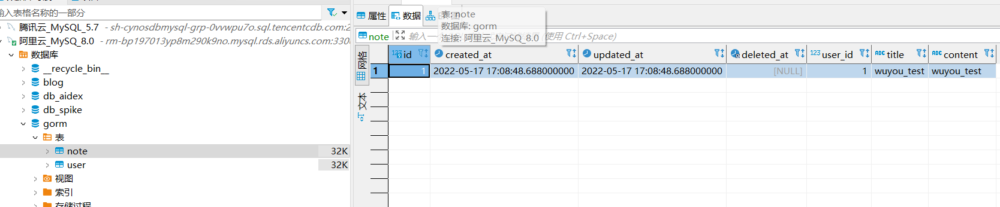

- 查询笔记

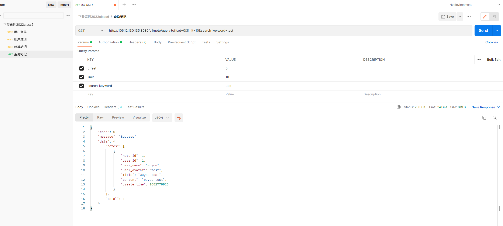

- 删除笔记

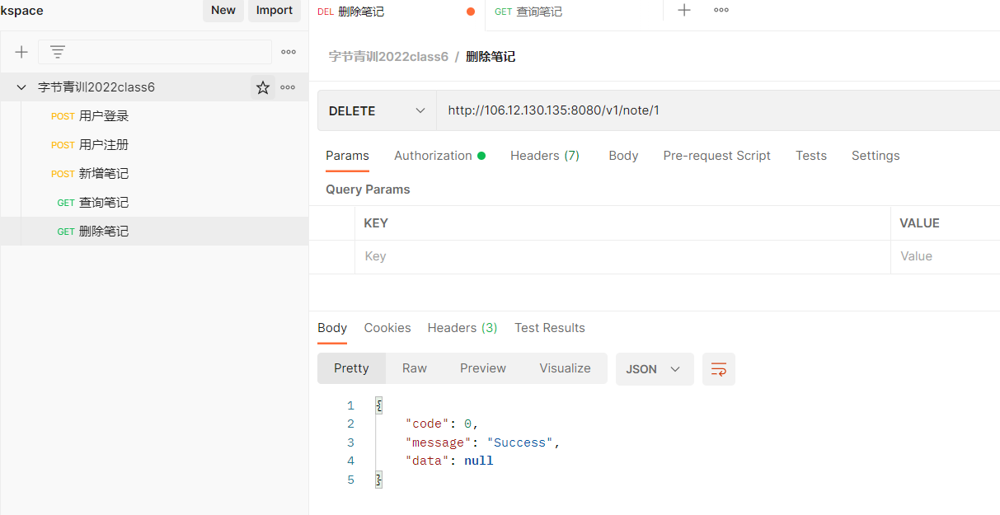

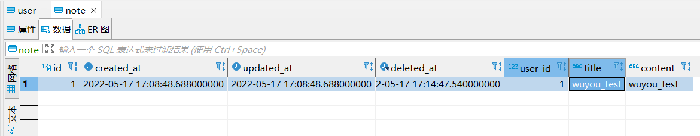

# 参考文档

- [www.cloudwego.io/zh/docs/kit…](https://link.juejin.cn?target=https%3A%2F%2Fwww.cloudwego.io%2Fzh%2Fdocs%2Fkitex%2F)

- [github.com/kitex-contr…](https://link.juejin.cn?target=https%3A%2F%2Fgithub.com%2Fkitex-contrib%2Fregistry-etcd)

- [github.com/kitex-contr…](https://link.juejin.cn?target=https%3A%2F%2Fgithub.com%2Fkitex-contrib%2Ftracer-opentracing)

- [github.com/cloudwego/k…](https://link.juejin.cn?target=https%3A%2F%2Fgithub.com%2Fcloudwego%2Fkitex)

- [gorm.io/docs/index.…](https://link.juejin.cn?target=https%3A%2F%2Fgorm.io%2Fdocs%2Findex.html)

- [github.com/go-gorm/gor…](https://link.juejin.cn?target=https%3A%2F%2Fgithub.com%2Fgo-gorm%2Fgorm)

- [github.com/go-gorm/ope…](https://link.juejin.cn?target=https%3A%2F%2Fgithub.com%2Fgo-gorm%2Fopentracing)

- [github.com/gin-gonic/g…](https://link.juejin.cn?target=https%3A%2F%2Fgithub.com%2Fgin-gonic%2Fgin)

- [github.com/appleboy/gi…](https://link.juejin.cn?target=https%3A%2F%2Fgithub.com%2Fappleboy%2Fgin-jwt)